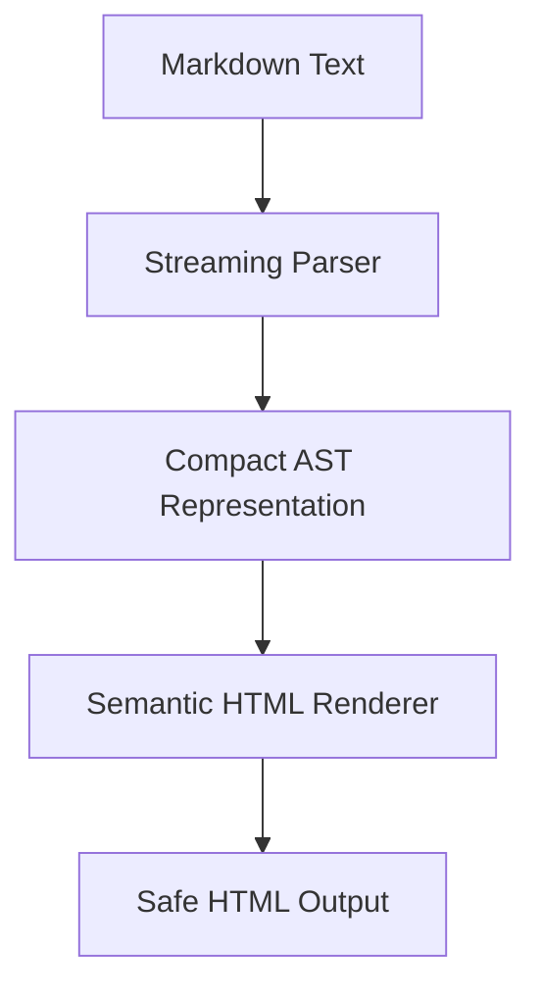

# md2htm : Lightweight Markdown-to-HTML Converter

## Functionality
Converts Markdown text to semantic HTML output using a custom AST-based parser. Supports standard Markdown syntax plus extensions including admonition blocks ([!NOTE], [!TIP], [!WARNING]), math notation (<c-math>), and GitHub-style tables with alignment support.

## Usage Example
```javascript
import md2htm from "@1-/md2htm";

const markdown = "# Hello\n\nThis is **bold** text.\n\n[!NOTE]\nThis is an admonition block.";
const html = md2htm(markdown);
// Returns semantic HTML with proper class attributes and structure
```

## Design Approach
The converter implements a three-stage pipeline with optimized memory usage:



Key implementation features:
- Memory-efficient AST using integer-based node types (T_H=2, T_P=3, etc.)
- Streaming parsing that processes text line-by-line
- Custom HTML encoding/decoding with comprehensive entity support
- Admonition block detection and semantic class generation
- Math notation support with <c-math> custom elements

## Technology Stack
- Pure JavaScript ES modules (no external dependencies)
- Custom AST-based parsing engine
- Semantic HTML generation with accessibility considerations
- Comprehensive HTML entity decoding (17+ entities supported)
- Safe URL encoding with RFC-compliant handling

## Code Structure
```
src/
├── _.js          # Main entry point with default export
├── ast.js        # Core parser with streaming architecture and 1324-line implementation
├── lib.js        # AST-to-HTML coordinator
├── renderBlock.js # Block-level renderer with 200+ line implementation
├── htmD.js       # HTML decoder with 17 entity mappings and punctuation handling
└── htmE.js       # HTML encoder with 4-character entity escaping
```

## Historical Context
Markdown was created by John Gruber and Aaron Swartz in 2004 to enable easy-to-read, easy-to-write plain text formatting. This md2htm implementation continues that tradition with modern optimizations, using integer-based AST nodes for memory efficiency and streaming parsing for performance - techniques inspired by the evolution of web standards from early HTML parsers to today's high-performance engines.