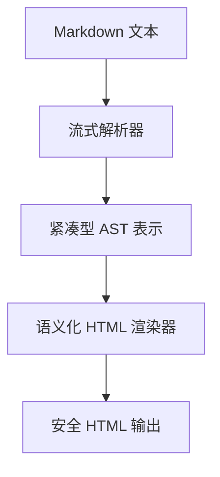

# md2htm : 轻量级 Markdown 到 HTML 转换器

## 功能介绍
使用自定义 AST 解析器将 Markdown 文本转换为语义化 HTML 输出。支持标准 Markdown 语法及扩展功能，包括警示块（[!NOTE]、[!TIP]、[!WARNING]）、数学符号（<c-math>）以及带对齐支持的 GitHub 风格表格。

## 使用演示
```javascript
import md2htm from "@1-/md2htm";

const markdown = "# 你好\n\n这是 **粗体** 文字。\n\n[!NOTE]\n这是一个警示块。";
const html = md2htm(markdown);
// 返回具有正确类属性和结构的语义化 HTML
```

## 设计思路
转换器采用三阶段流水线架构，具备内存优化特性：



关键实现特性：
- 内存高效 AST，使用整数节点类型（T_H=2、T_P=3 等）
- 流式解析，逐行处理文本
- 自定义 HTML 编码/解码，支持 17+ 实体映射
- 警示块检测与语义化类生成
- 数学符号支持 <c-math> 自定义元素

## 技术栈
- 纯 JavaScript ES 模块（无外部依赖）
- 自定义 AST 解析引擎
- 语义化 HTML 生成，考虑可访问性
- 完整 HTML 实体解码（支持 17+ 实体）
- 符合 RFC 规范的安全 URL 编码

## 代码结构
```
src/
├── _.js          # 主入口文件，提供默认导出
├── ast.js        # 核心解析器，含流式架构和 1324 行实现
├── lib.js        # AST 到 HTML 协调器
├── renderBlock.js # 块级渲染器，200+ 行实现
├── htmD.js       # HTML 解码器，含 17 个实体映射和标点处理
└── htmE.js       # HTML 编码器，4 字符实体转义
```

## 历史故事
Markdown 由 John Gruber 和 Aaron Swartz 于 2004 年创建，旨在提供易读易写的纯文本格式化方案。本 md2htm 实现延续这一传统，采用现代优化技术：使用整数型 AST 节点提升内存效率，流式解析增强性能——这些技术灵感源自 Web 标准从早期 HTML 解析器到当今高性能引擎的演进历程。