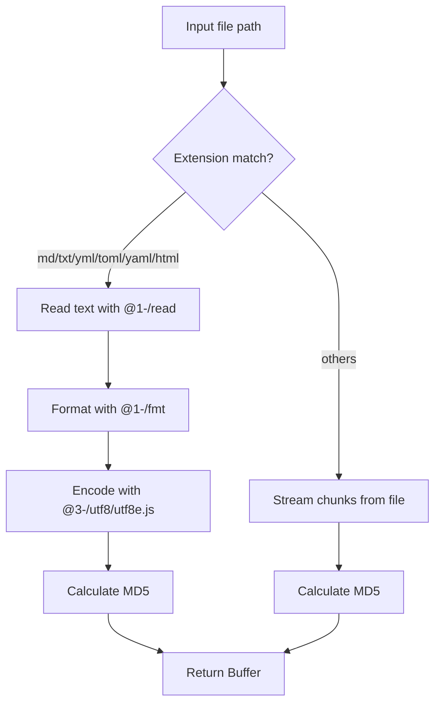
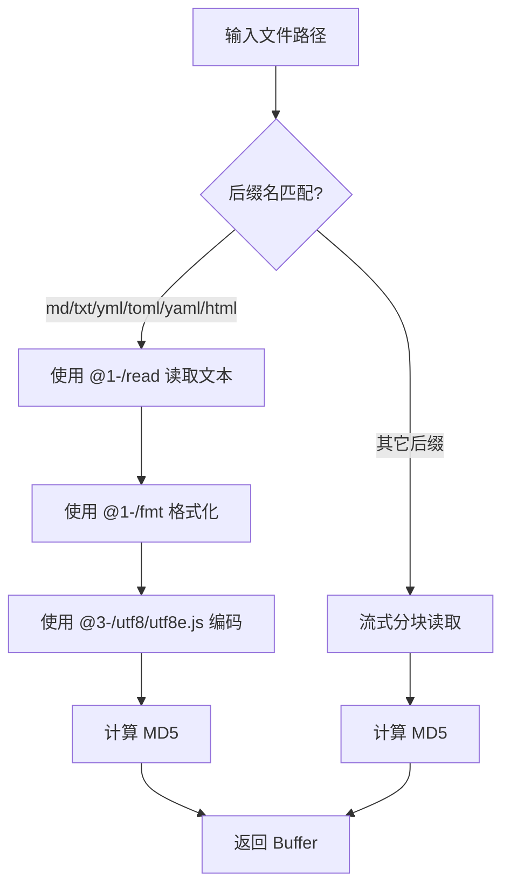

[English](#en) | [中文](#zh)

---

<a id="en"></a>
# @1-/md5 : Efficiently compute MD5 hashes for files and text

- [@1-/md5 : Efficiently compute MD5 hashes for files and text](#1-md5-efficiently-compute-md5-hashes-for-files-and-text)
  - [Functionality](#functionality)
  - [Usage demonstration](#usage-demonstration)
    - [1. Calculate file MD5](#1-calculate-file-md5)
    - [2. Format and calculate text MD5](#2-format-and-calculate-text-md5)
  - [Design rationale](#design-rationale)
  - [Technology stack](#technology-stack)
  - [Code structure](#code-structure)
  - [Historical context](#historical-context)
  - [About](#about)

## Functionality

Compute MD5 hash values for files or raw text strings.

- Stream-based calculation avoids loading entire files into memory
- Returns binary hash as `Buffer`
- For text files (`md`, `txt`, `yml`, `toml`, `yaml`, `html`): reads with `@1-/read`, formats with `@1-/fmt`, encodes with `@3-/utf8/utf8e.js`, then computes MD5
- Handles large files without memory pressure
- Uses Node.js built-in `crypto` module

## Usage demonstration

```bash
npm install @1-/md5
```

### 1. Calculate file MD5

```javascript
import pathMd5 from "@1-/md5/pathMd5.js";

const hash = await pathMd5("/path/to/file.txt");
console.log(hash); // Buffer (MD5 binary)
```

### 2. Format and calculate text MD5

```javascript
import fmtMd5 from "@1-/md5/fmtMd5.js";

const hash = await fmtMd5(" hello world \r\n");
console.log(hash); // Buffer (MD5 binary)
```

## Design rationale



## Technology stack

- Node.js built-in `fs` and `crypto` modules
- ES modules syntax
- Dependencies: `@1-/read`, `@1-/fmt`, `@3-/ext`, `@3-/utf8`

## Code structure

- `src/pathMd5.js`: Main entry point, selects processing path based on file extension
- `src/fmtMd5.js`: Format text and compute its MD5
- `src/fpMd5.js`: Stream-based MD5 calculation for arbitrary files
- `test/_.test.js`: Test suite
- `readme/en/README.md`: English documentation
- `readme/zh/README.md`: Chinese documentation

## Historical context

The MD5 algorithm was designed by Ronald Rivest in 1991 to replace MD4 and specified in RFC 1321 in 1992. Though cryptographically broken for collision resistance since 2004, MD5 remains suitable for non-security-critical applications such as checksum verification, data partitioning, and file integrity checking. This library implements streaming chunked processing to handle large files efficiently.

## About

This library is developed by [WebC.site](https://webc.site).

[WebC.site](https://webc.site): A new paradigm of web development for AI


---

<a id="zh"></a>
# @1-/md5 : 高效计算文件与文本 MD5 哈希值

- [@1-/md5 : 高效计算文件与文本 MD5 哈希值](#1-md5-高效计算文件与文本-md5-哈希值)
  - [功能介绍](#功能介绍)
  - [使用演示](#使用演示)
    - [1. 计算文件 MD5](#1-计算文件-md5)
    - [2. 格式化并计算文本 MD5](#2-格式化并计算文本-md5)
  - [设计思路](#设计思路)
  - [技术栈](#技术栈)
  - [代码结构](#代码结构)
  - [历史故事](#历史故事)
  - [关于](#关于)

## 功能介绍

计算文件或文本字符串的 MD5 哈希值。

- 流式计算避免将整个文件加载到内存
- 返回二进制哈希值 `Buffer`
- 对文本文件（`md`, `txt`, `yml`, `toml`, `yaml`, `html`）：使用 `@1-/read` 读取，`@1-/fmt` 格式化，`@3-/utf8/utf8e.js` 编码后计算 MD5
- 处理大文件无内存压力
- 使用 Node.js 内置 `crypto` 模块

## 使用演示

```bash
npm install @1-/md5
```

### 1. 计算文件 MD5

```javascript
import pathMd5 from "@1-/md5/pathMd5.js";

const hash = await pathMd5("/path/to/file.txt");
console.log(hash); // Buffer (MD5 二进制)
```

### 2. 格式化并计算文本 MD5

```javascript
import fmtMd5 from "@1-/md5/fmtMd5.js";

const hash = await fmtMd5(" hello world \r\n");
console.log(hash); // Buffer (MD5 二进制)
```

## 设计思路



## 技术栈

- Node.js 内置 `fs` 和 `crypto` 模块
- ES 模块语法
- 依赖：`@1-/read`, `@1-/fmt`, `@3-/ext`, `@3-/utf8`

## 代码结构

- `src/pathMd5.js`: 主入口，根据文件后缀选择处理路径
- `src/fmtMd5.js`: 格式化文本并计算其 MD5
- `src/fpMd5.js`: 流式计算任意文件的 MD5
- `test/_.test.js`: 测试套件
- `readme/en/README.md`: 英文文档
- `readme/zh/README.md`: 中文文档

## 历史故事

MD5 算法由 Ronald Rivest 于 1991 年设计，用于替代 MD4，并于 1992 年在 RFC 1321 中正式发布。尽管自 2004 年起已证实其碰撞抵抗性被攻破，MD5 仍适用于非密码学场景，例如校验和验证、数据分区与文件完整性检查。本库采用流式分块处理方式，高效支持大文件计算。

## 关于

本库由 [WebC.site](https://webc.site) 开发。

[WebC.site](https://webc.site) : 面向人工智能的网站开发新范式

