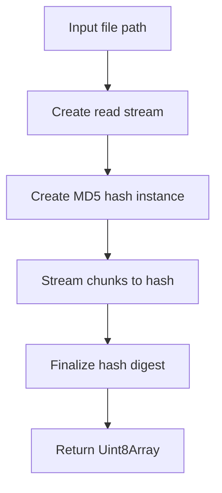
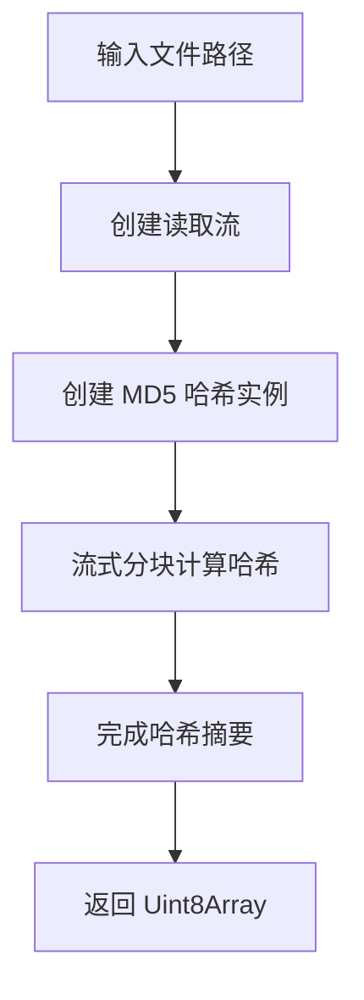

[English](#en) | [中文](#zh)

---

<a id="en"></a>
# @1-/md5 : Calculate file MD5 hashes efficiently

- [@1-/md5 : Calculate file MD5 hashes efficiently](#1-md5-calculate-file-md5-hashes-efficiently)
  - [Functionality](#functionality)
  - [Usage demonstration](#usage-demonstration)
  - [Design rationale](#design-rationale)
  - [Technology stack](#technology-stack)
  - [Code structure](#code-structure)
  - [Historical context](#historical-context)
  - [About](#about)

## Functionality

Calculate MD5 hash of files using Node.js streams for memory-efficient processing.

- Stream-based calculation avoids loading entire files into memory
- Returns binary hash as Uint8Array
- Handles large files without memory pressure
- Uses Node.js built-in crypto module

## Usage demonstration

```bash
npm install @1-/md5
```

```javascript
import pathMd5 from "@1-/md5/pathMd5.js";

const hash = await pathMd5("/path/to/file");
console.log(hash); // Uint8Array (MD5 binary)
```

## Design rationale



## Technology stack

- Node.js built-in `fs` module for file streaming
- Node.js built-in `crypto` module for MD5 calculation
- ES modules syntax
- Bun test framework for testing

## Code structure

- `src/pathMd5.js`: Main implementation calculating MD5 from file path
- `test/_.test.js`: Test suite with file existence and hash verification test
- `readme/en/README.md`: English documentation
- `readme/zh/README.md`: Chinese documentation

## Historical context

MD5 algorithm developed by Ronald Rivest in 1991 as cryptographic hash function. While no longer secure for cryptographic purposes, MD5 remains widely used for checksum verification and file integrity checking. This library implements the standard approach of streaming file content through MD5 hash computation, following Node.js best practices for handling large files efficiently.

## About

This library is developed by [WebC.site](https://webc.site).

[WebC.site](https://webc.site): A new paradigm of web development for AI


---

<a id="zh"></a>
# @1-/md5 : 高效计算文件 MD5 哈希值

- [@1-/md5 : 高效计算文件 MD5 哈希值](#1-md5-高效计算文件-md5-哈希值)
  - [功能介绍](#功能介绍)
  - [使用演示](#使用演示)
  - [设计思路](#设计思路)
  - [技术栈](#技术栈)
  - [代码结构](#代码结构)
  - [历史故事](#历史故事)
  - [关于](#关于)

## 功能介绍

使用 Node.js 流式处理高效计算文件 MD5 哈希值。

- 流式计算避免将整个文件加载到内存
- 返回 Uint8Array 格式二进制哈希值
- 处理大文件无内存压力
- 使用 Node.js 内置 crypto 模块

## 使用演示

```bash
npm install @1-/md5
```

```javascript
import pathMd5 from "@1-/md5/pathMd5.js";

const hash = await pathMd5("/path/to/file");
console.log(hash); // Uint8Array (MD5 二进制)
```

## 设计思路



## 技术栈

- Node.js 内置 `fs` 模块实现文件流式读取
- Node.js 内置 `crypto` 模块实现 MD5 计算
- ES 模块语法
- Bun 测试框架

## 代码结构

- `src/pathMd5.js`: 主要实现，从文件路径计算 MD5
- `test/_.test.js`: 测试套件，包含文件存在性与哈希验证测试
- `readme/en/README.md`: 英文文档
- `readme/zh/README.md`: 中文文档

## 历史故事

MD5 算法由 Ronald Rivest 于 1991 年设计，作为密码学哈希函数。虽然不再适用于密码学安全场景，MD5 仍广泛用于校验和验证与文件完整性检查。本库采用标准流式处理方式，将文件内容分块送入 MD5 计算，遵循 Node.js 大文件处理最佳实践。

## 关于

本库由 [WebC.site](https://webc.site) 开发。

[WebC.site](https://webc.site) : 面向人工智能的网站开发新范式

