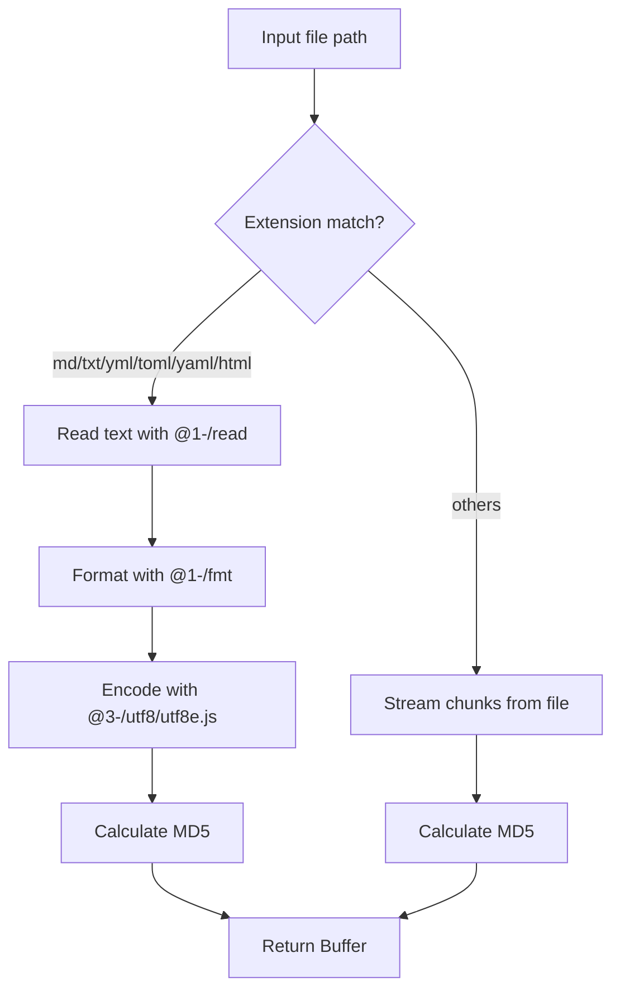

# @1-/md5 : Efficiently compute MD5 hashes for files and text

## Functionality

Compute MD5 hash values for files or raw text strings.

- Stream-based calculation avoids loading entire files into memory
- Returns binary hash as `Buffer`
- For text files (`md`, `txt`, `yml`, `toml`, `yaml`, `html`): reads with `@1-/read`, formats with `@1-/fmt`, encodes with `@3-/utf8/utf8e.js`, then computes MD5
- Handles large files without memory pressure
- Uses Node.js built-in `crypto` module

## Usage demonstration

```bash
npm install @1-/md5
```

### 1. Calculate file MD5

```javascript
import pathMd5 from "@1-/md5/pathMd5.js";

const hash = await pathMd5("/path/to/file.txt");
console.log(hash); // Buffer (MD5 binary)
```

### 2. Format and calculate text MD5

```javascript
import fmtMd5 from "@1-/md5/fmtMd5.js";

const hash = await fmtMd5(" hello world \r\n");
console.log(hash); // Buffer (MD5 binary)
```

## Design rationale



## Technology stack

- Node.js built-in `fs` and `crypto` modules
- ES modules syntax
- Dependencies: `@1-/read`, `@1-/fmt`, `@3-/ext`, `@3-/utf8`

## Code structure

- `src/pathMd5.js`: Main entry point, selects processing path based on file extension
- `src/fmtMd5.js`: Format text and compute its MD5
- `src/fpMd5.js`: Stream-based MD5 calculation for arbitrary files
- `test/_.test.js`: Test suite
- `readme/en/README.md`: English documentation
- `readme/zh/README.md`: Chinese documentation

## Historical context

The MD5 algorithm was designed by Ronald Rivest in 1991 to replace MD4 and specified in RFC 1321 in 1992. Though cryptographically broken for collision resistance since 2004, MD5 remains suitable for non-security-critical applications such as checksum verification, data partitioning, and file integrity checking. This library implements streaming chunked processing to handle large files efficiently.