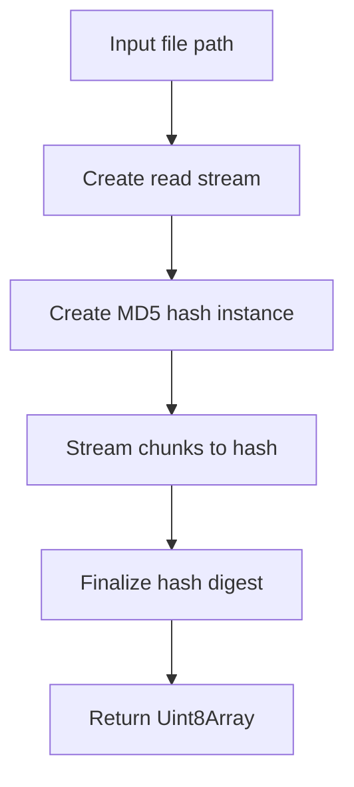

# @1-/md5 : Calculate file MD5 hashes efficiently

## Functionality

Calculate MD5 hash of files using Node.js streams for memory-efficient processing.

- Stream-based calculation avoids loading entire files into memory
- Returns binary hash as Uint8Array
- Handles large files without memory pressure
- Uses Node.js built-in crypto module

## Usage demonstration

```bash
npm install @1-/md5
```

```javascript
import pathMd5 from "@1-/md5/pathMd5.js";

const hash = await pathMd5("/path/to/file");
console.log(hash); // Uint8Array (MD5 binary)
```

## Design rationale



## Technology stack

- Node.js built-in `fs` module for file streaming
- Node.js built-in `crypto` module for MD5 calculation
- ES modules syntax
- Bun test framework for testing

## Code structure

- `src/pathMd5.js`: Main implementation calculating MD5 from file path
- `test/_.test.js`: Test suite with file existence and hash verification test
- `readme/en/README.md`: English documentation
- `readme/zh/README.md`: Chinese documentation

## Historical context

MD5 algorithm developed by Ronald Rivest in 1991 as cryptographic hash function. While no longer secure for cryptographic purposes, MD5 remains widely used for checksum verification and file integrity checking. This library implements the standard approach of streaming file content through MD5 hash computation, following Node.js best practices for handling large files efficiently.