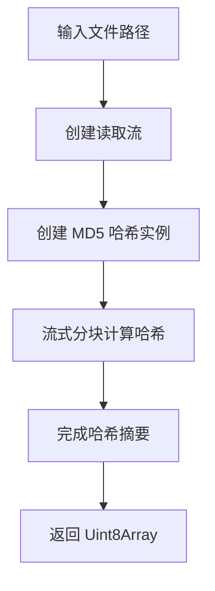

# @1-/md5 : 高效计算文件 MD5 哈希值

## 功能介绍

使用 Node.js 流式处理高效计算文件 MD5 哈希值。

- 流式计算避免将整个文件加载到内存
- 返回 Uint8Array 格式二进制哈希值
- 处理大文件无内存压力
- 使用 Node.js 内置 crypto 模块

## 使用演示

```bash
npm install @1-/md5
```

```javascript
import pathMd5 from "@1-/md5/pathMd5.js";

const hash = await pathMd5("/path/to/file");
console.log(hash); // Uint8Array (MD5 二进制)
```

## 设计思路



## 技术栈

- Node.js 内置 `fs` 模块实现文件流式读取
- Node.js 内置 `crypto` 模块实现 MD5 计算
- ES 模块语法
- Bun 测试框架

## 代码结构

- `src/pathMd5.js`: 主要实现，从文件路径计算 MD5
- `test/_.test.js`: 测试套件，包含文件存在性与哈希验证测试
- `readme/en/README.md`: 英文文档
- `readme/zh/README.md`: 中文文档

## 历史故事

MD5 算法由 Ronald Rivest 于 1991 年设计，作为密码学哈希函数。虽然不再适用于密码学安全场景，MD5 仍广泛用于校验和验证与文件完整性检查。本库采用标准流式处理方式，将文件内容分块送入 MD5 计算，遵循 Node.js 大文件处理最佳实践。