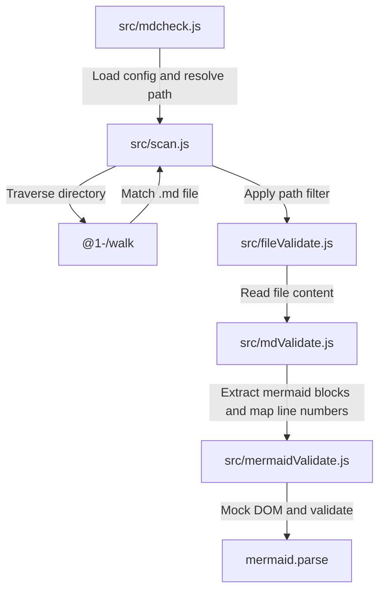
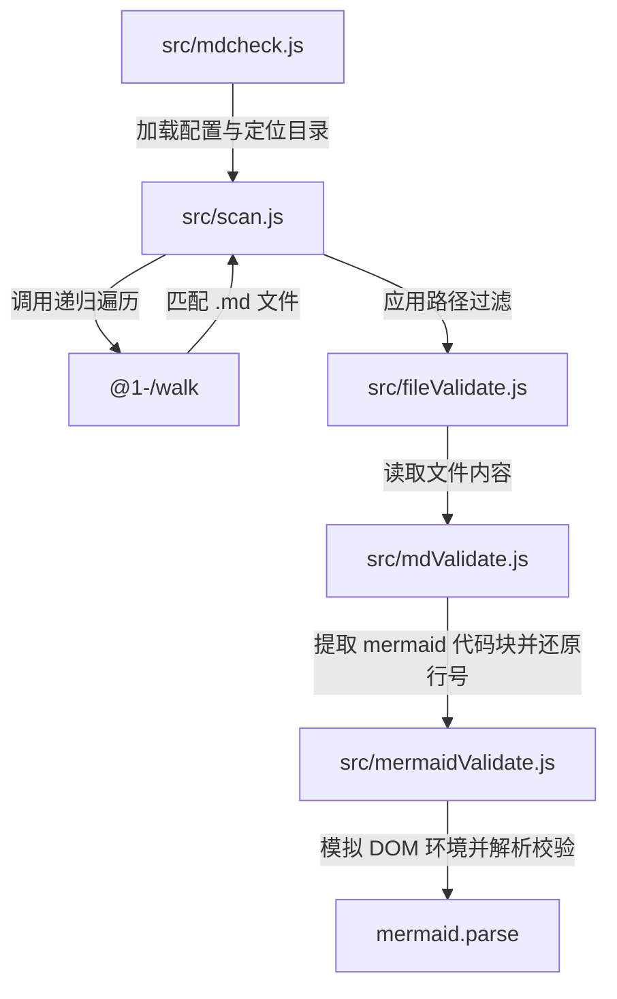

[English](#en) | [中文](#zh)

---

<a id="en"></a>

# mdcheck : Validate Mermaid syntax in Markdown files without browsers

- [mdcheck : Validate Mermaid syntax in Markdown files without browsers](#mdcheck-validate-mermaid-syntax-in-markdown-files-without-browsers)
  - [1. Features](#1-features)
  - [2. Usage](#2-usage)
    - [CLI Execution](#cli-execution)
    - [Configuration](#configuration)
  - [3. Design](#3-design)
  - [4. Tech Stack](#4-tech-stack)
  - [5. Code Structure](#5-code-structure)
  - [6. History](#6-history)
  - [About](#about)

## 1. Features

- Scans directories recursively for Markdown files.
- Extracts `mermaid` code blocks.
- Mocks browser DOM environment to run Mermaid in Node.js or Bun.
- Parses syntax using official Mermaid engine directly, eliminating headless browsers.
- Reports file paths, error lines, and parser error details.
- Supports exclusion rules through JavaScript configuration files.

## 2. Usage

### CLI Execution

```bash
bun x mdcheck [dir_path]
```

Default directory is current working directory when `dir_path` is omitted.

### Configuration

Create `.mdcheck.js` in target directory or parent directories to exclude paths:

```javascript
export default (relativePath) => {
  return relativePath.includes("exclude_dir");
};
```

## 3. Design



## 4. Tech Stack

- **Bun**: Runtime and testing framework.
- **Mermaid**: Parsing engine.
- **Yargs**: Command-line argument parser.
- **@1-/walk**: Directory traversal utility.
- **@1-/md**: Markdown content parser.
- **@3-/log**: Terminal log formatter.

## 5. Code Structure

- `src/mdcheck.js`: Command-line entry, config loader, output formatter.
- `src/scan.js`: Directory scanner with configuration filter.
- `src/fileValidate.js`: File reader and validator coordinator.
- `src/mdValidate.js`: Markdown code block extractor and line number mapper.
- `src/mermaidValidate.js`: DOM mock injector and Mermaid parser wrapper.

## 6. History

Knut Sveidqvist created Mermaid in 2014 to generate diagrams from Markdown text, introducing the "Diagrams as Code" concept. The project won the JS Open Source Award in 2019.

Since Mermaid depends on browser layout engines to calculate text dimensions, the official utility `mermaid-cli` executes Puppeteer to boot chromium instances. This process increases resource consumption and limits validation speed in continuous integration pipelines.

Developers bypassed browser engine initialization by mocking global objects like `window`, `document`, and `DOMParser` in headless JS runtimes. This technique enables execution of the core compiler directly inside terminal environments, completing validation checks in milliseconds.

## About

This library is developed by [WebC.site](https://webc.site).

[WebC.site](https://webc.site): A new paradigm of web development for AI

---

<a id="zh"></a>

# mdcheck : 无需浏览器校验 Markdown 中的 Mermaid 语法

- [mdcheck : 无需浏览器校验 Markdown 中的 Mermaid 语法](#mdcheck-无需浏览器校验-markdown-中的-mermaid-语法)
  - [1. 功能介绍](#1-功能介绍)
  - [2. 使用演示](#2-使用演示)
    - [运行校验](#运行校验)
    - [过滤配置](#过滤配置)
  - [3. 设计思路](#3-设计思路)
  - [4. 技术栈](#4-技术栈)
  - [5. 代码结构](#5-代码结构)
  - [6. 历史故事](#6-历史故事)
  - [关于](#关于)

## 1. 功能介绍

- 递归扫描目录检索 Markdown 文件。
- 提取 `mermaid` 代码块。
- 模拟浏览器 DOM 环境，支持 Mermaid 引擎运行于 Node.js 或 Bun。
- 调用 Mermaid 官方解析器校验语法，免去启动 Headless 浏览器。
- 输出错误文件路径、行号及具体错误信息。
- 支持使用 JavaScript 配置文件排除特定文件与目录。

## 2. 使用演示

### 运行校验

```bash
bun x mdcheck [目录路径]
```

省略 `目录路径` 默认校验当前工作目录。

### 过滤配置

校验目录或其父目录创建 `.mdcheck.js` 配置文件：

```javascript
export default (relativePath) => {
  return relativePath.includes("exclude_dir");
};
```

## 3. 设计思路



## 4. 技术栈

- **Bun**: 运行环境与测试框架。
- **Mermaid**: 官方图表语法解析引擎。
- **Yargs**: 命令行参数解析工具。
- **@1-/walk**: 目录递归遍历工具。
- **@1-/md**: Markdown 解析与代码块提取工具。
- **@3-/log**: 终端日志格式化输出工具。

## 5. 代码结构

- `src/mdcheck.js`: 命令行入口，加载配置，格式化输出。
- `src/scan.js`: 递归扫描目录并应用过滤逻辑。
- `src/fileValidate.js`: 读取文件内容并触发校验。
- `src/mdValidate.js`: 提取 Markdown 内 Mermaid 代码块并还原行号。
- `src/mermaidValidate.js`: 模拟浏览器 DOM 环境并调用 Mermaid 校验。

## 6. 历史故事

Knut Sveidqvist 于 2014 年发起 Mermaid 项目，通过类似 Markdown 文本生成图表，实践“图表即代码”（Diagrams as Code）。项目于 2019 年获得 JS 开源奖（JS Open Source Awards）。

由于 Mermaid 依赖浏览器渲染 API 计算文本尺寸，官方命令行工具 `mermaid-cli` 需调用 Puppeteer 启动 Headless 浏览器。此方案增加启动开销，占用系统资源，降低 CI/CD 容器执行效率。

为突破此限制，社区探索 DOM 模拟方案。通过在 Node.js 或 Bun 全局注入 `window`、`document`、`DOMParser` 等桩对象，绕过浏览器渲染引擎初始化。Mermaid 解析器借此于终端环境实现毫秒级解析。本项目采用该方案，实现轻量化离线校验。

## 关于

本库由 [WebC.site](https://webc.site) 开发。

[WebC.site](https://webc.site) : 面向人工智能的网站开发新范式
