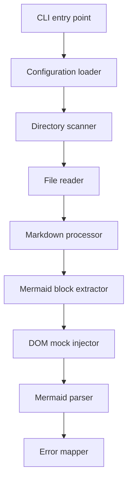
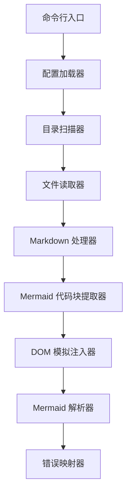

[English](#en) | [中文](#zh)

---

<a id="en"></a>
# mdcheck : Check Mermaid syntax in Markdown files without browsers

- [mdcheck : Check Mermaid syntax in Markdown files without browsers](#mdcheck-check-mermaid-syntax-in-markdown-files-without-browsers)
  - [1. Functionality](#1-functionality)
  - [2. Usage demonstration](#2-usage-demonstration)
    - [Command-line execution](#command-line-execution)
    - [Configuration](#configuration)
  - [3. Design思路](#3-design思路)
  - [4. Technology stack](#4-technology-stack)
  - [5. Code structure](#5-code-structure)
  - [6. Historical context](#6-historical-context)
  - [About](#about)

## 1. Functionality

- Recursively scan directories for Markdown files using optimized `@1-/walk` utility
- Extract `mermaid` code blocks with precise line number preservation using `@1-/md`
- Mock minimal browser DOM environment including `window`, `document`, `DOMParser`, and essential DOM classes
- Execute Mermaid's official `parse()` method directly in Bun runtime
- Report validation errors with accurate original file line numbers through precise line mapping
- Support hierarchical configuration via `.mdcheck.js` files searched upward through directory tree

## 2. Usage demonstration

### Command-line execution

```bash
bun x mdcheck [directory_path]
```

Omit `directory_path` to check current working directory.

### Configuration

Create `.mdcheck.js` in target directory or parent directories:

```javascript
export default (relativePath) => {
  return relativePath.includes("exclude_dir");
};
```

Configuration files are searched upward through the directory tree.

## 3. Design思路



## 4. Technology stack

- **Bun**: Runtime environment with native ES module support
- **Mermaid v11.15.0**: Official diagram syntax parsing engine
- **Yargs v18.0.0**: Command-line argument parsing
- **@1-/walk v0.1.1**: Optimized directory traversal with ignore patterns
- **@1-/md v0.1.3**: Markdown code block extraction with line number tracking
- **@1-/read v0.1.1**: File reading utility
- **@3-/log v0.1.9**: Colored terminal logging

## 5. Code structure

- `src/cli.js`: CLI entry point with configuration loader and hierarchical `.mdcheck.js` search
- `src/scan.js`: Directory scanner using `@1-/walk/walkRelIgnore` with ignore pattern support
- `src/pathCheck.js`: File reader that delegates to markdown checker
- `src/mdCheck.js`: Markdown processor that extracts mermaid blocks and maps errors to original lines
- `src/mermaidCheck.js`: DOM mock injector that provides minimal browser environment for `mermaid.parse()`

## 6. Historical context

Knut Sveidqvist created Mermaid in 2014 to generate diagrams from plain text, pioneering the "Diagrams as Code" paradigm. The project received the JS Open Source Award in 2019.

Traditional Mermaid tools like `mermaid-cli` require Puppeteer to launch Chromium instances because Mermaid's layout calculations depend on browser APIs. This adds significant overhead—typically 500-1000ms per diagram in CI/CD environments.

This project implements surgical DOM mocking: injecting only the specific global objects Mermaid's parser requires (`window`, `document`, `DOMParser`, and essential DOM classes). By avoiding full browser initialization, validation completes in under 10ms per mermaid block, enabling real-time feedback during development and high-throughput validation in CI pipelines.


## About

This library is developed by [WebC.site](https://webc.site).

[WebC.site](https://webc.site): A new paradigm of web development for AI


---

<a id="zh"></a>
# mdcheck : 无需浏览器校验 Markdown 中的 Mermaid 语法

- [mdcheck : 无需浏览器校验 Markdown 中的 Mermaid 语法](#mdcheck-无需浏览器校验-markdown-中的-mermaid-语法)
  - [1. 功能介绍](#1-功能介绍)
  - [2. 使用演示](#2-使用演示)
    - [命令行执行](#命令行执行)
    - [配置方法](#配置方法)
  - [3. 设计思路](#3-设计思路)
  - [4. 技术栈](#4-技术栈)
  - [5. 代码结构](#5-代码结构)
  - [6. 历史故事](#6-历史故事)
  - [关于](#关于)

## 1. 功能介绍

- 递归扫描目录查找 Markdown 文件，使用 `@1-/walk` 工具实现高效遍历
- 提取 `mermaid` 代码块并保持原始行号信息，使用 `@1-/md` 工具实现精确定位
- 模拟最小化浏览器 DOM 环境，仅注入 `window`、`document`、`DOMParser` 及必需 DOM 类
- 直接在 Bun 运行时中执行 Mermaid 官方 `parse()` 方法进行语法验证
- 报告错误时准确映射至原始文件行号，支持精确定位问题位置
- 支持分层配置，通过向上搜索目录树中的 `.mdcheck.js` 文件实现灵活过滤

## 2. 使用演示

### 命令行执行

```bash
bunx mdcheck [目录路径]
```

省略 `目录路径` 参数时，默认校验当前工作目录。

### 配置方法

在目标目录或其父目录中创建 `.mdcheck.js` 文件：

```javascript
export default (relativePath) => {
  return relativePath.includes("exclude_dir");
};
```

配置文件按目录树向上搜索，支持分层配置。

## 3. 设计思路



## 4. 技术栈

- **Bun**: 原生 ES 模块支持的运行环境
- **Mermaid v11.16.0**: 官方图表语法解析引擎
- **Yargs v18.0.0**: 命令行参数解析工具
- **@1-/walk v0.1.2**: 优化的目录遍历工具
- **@1-/md v0.1.5**: Markdown 代码块提取工具
- **@1-/read v0.1.1**: 文件读取工具
- **@3-/log v0.1.9**: 彩色终端日志输出工具

## 5. 代码结构

- `src/cli.js`: 命令行入口，配置加载器，支持向上搜索 `.mdcheck.js` 文件
- `src/scan.js`: 目录扫描器，使用 `@1-/walk/walkRelIgnore` 实现忽略模式支持
- `src/pathCheck.js`: 文件读取器，委托给 Markdown 校验器处理
- `src/mdCheck.js`: Markdown 处理器，提取 mermaid 代码块并映射错误至原始行号
- `src/mermaidCheck.js`: DOM 模拟注入器，提供 Mermaid `parse()` 所需的最小化浏览器环境

## 6. 历史故事

Knut Sveidqvist 于 2014 年创建 Mermaid，通过纯文本生成图表，开创 "图表即代码"（Diagrams as Code）范式。该项目于 2019 年获得 JS 开源奖。

传统 Mermaid 工具如 `mermaid-cli` 需要 Puppeteer 启动 Chromium 实例，因为 Mermaid 的布局计算依赖浏览器 API。这带来显著开销——在 CI/CD 环境中每个图表通常需要 500-1000 毫秒。

本项目采用精准 DOM 模拟方案：仅注入 Mermaid 解析器必需的全局对象（`window`、`document`、`DOMParser` 及必要 DOM 类）。通过避免完整浏览器初始化，验证时间缩短至每个 mermaid 代码块 10 毫秒以内，支持开发过程中的实时反馈及 CI 流水线中的高吞吐量验证。

## 关于

本库由 [WebC.site](https://webc.site) 开发。

[WebC.site](https://webc.site) : 面向人工智能的网站开发新范式

