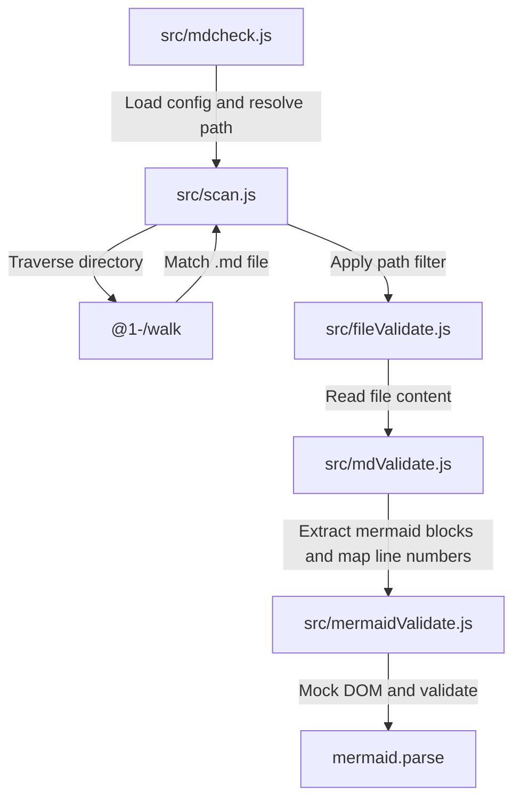

# mdcheck : Validate Mermaid syntax in Markdown files without browsers

## 1. Features

- Scans directories recursively for Markdown files.
- Extracts `mermaid` code blocks.
- Mocks browser DOM environment to run Mermaid in Node.js or Bun.
- Parses syntax using official Mermaid engine directly, eliminating headless browsers.
- Reports file paths, error lines, and parser error details.
- Supports exclusion rules through JavaScript configuration files.

## 2. Usage

### CLI Execution

```bash
bun x mdcheck [dir_path]
```

Default directory is current working directory when `dir_path` is omitted.

### Configuration

Create `.mdcheck.js` in target directory or parent directories to exclude paths:

```javascript
export default (relativePath) => {
  return relativePath.includes("exclude_dir");
};
```

## 3. Design



## 4. Tech Stack

- **Bun**: Runtime and testing framework.
- **Mermaid**: Parsing engine.
- **Yargs**: Command-line argument parser.
- **@1-/walk**: Directory traversal utility.
- **@1-/md**: Markdown content parser.
- **@3-/log**: Terminal log formatter.

## 5. Code Structure

- `src/mdcheck.js`: Command-line entry, config loader, output formatter.
- `src/scan.js`: Directory scanner with configuration filter.
- `src/fileValidate.js`: File reader and validator coordinator.
- `src/mdValidate.js`: Markdown code block extractor and line number mapper.
- `src/mermaidValidate.js`: DOM mock injector and Mermaid parser wrapper.

## 6. History

Knut Sveidqvist created Mermaid in 2014 to generate diagrams from Markdown text, introducing the "Diagrams as Code" concept. The project won the JS Open Source Award in 2019.

Since Mermaid depends on browser layout engines to calculate text dimensions, the official utility `mermaid-cli` executes Puppeteer to boot chromium instances. This process increases resource consumption and limits validation speed in continuous integration pipelines.

Developers bypassed browser engine initialization by mocking global objects like `window`, `document`, and `DOMParser` in headless JS runtimes. This technique enables execution of the core compiler directly inside terminal environments, completing validation checks in milliseconds.
