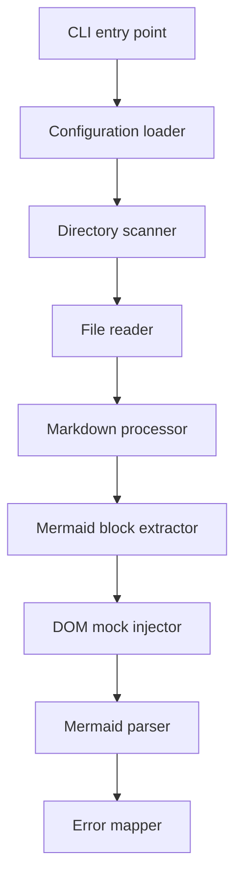

# mdcheck : Check Mermaid syntax in Markdown files without browsers

## 1. Functionality

- Recursively scan directories for Markdown files using optimized `@1-/walk` utility
- Extract `mermaid` code blocks with precise line number preservation using `@1-/md`
- Mock minimal browser DOM environment including `window`, `document`, `DOMParser`, and essential DOM classes
- Execute Mermaid's official `parse()` method directly in Bun runtime
- Report validation errors with accurate original file line numbers through precise line mapping
- Support hierarchical configuration via `.mdcheck.js` files searched upward through directory tree

## 2. Usage demonstration

### Command-line execution

```bash
bun x mdcheck [directory_path]
```

Omit `directory_path` to check current working directory.

### Configuration

Create `.mdcheck.js` in target directory or parent directories:

```javascript
export default (relativePath) => {
  return relativePath.includes("exclude_dir");
};
```

Configuration files are searched upward through the directory tree.

## 3. Design思路



## 4. Technology stack

- **Bun**: Runtime environment with native ES module support
- **Mermaid v11.15.0**: Official diagram syntax parsing engine
- **Yargs v18.0.0**: Command-line argument parsing
- **@1-/walk v0.1.1**: Optimized directory traversal with ignore patterns
- **@1-/md v0.1.3**: Markdown code block extraction with line number tracking
- **@1-/read v0.1.1**: File reading utility
- **@3-/log v0.1.9**: Colored terminal logging

## 5. Code structure

- `src/cli.js`: CLI entry point with configuration loader and hierarchical `.mdcheck.js` search
- `src/scan.js`: Directory scanner using `@1-/walk/walkRelIgnore` with ignore pattern support
- `src/pathCheck.js`: File reader that delegates to markdown checker
- `src/mdCheck.js`: Markdown processor that extracts mermaid blocks and maps errors to original lines
- `src/mermaidCheck.js`: DOM mock injector that provides minimal browser environment for `mermaid.parse()`

## 6. Historical context

Knut Sveidqvist created Mermaid in 2014 to generate diagrams from plain text, pioneering the "Diagrams as Code" paradigm. The project received the JS Open Source Award in 2019.

Traditional Mermaid tools like `mermaid-cli` require Puppeteer to launch Chromium instances because Mermaid's layout calculations depend on browser APIs. This adds significant overhead—typically 500-1000ms per diagram in CI/CD environments.

This project implements surgical DOM mocking: injecting only the specific global objects Mermaid's parser requires (`window`, `document`, `DOMParser`, and essential DOM classes). By avoiding full browser initialization, validation completes in under 10ms per mermaid block, enabling real-time feedback during development and high-throughput validation in CI pipelines.
