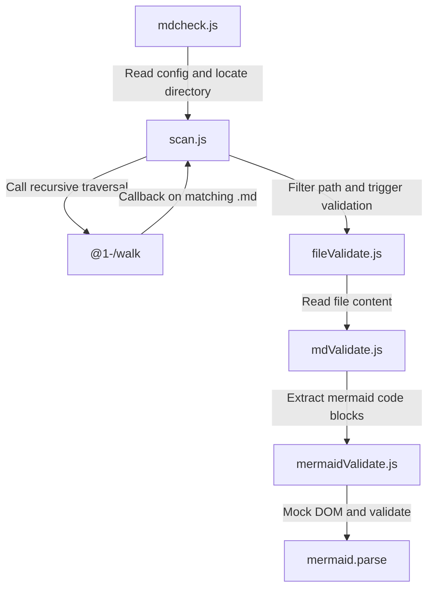

# mdcheck : Offline Mermaid syntax validation in Markdown

Verify Mermaid syntax in Markdown documents in terminal without browsers.

## Features

- Scan directory, retrieve Markdown files
- Extract `mermaid` code blocks
- Mock browser DOM environment, call Mermaid parser for syntax verification
- Output error line numbers, file paths, and error details
- Support path exclusion via configuration file

## Usage

### Validate Directory

Execute in project directory:

```bash
bun x mdcheck [dir_path]
```

Omitted `dir_path` defaults to current working directory.

### Filter Files

Create `.mdcheck.js` under project root directory:

```javascript
export default (relativePath) => {
  // Return true to exclude file from validation
  return relativePath.includes("exclude_dir");
};
```

## Design Ideas

Execution flow of modules:



## Tech Stack

- **Bun**: Runtime and test environment
- **Mermaid**: Syntax parsing engine
- **Yargs**: Command-line arguments parser
- **@1-/walk**: Directory traversal helper

## Directory Structure

```
.
├── src
│   ├── fileValidate.js     # Reads files for validation
│   ├── mdValidate.js       # Locates and extracts mermaid code blocks
│   ├── mdcheck.js          # CLI entry point, config loader, output formatter
│   ├── mermaidValidate.js  # Mocks browser DOM, validates syntax via Mermaid
│   └── scan.js             # Recursively walks directory tree
├── tests                   # Unit and integration tests
└── readme                  # Documentations
```

## History

Mermaid was initiated in 2014 by Knut Sveidqvist to manage diagrams as code. Since Mermaid relies on browser rendering APIs to calculate text dimensions, executing Mermaid server-side traditionally required Puppeteer or similar browser instances. This introduced performance overhead and environment setup costs. Development of DOM mocking techniques (injecting virtual window and document objects into Node.js/Bun global scope) enabled running browser-based libraries directly in text terminals. This project implements DOM mocking to eliminate browser startup overhead, providing fast validation capabilities.
