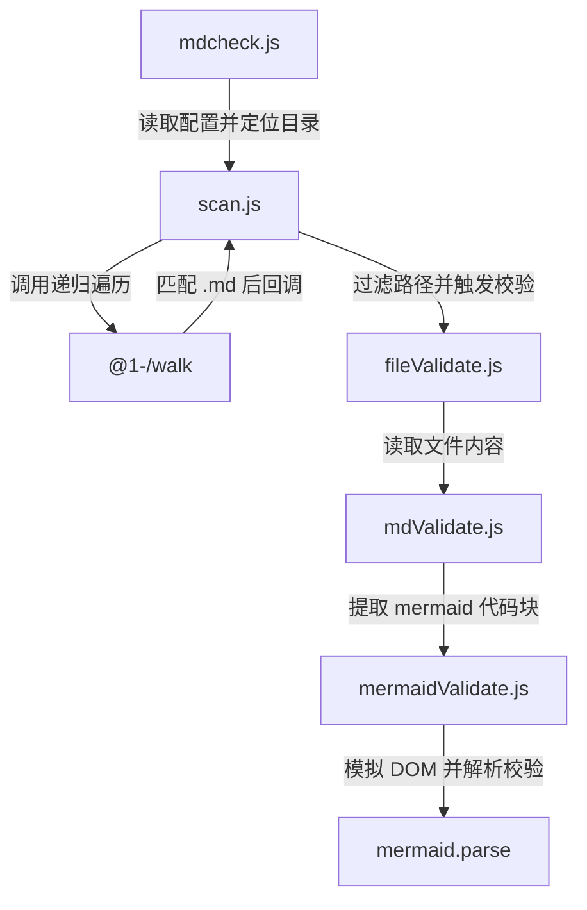

# mdcheck : 离线校验 Markdown 中的 Mermaid 语法

无需启动浏览器，在本地终端校验 Markdown 文档中的 Mermaid 语法。

## 功能介绍

- 扫描目录，检索 Markdown 文件
- 匹配并提取 `mermaid` 代码块
- 模拟浏览器 DOM 环境，调用 Mermaid 解析器进行语法检查
- 输出语法错误行号、文件路径与错误详情
- 支持配置文件过滤指定路径

## 使用演示

### 运行校验

在项目目录执行：

```bash
bun x mdcheck [目录路径]
```

省略路径时默认校验当前目录。

### 过滤配置

于项目根目录创建 `.mdcheck.js` 配置文件：

```javascript
export default (relativePath) => {
  // 返回 true 则跳过该文件校验
  return relativePath.includes("exclude_dir");
};
```

## 设计思路

模块调用流程如下：



## 技术栈

- **Bun**: 运行环境与测试工具
- **Mermaid**: 语法解析引擎
- **Yargs**: 命令行参数解析器
- **@1-/walk**: 目录遍历工具

## 目录结构

```
.
├── src
│   ├── fileValidate.js     # 读取文件内容
│   ├── mdValidate.js       # 提取 markdown 中 mermaid 代码块并计算行号
│   ├── mdcheck.js          # 命令行入口、配置加载、结果输出
│   ├── mermaidValidate.js  # 模拟浏览器环境，调用 Mermaid 进行语法校验
│   └── scan.js             # 递归扫描指定目录
├── tests                   # 测试套件
└── readme                  # 文档目录
```

## 历史故事

Mermaid 由 Knut Sveidqvist 于 2014 年发起，核心设计思想是将图表源文本作为代码管理。由于 Mermaid 强依赖浏览器渲染 API 以计算文本尺寸，在服务器端独立运行时，传统方案多依赖 Puppeteer 等浏览器实例。这导致了额外的资源消耗与运行延迟。后来，社区探索出通过在 Node.js 或 Bun 中全局注入虚拟 window 与 document 对象的 DOM 模拟方案，使这类依赖浏览器环境的库能够在纯文本终端下高效率运行。本项目即采用此技术，避开浏览器启动开销，提供高效的本地校验能力。
