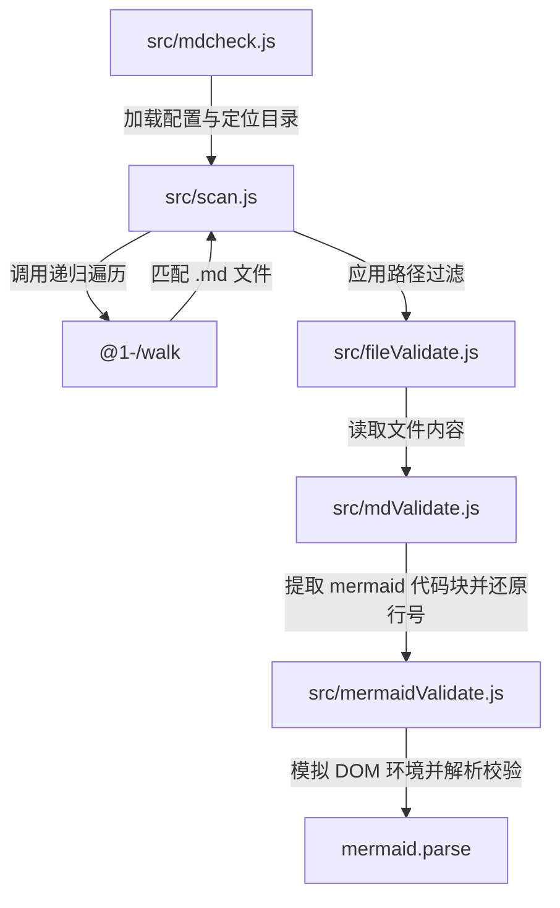

# mdcheck : 无需浏览器校验 Markdown 中的 Mermaid 语法

## 1. 功能介绍

- 递归扫描目录检索 Markdown 文件。
- 提取 `mermaid` 代码块。
- 模拟浏览器 DOM 环境，支持 Mermaid 引擎运行于 Node.js 或 Bun。
- 调用 Mermaid 官方解析器校验语法，免去启动 Headless 浏览器。
- 输出错误文件路径、行号及具体错误信息。
- 支持使用 JavaScript 配置文件排除特定文件与目录。

## 2. 使用演示

### 运行校验

```bash
bun x mdcheck [目录路径]
```

省略 `目录路径` 默认校验当前工作目录。

### 过滤配置

校验目录或其父目录创建 `.mdcheck.js` 配置文件：

```javascript
export default (relativePath) => {
  return relativePath.includes("exclude_dir");
};
```

## 3. 设计思路



## 4. 技术栈

- **Bun**: 运行环境与测试框架。
- **Mermaid**: 官方图表语法解析引擎。
- **Yargs**: 命令行参数解析工具。
- **@1-/walk**: 目录递归遍历工具。
- **@1-/md**: Markdown 解析与代码块提取工具。
- **@3-/log**: 终端日志格式化输出工具。

## 5. 代码结构

- `src/mdcheck.js`: 命令行入口，加载配置，格式化输出。
- `src/scan.js`: 递归扫描目录并应用过滤逻辑。
- `src/fileValidate.js`: 读取文件内容并触发校验。
- `src/mdValidate.js`: 提取 Markdown 内 Mermaid 代码块并还原行号。
- `src/mermaidValidate.js`: 模拟浏览器 DOM 环境并调用 Mermaid 校验。

## 6. 历史故事

Knut Sveidqvist 于 2014 年发起 Mermaid 项目，通过类似 Markdown 文本生成图表，实践“图表即代码”（Diagrams as Code）。项目于 2019 年获得 JS 开源奖（JS Open Source Awards）。

由于 Mermaid 依赖浏览器渲染 API 计算文本尺寸，官方命令行工具 `mermaid-cli` 需调用 Puppeteer 启动 Headless 浏览器。此方案增加启动开销，占用系统资源，降低 CI/CD 容器执行效率。

为突破此限制，社区探索 DOM 模拟方案。通过在 Node.js 或 Bun 全局注入 `window`、`document`、`DOMParser` 等桩对象，绕过浏览器渲染引擎初始化。Mermaid 解析器借此于终端环境实现毫秒级解析。本项目采用该方案，实现轻量化离线校验。
