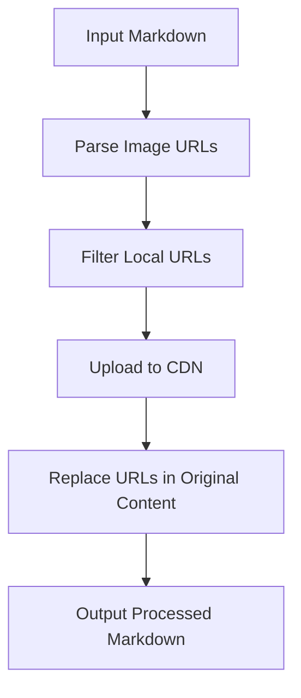
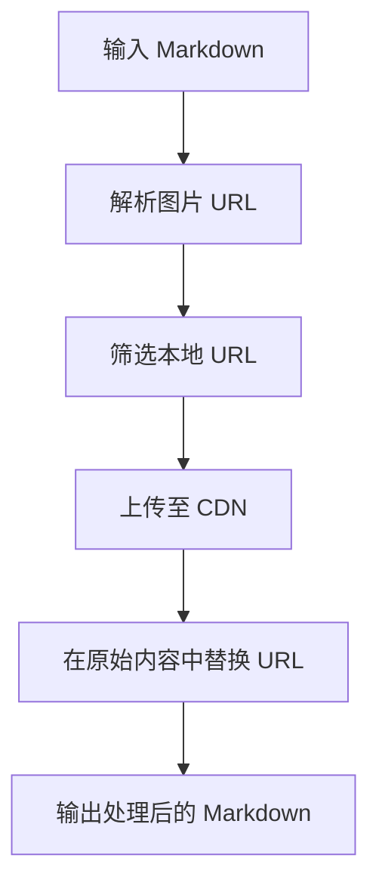

[English](#en) | [中文](#zh)

---

<a id="en"></a>

# @1-/mdimg2cdn : Convert local Markdown images to CDN URLs

- [@1-/mdimg2cdn : Convert local Markdown images to CDN URLs](#1-mdimg2cdn-convert-local-markdown-images-to-cdn-urls)
  - [Functionality](#functionality)
  - [Usage Demonstration](#usage-demonstration)
  - [Design Rationale](#design-rationale)
  - [Technology Stack](#technology-stack)
  - [Code Structure](#code-structure)
  - [Historical Context](#historical-context)
  - [About](#about)

## Functionality

@1-/mdimg2cdn processes Markdown documents to identify local image references and replaces them with CDN-hosted URLs. It handles both Markdown syntax (``) and HTML `` tags while intelligently skipping code blocks and inline code to avoid unintended replacements.

The tool integrates Mermaid diagram rendering by uploading generated SVG images to CDN storage, enabling consistent visual presentation across different environments.

## Usage Demonstration

Install as a CLI tool:

```bash
npm install -g @1-/mdimg2cdn
```

Process a Markdown file and output to stdout:

```bash
mdimg2cdn README.md
```

Write changes back to the original file:

```bash
mdimg2cdn README.md --write
```

As a library in JavaScript:

```javascript
import mdimg2cdn from "@1-/mdimg2cdn";

const processedMd = await mdimg2cdn(
  markdownContent,
  async (buffer, ext) => {
    // Your CDN upload logic here
    return "https://cdn.example.com/image.png";
  },
  "/path/to/base/directory"
);
```

## Design Rationale

The architecture follows a pipeline pattern with clear separation of concerns:



Key design decisions:

- State machine parsing for robust URL extraction from both Markdown and HTML syntax
- Code block and inline code detection to prevent false positives in code examples
- Mermaid integration for dynamic diagram rendering
- Asynchronous processing to handle file I/O and network operations efficiently

## Technology Stack

- Runtime: bun (ES modules)
- Core dependencies: `@1-/md/li.js`, `@1-/md/code.js`, `@1-/mdmermaid`, `@1-/read`, `@1-/findgit`, `@1-/github_cdn`
- CLI framework: yargs

## Code Structure

```
src/
├── _.js          # Main transformation function, orchestrates parsing, upload, and replacement
├── cli.js        # Command-line interface, handles arguments, path resolution, and config loading
└── parse.js      # State machines for extracting image URLs from Markdown and HTML
```

The core module (`_.js`) implements the main transformation algorithm, `cli.js` manages the CLI entry point and GitHub CDN configuration, and `parse.js` contains specialized state machines for precise URL extraction.

## Historical Context

The concept of content delivery networks emerged in the late 1990s. Akamai Technologies, founded in 1998, pioneered the CDN approach by distributing content across geographically dispersed edge servers to address web performance bottlenecks caused by geographic distance between users and origin servers. Akamai's foundational technology stemmed from research by MIT professor Tom Leighton and his team, whose algorithms optimized internet content routing and caching. Today's modern Markdown tooling like @1-/mdimg2cdn builds upon this foundational infrastructure, enabling developers to leverage CDN benefits without manual image management overhead.

## About

This library is developed by [WebC.site](https://webc.site).

[WebC.site](https://webc.site): A new paradigm of web development for AI

---

<a id="zh"></a>

# @1-/mdimg2cdn : 将本地 Markdown 图片转换为 CDN 链接

- [@1-/mdimg2cdn : 将本地 Markdown 图片转换为 CDN 链接](#1-mdimg2cdn-将本地-markdown-图片转换为-cdn-链接)
  - [功能介绍](#功能介绍)
  - [使用演示](#使用演示)
  - [设计思路](#设计思路)
  - [技术栈](#技术栈)
  - [代码结构](#代码结构)
  - [历史故事](#历史故事)
  - [关于](#关于)

## 功能介绍

@1-/mdimg2cdn 处理 Markdown 文档，识别本地图片引用并替换为 CDN 托管的 URL。支持 Markdown 语法（``）和 HTML `` 标签，同时智能跳过代码块与行内代码以避免错误替换。

工具集成 Mermaid 图表渲染，将生成的 SVG 图片上传至 CDN，确保在不同环境中呈现一致的视觉效果。

## 使用演示

作为 CLI 工具安装：

```bash
npm install -g @1-/mdimg2cdn
```

处理 Markdown 文件并输出到标准输出：

```bash
mdimg2cdn README.md
```

将更改写回原始文件：

```bash
mdimg2cdn README.md --write
```

在 JavaScript 中作为库使用：

```javascript
import mdimg2cdn from "@1-/mdimg2cdn";

const processedMd = await mdimg2cdn(
  markdownContent,
  async (buffer, ext) => {
    // 自定义 CDN 上传逻辑
    return "https://cdn.example.com/image.png";
  },
  "/path/to/base/directory"
);
```

## 设计思路

架构采用管道模式，关注点分离清晰：



关键设计考量：

- 状态机解析，确保从 Markdown 和 HTML 语法中稳健提取图片 URL
- 代码块与行内代码检测，防止在代码示例中产生误匹配
- Mermaid 集成，支持动态图表渲染
- 异步处理，高效管理文件 I/O 和网络操作

## 技术栈

- 运行时：bun（ES 模块）
- 核心依赖：`@1-/md/li.js`, `@1-/md/code.js`, `@1-/mdmermaid`, `@1-/read`, `@1-/findgit`, `@1-/github_cdn`
- CLI 框架：yargs

## 代码结构

```
src/
├── _.js          # 主转换函数，协调解析、上传与替换流程
├── cli.js        # 命令行接口，处理参数、路径解析与配置加载
└── parse.js      # Markdown 与 HTML 图片 URL 解析状态机
```

核心模块（`_.js`）实现主转换逻辑，`cli.js` 负责 CLI 入口与 GitHub CDN 配置加载，`parse.js` 提供专用状态机以精确提取图片 URL。

## 历史故事

内容分发网络（CDN）概念诞生于 20 世纪 90 年代末。1998 年成立的 Akamai Technologies 开创性地采用分布式边缘服务器架构部署 CDN，旨在解决因用户与源服务器地理距离导致的网页性能瓶颈。Akamai 的技术基础源于麻省理工学院教授 Tom Leighton 及其团队的研究，其算法有效优化了互联网内容的路由与缓存策略。如今 @1-/mdimg2cdn 等现代 Markdown 工具构建于这一基础设施之上，使开发者无需手动管理图片即可享受 CDN 带来的性能优势。

## 关于

本库由 [WebC.site](https://webc.site) 开发。

[WebC.site](https://webc.site) : 面向人工智能的网站开发新范式
