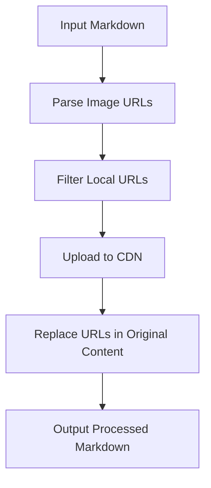

# @1-/mdimg2cdn : Convert local Markdown images to CDN URLs

## Functionality

@1-/mdimg2cdn processes Markdown documents to identify local image references and replaces them with CDN-hosted URLs. It handles both Markdown syntax (``) and HTML `` tags while intelligently skipping code blocks to avoid unintended replacements.

The tool supports Mermaid diagram rendering by uploading generated SVG images to CDN storage, enabling consistent visual presentation across different environments.

## Usage Demonstration

Install as a CLI tool:

```bash
npm install -g @1-/mdimg2cdn
```

Process a Markdown file and output to stdout:

```bash
mdimg2cdn README.md
```

Write changes back to the original file:

```bash
mdimg2cdn README.md --write
```

As a library in JavaScript:

```javascript
import mdimg2cdn from "@1-/mdimg2cdn";

const processedMd = await mdimg2cdn(
  markdownContent,
  async (buffer, ext) => {
    // Your CDN upload logic here
    return "https://cdn.example.com/image.png";
  },
  "/path/to/base/directory",
);
```

## Design Rationale

The architecture follows a pipeline pattern with clear separation of concerns:



Key design decisions:

- State machine parsing for robust URL extraction from both Markdown and HTML syntax
- Code block detection to prevent false positives in code examples
- Mermaid integration for dynamic diagram rendering
- Asynchronous processing to handle file I/O and network operations efficiently

## Technology Stack

- Runtime: bun (ES modules)
- Core dependencies: `@1-/md/li.js`, `@1-/md/code.js`, `@1-/mdmermaid`, `@1-/read`, `@1-/findgit`, `@1-/github_cdn`
- CLI framework: yargs

## Code Structure

```
src/
├── _.js          # Core transformation logic
├── cli.js        # Command-line interface
└── parse.js      # URL parsing state machines for Markdown and HTML
```

The core module (`_.js`) implements the main transformation algorithm, while `parse.js` contains specialized state machines for extracting image URLs from different syntax formats.

## Historical Context

The concept of content delivery networks emerged in the late 1990s to address web performance bottlenecks caused by geographic distance between users and origin servers. Akamai Technologies, founded in 1998, pioneered the CDN approach by distributing content across geographically dispersed edge servers. Today's modern Markdown tooling like @1-/mdimg2cdn builds upon this foundational infrastructure, enabling developers to leverage CDN benefits without manual image management overhead.
