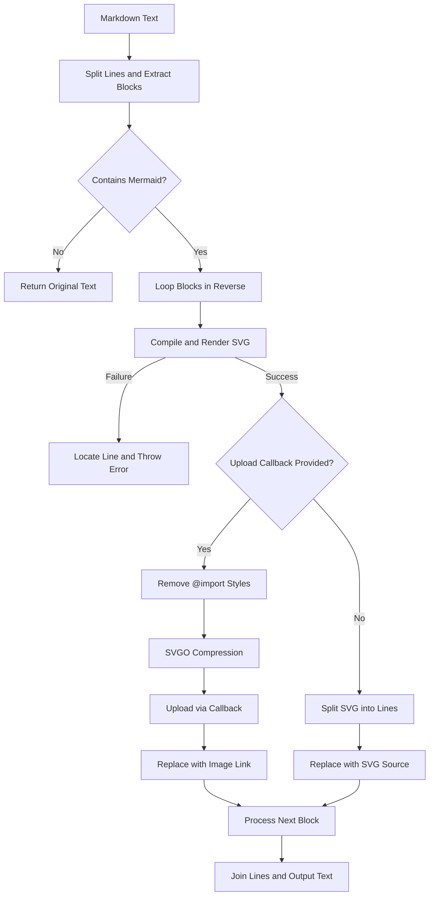
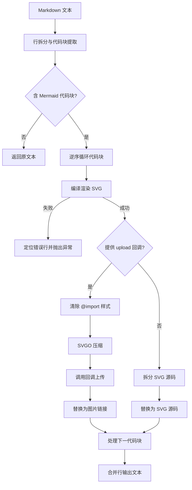

[English](#en) | [中文](#zh)

---

<a id="en"></a>
# @1-/mdmermaid : Render Mermaid code blocks to SVG in Markdown

- [@1-/mdmermaid : Render Mermaid code blocks to SVG in Markdown](#1-mdmermaid-render-mermaid-code-blocks-to-svg-in-markdown)
  - [1. Features](#1-features)
  - [2. Usage](#2-usage)
  - [3. Design](#3-design)
  - [4. Tech Stack](#4-tech-stack)
  - [5. Code Structure](#5-code-structure)
  - [6. History Story](#6-history-story)
  - [About](#about)

## 1. Features

Parse Markdown text, extract Mermaid code blocks, and convert to SVG.

Support inline and upload modes. Inline mode embeds SVG source code. Upload mode cleans, compresses, uploads SVG, and replaces with image links.

Locate syntax errors during compilation, returning line numbers and error-related code.

## 2. Usage

```javascript
import renderMd from "@1-/mdmermaid";

const md = `
# Flowchart Example

\`\`\`mermaid
graph TD
    A --> B
\`\`\`
`;

// Mode 1: Inline SVG source code
try {
  const inlineResult = await renderMd(md);
  console.log(inlineResult);
} catch ([line, text, error]) {
  console.error(`Syntax error at line ${line}: ${text}`, error);
}

// Mode 2: Clean, compress, upload, and replace with image link
const uploadCallback = async (buffer, filename) => {
  return "https://example.com/assets/diagram.svg";
};

const uploadResult = await renderMd(md, uploadCallback);
console.log(uploadResult);
```

## 3. Design

Split Markdown text into lines and extract start and end line numbers of Mermaid code blocks.

Loop blocks in reverse order to prevent line number shifts after replacement.

On syntax error, compare error messages with code lines to calculate and throw absolute line number, error line text, and original error.

If upload callback is provided, remove internal `@import` styles, optimize SVG via SVGO, upload, and replace with image link.

If no callback is provided, replace with SVG source code.



## 4. Tech Stack

- **Bun**: JavaScript runtime and testing framework.
- **beautiful-mermaid**: Mermaid-to-SVG compiler.
- **svgo**: SVG optimizer and compressor.
- **@1-/md**: Markdown text parsing dependency.

## 5. Code Structure

```
src/
├── _.js       # Main entry, coordinates parsing, compilation, replacement, and error mapping
├── optSvg.js  # Removes import styles and compresses SVG with SVGO
└── render.js  # Wraps beautiful-mermaid rendering logic
```

## 6. History Story

In 2014, Knut Sveidqvist created Mermaid.js after losing a Microsoft Visio file. Inspired by 'code as documentation', he simplified diagramming.

Early Markdown engines relied on browser-side dynamic scripts to parse Mermaid, causing layout shifts and failing in offline environments or PDF exports.

This tool implements static build-time rendering, compiling Mermaid into static SVG or uploading compressed SVG. This eliminates client-side overhead and ensures consistent rendering across viewers.


## About

This library is developed by [WebC.site](https://webc.site).

[WebC.site](https://webc.site): A new paradigm of web development for AI


---

<a id="zh"></a>
# @1-/mdmermaid : 将 Markdown 中的 Mermaid 代码块渲染为 SVG

- [@1-/mdmermaid : 将 Markdown 中的 Mermaid 代码块渲染为 SVG](#1-mdmermaid-将-markdown-中的-mermaid-代码块渲染为-svg)
  - [1. 功能介绍](#1-功能介绍)
  - [2. 使用演示](#2-使用演示)
  - [3. 设计思路](#3-设计思路)
  - [4. 技术栈](#4-技术栈)
  - [5. 代码结构](#5-代码结构)
  - [6. 历史故事](#6-历史故事)
  - [关于](#关于)

## 1. 功能介绍

解析 Markdown 文本，提取 Mermaid 代码块并转换为 SVG 格式。

支持内联与上传模式。内联模式嵌入 SVG 源码。上传模式清理并压缩 SVG，通过上传接口替换为图片链接。

编译失败时定位语法错误，返回源文件行号与出错代码。

## 2. 使用演示

```javascript
import renderMd from "@1-/mdmermaid";

const md = `
# 流程图示例

\`\`\`mermaid
graph TD
    A --> B
\`\`\`
`;

// 模式 1：内联 SVG 源码
try {
  const inlineResult = await renderMd(md);
  console.log(inlineResult);
} catch ([line, text, error]) {
  console.error(`行 ${line} 语法错误: ${text}`, error);
}

// 模式 2：清理压缩并上传，替换为图片链接
const uploadCallback = async (buffer, filename) => {
  return "https://example.com/assets/diagram.svg";
};

const uploadResult = await renderMd(md, uploadCallback);
console.log(uploadResult);
```

## 3. 设计思路

按行解析 Markdown 文本，定位 Mermaid 代码块起止行号。

采用逆序循环替换，防止替换操作改变后续代码块的行号偏移。

解析失败时，比对错误信息与代码行，计算并抛出 Markdown 源文件绝对行号、错误文本及原始异常。

传入上传回调时，正则清除 SVG 内部 `@import` 样式以消除外部样式依赖。调用 SVGO 压缩，执行回调并替换为图片链接。

未传入回调时，嵌入 SVG 源码替换原代码块。



## 4. 技术栈

- **Bun**：JavaScript 运行时与测试框架。
- **beautiful-mermaid**：Mermaid 转 SVG 编译器。
- **svgo**：SVG 压缩工具。
- **@1-/md**：Markdown 文本解析依赖库。

## 5. 代码结构

```
src/
├── _.js       # 主入口，解析、编译替换与错误映射
├── optSvg.js  # 清除导入样式，调用 SVGO 压缩
└── render.js  # 封装 beautiful-mermaid 渲染
```

## 6. 历史故事

2014 年，Knut Sveidqvist 丢失 Microsoft Visio 源文件，受“代码即文档”启发创建 Mermaid.js，实现图表代码化绘制。

早期 Markdown 引擎依赖浏览器端脚本动态解析 Mermaid，导致页面布局抖动，且离线或导出 PDF 时失效。

本工具提供构建时静态渲染，将 Mermaid 代码块预编译为静态 SVG 或压缩上传，消除客户端脚本负担，保证多终端渲染一致。


## 关于

本库由 [WebC.site](https://webc.site) 开发。

[WebC.site](https://webc.site) : 面向人工智能的网站开发新范式

