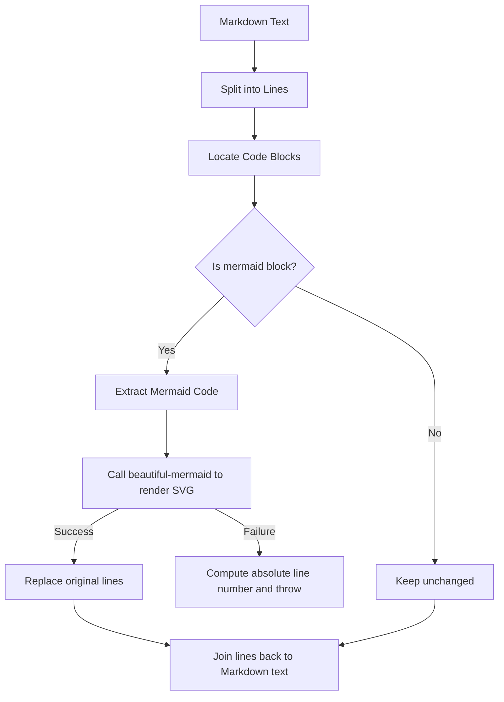
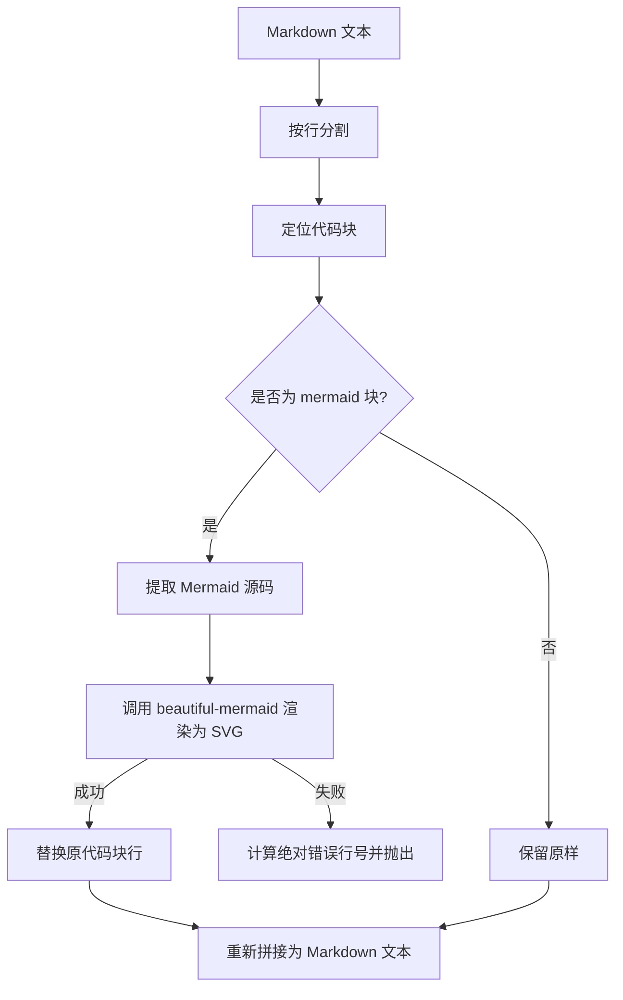

[English](#en) | [中文](#zh)

---

<a id="en"></a>
# @1-/mdmermaid : Render Mermaid code blocks to SVG in Markdown

## 1. Features

Parses Markdown text, extracts Mermaid code blocks, renders them to SVG via `beautiful-mermaid`, and replaces original code blocks.
Supports syntax error positioning, throwing error line number, line content, and error details upon rendering failure.

## 2. Usage

```javascript
import renderMd from "@1-/mdmermaid";

const md = `
# Flowchart

\`\`\`mermaid
graph TD
    A --> B
\`\`\`
`;

try {
  const result = await renderMd(md);
  console.log(result);
} catch ([line, text, error]) {
  console.error(`Syntax error at line \${line}: \${text}`, error);
}
```

## 3. Design

The process combines line-based parsing and block extraction. Markdown is split into lines to locate all code blocks. Blocks of type `mermaid` are extracted and rendered to SVG. Successful render results replace original lines. Failure computes absolute error line number in Markdown file and throws exception.



## 4. Tech Stack

- **Bun**: Runtime and test runner
- **beautiful-mermaid**: Mermaid diagram rendering engine
- **@1-/md**: Markdown line parsing and code block extraction utility

## 5. Codebase Structure

```
src/
├── _.js       # Entry point, parses Markdown and replaces Mermaid blocks
└── render.js   # Wraps beautiful-mermaid render logic
```

## 6. History Story

In early Markdown rendering ecosystems, Mermaid flowcharts relied on frontend browsers loading `mermaid.js` scripts asynchronously for dynamic rendering. This caused noticeable layout shifts and white screens during page load, rendering diagrams unusable in offline or PDF export scenarios.
To address this limitation, this tool uses server-side/compile-time static rendering. Mermaid blocks are translated directly into inline SVG during Markdown compilation, ensuring instant visual presentation and seamless static document viewing.
---

[WebC.site](https://webc.site) : A new paradigm of web development for AI

---

<a id="zh"></a>
# @1-/mdmermaid : 将 Markdown 中的 Mermaid 代码块渲染为 SVG

## 1. 功能介绍

解析 Markdown 文本，提取其中 Mermaid 格式代码块，调用 `beautiful-mermaid` 渲染为 SVG，并替换原代码块。
支持语法错误定位，渲染失败时抛出错误行号、该行内容及错误详情。

## 2. 使用演示

```javascript
import renderMd from "@1-/mdmermaid";

const md = `
# 流程图

\`\`\`mermaid
graph TD
    A --> B
\`\`\`
`;

try {
  const result = await renderMd(md);
  console.log(result);
} catch ([line, text, error]) {
  console.error(`第 \${line} 行语法错误: \${text}`, error);
}
```

## 3. 设计思路

系统采用行解析与块提取相结合方式。先将 Markdown 拆分为行数组，定位所有代码块；若代码块类型为 `mermaid`，则截取其内容进行 SVG 渲染；渲染成功后用新生成的 SVG 文本行替换原 Mermaid 代码块；若解析失败，则根据相对偏移量计算出源 Markdown 文件中的绝对错误行号，并向外抛出异常。



## 4. 技术栈

- **Bun**: 运行时与测试框架
- **beautiful-mermaid**: Mermaid 图表渲染引擎
- **@1-/md**: Markdown 行解析及代码块提取工具

## 5. 代码结构

```
src/
├── _.js       # 主入口，解析 Markdown 并替换 Mermaid 代码块
└── render.js   # 封装 beautiful-mermaid 渲染逻辑
```

## 6. 历史故事

在早期 Markdown 渲染生态中，Mermaid 流程图通常依赖前端浏览器异步加载 `mermaid.js` 脚本进行动态渲染。这导致页面首次加载时出现明显的白屏和闪烁问题，且在无网、离线导出 PDF 等场景下无法正常显示图表。
为了解决这个痛点，本工具采用服务端/构建时静态渲染方案，在 Markdown 编译阶段直接将 Mermaid 代码块转译为内联 SVG，保证页面即开即现，提供无缝的静态文档阅读体验。
---

[WebC.site](https://webc.site) : 面向人工智能的网站开发新范式
