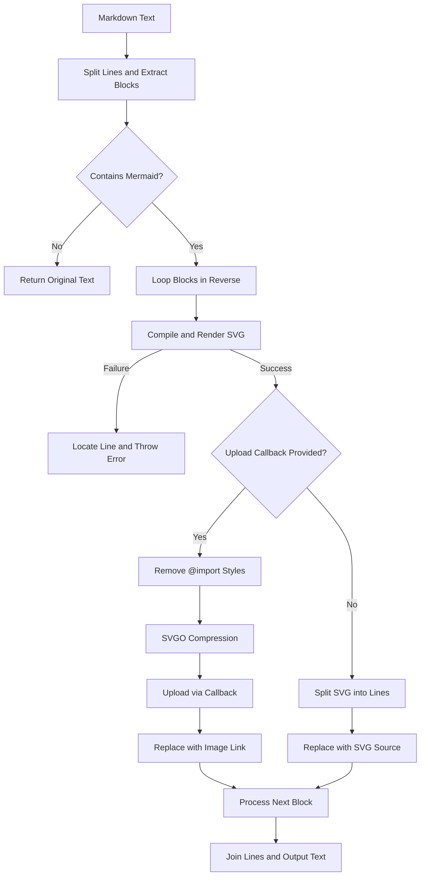

# @1-/mdmermaid : Render Mermaid code blocks to SVG in Markdown

## 1. Features

Parse Markdown text, extract Mermaid code blocks, and convert to SVG.

Support inline and upload modes. Inline mode embeds SVG source code. Upload mode cleans, compresses, uploads SVG, and replaces with image links.

Locate syntax errors during compilation, returning line numbers and error-related code.

## 2. Usage

```javascript
import renderMd from "@1-/mdmermaid";

const md = `
# Flowchart Example

\`\`\`mermaid
graph TD
    A --> B
\`\`\`
`;

// Mode 1: Inline SVG source code
try {
  const inlineResult = await renderMd(md);
  console.log(inlineResult);
} catch ([line, text, error]) {
  console.error(`Syntax error at line ${line}: ${text}`, error);
}

// Mode 2: Clean, compress, upload, and replace with image link
const uploadCallback = async (buffer, filename) => {
  return "https://example.com/assets/diagram.svg";
};

const uploadResult = await renderMd(md, uploadCallback);
console.log(uploadResult);
```

## 3. Design

Split Markdown text into lines and extract start and end line numbers of Mermaid code blocks.

Loop blocks in reverse order to prevent line number shifts after replacement.

On syntax error, compare error messages with code lines to calculate and throw absolute line number, error line text, and original error.

If upload callback is provided, remove internal `@import` styles, optimize SVG via SVGO, upload, and replace with image link.

If no callback is provided, replace with SVG source code.



## 4. Tech Stack

- **Bun**: JavaScript runtime and testing framework.
- **beautiful-mermaid**: Mermaid-to-SVG compiler.
- **svgo**: SVG optimizer and compressor.
- **@1-/md**: Markdown text parsing dependency.

## 5. Code Structure

```
src/
├── _.js       # Main entry, coordinates parsing, compilation, replacement, and error mapping
├── optSvg.js  # Removes import styles and compresses SVG with SVGO
└── render.js  # Wraps beautiful-mermaid rendering logic
```

## 6. History Story

In 2014, Knut Sveidqvist created Mermaid.js after losing a Microsoft Visio file. Inspired by 'code as documentation', he simplified diagramming.

Early Markdown engines relied on browser-side dynamic scripts to parse Mermaid, causing layout shifts and failing in offline environments or PDF exports.

This tool implements static build-time rendering, compiling Mermaid into static SVG or uploading compressed SVG. This eliminates client-side overhead and ensures consistent rendering across viewers.
