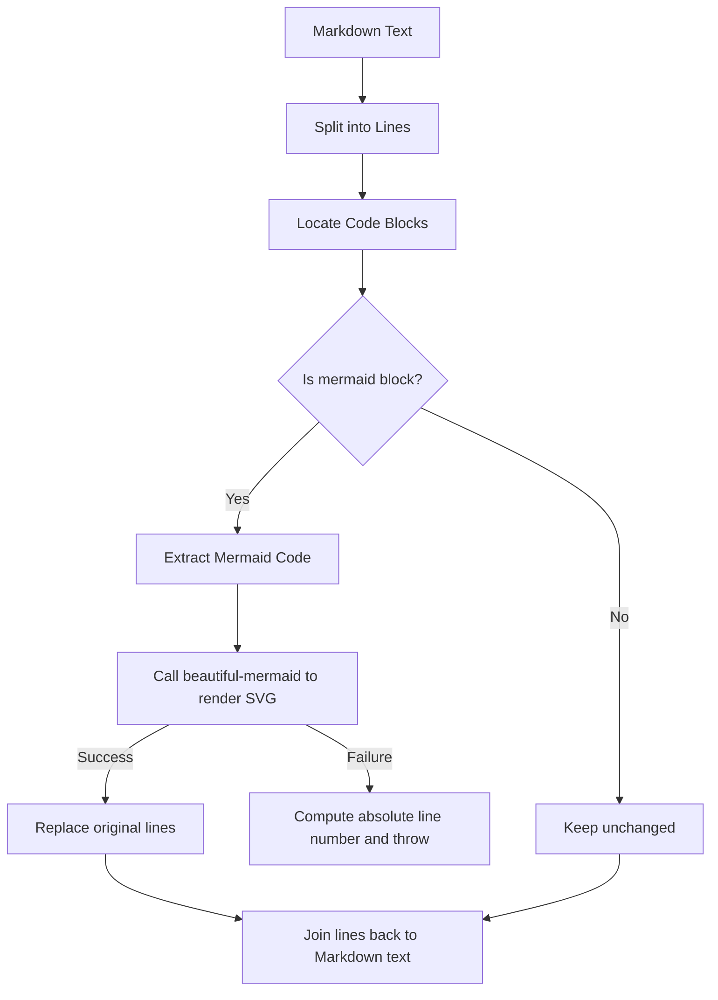

# @1-/mdmermaid : Render Mermaid code blocks to SVG in Markdown

## 1. Features

Parses Markdown text, extracts Mermaid code blocks, renders them to SVG via `beautiful-mermaid`, and replaces original code blocks.
Supports syntax error positioning, throwing error line number, line content, and error details upon rendering failure.

## 2. Usage

```javascript
import renderMd from "@1-/mdmermaid";

const md = `
# Flowchart

\`\`\`mermaid
graph TD
    A --> B
\`\`\`
`;

try {
  const result = await renderMd(md);
  console.log(result);
} catch ([line, text, error]) {
  console.error(`Syntax error at line \${line}: \${text}`, error);
}
```

## 3. Design

The process combines line-based parsing and block extraction. Markdown is split into lines to locate all code blocks. Blocks of type `mermaid` are extracted and rendered to SVG. Successful render results replace original lines. Failure computes absolute error line number in Markdown file and throws exception.



## 4. Tech Stack

- **Bun**: Runtime and test runner
- **beautiful-mermaid**: Mermaid diagram rendering engine
- **@1-/md**: Markdown line parsing and code block extraction utility

## 5. Codebase Structure

```
src/
├── _.js       # Entry point, parses Markdown and replaces Mermaid blocks
└── render.js   # Wraps beautiful-mermaid render logic
```

## 6. History Story

In early Markdown rendering ecosystems, Mermaid flowcharts relied on frontend browsers loading `mermaid.js` scripts asynchronously for dynamic rendering. This caused noticeable layout shifts and white screens during page load, rendering diagrams unusable in offline or PDF export scenarios.
To address this limitation, this tool uses server-side/compile-time static rendering. Mermaid blocks are translated directly into inline SVG during Markdown compilation, ensuring instant visual presentation and seamless static document viewing.
