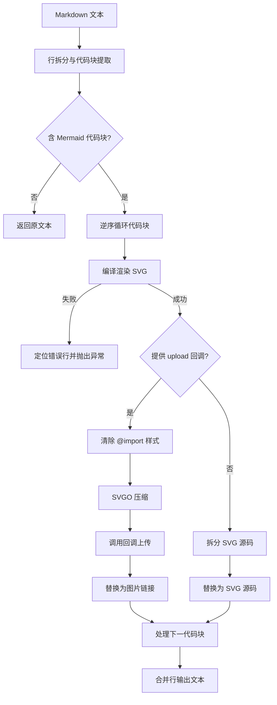

# @1-/mdmermaid : 将 Markdown 中的 Mermaid 代码块渲染为 SVG

## 1. 功能介绍

解析 Markdown 文本，提取 Mermaid 代码块并转换为 SVG 格式。

支持内联与上传模式。内联模式嵌入 SVG 源码。上传模式清理并压缩 SVG，通过上传接口替换为图片链接。

编译失败时定位语法错误，返回源文件行号与出错代码。

## 2. 使用演示

```javascript
import renderMd from "@1-/mdmermaid";

const md = `
# 流程图示例

\`\`\`mermaid
graph TD
    A --> B
\`\`\`
`;

// 模式 1：内联 SVG 源码
try {
  const inlineResult = await renderMd(md);
  console.log(inlineResult);
} catch ([line, text, error]) {
  console.error(`行 ${line} 语法错误: ${text}`, error);
}

// 模式 2：清理压缩并上传，替换为图片链接
const uploadCallback = async (buffer, filename) => {
  return "https://example.com/assets/diagram.svg";
};

const uploadResult = await renderMd(md, uploadCallback);
console.log(uploadResult);
```

## 3. 设计思路

按行解析 Markdown 文本，定位 Mermaid 代码块起止行号。

采用逆序循环替换，防止替换操作改变后续代码块的行号偏移。

解析失败时，比对错误信息与代码行，计算并抛出 Markdown 源文件绝对行号、错误文本及原始异常。

传入上传回调时，正则清除 SVG 内部 `@import` 样式以消除外部样式依赖。调用 SVGO 压缩，执行回调并替换为图片链接。

未传入回调时，嵌入 SVG 源码替换原代码块。



## 4. 技术栈

- **Bun**：JavaScript 运行时与测试框架。
- **beautiful-mermaid**：Mermaid 转 SVG 编译器。
- **svgo**：SVG 压缩工具。
- **@1-/md**：Markdown 文本解析依赖库。

## 5. 代码结构

```
src/
├── _.js       # 主入口，解析、编译替换与错误映射
├── optSvg.js  # 清除导入样式，调用 SVGO 压缩
└── render.js  # 封装 beautiful-mermaid 渲染
```

## 6. 历史故事

2014 年，Knut Sveidqvist 丢失 Microsoft Visio 源文件，受“代码即文档”启发创建 Mermaid.js，实现图表代码化绘制。

早期 Markdown 引擎依赖浏览器端脚本动态解析 Mermaid，导致页面布局抖动，且离线或导出 PDF 时失效。

本工具提供构建时静态渲染，将 Mermaid 代码块预编译为静态 SVG 或压缩上传，消除客户端脚本负担，保证多终端渲染一致。
