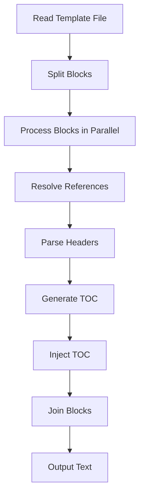
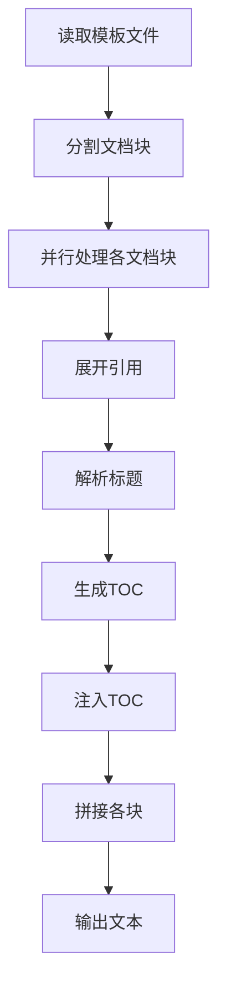

[English](#en) | [中文](#zh)

---

<a id="en"></a>

# @1-/mdt : Render Markdown templates and generate hierarchical TOC

- [1. Features](#1-features)
- [2. Usage Demonstration](#2-usage-demonstration)
  - [API Usage](#api-usage)
  - [CLI Tool](#cli-tool)
  - [Template Example (README.mdt)](#template-example-readmemdt)
- [3. Design Idea](#3-design-idea)
- [4. Tech Stack](#4-tech-stack)
- [5. Code Structure](#5-code-structure)
- [6. History](#6-history)
- [About](#about)

## 1. Features

`mdt` parses Markdown template files with recursive assembly and automated TOC generation to solve multi-file documentation maintenance challenges.

- **Recursive Assembly**: Imports external Markdown files using `<+ relative_path >` syntax with nested support; missing files generate warnings but processing continues
- **Block Rendering**: Splits documents by `---` into independent blocks for isolated processing
- **Hierarchical TOC**: Extracts headers level 2 and above within each block to build indented tables of contents, skipping headers inside all types of code blocks (including language-specific blocks)
- **Automatic Injection**: Inserts generated TOC directly before the first level-2+ header of each block at optimal whitespace position
- **Anchor Conversion**: Translates header text into standardized Markdown anchor links with full Unicode character support (Chinese, Japanese, etc.), using Unicode-aware regex processing

## 2. Usage Demonstration

### API Usage

Import the main module and pass template path and package root directory:

```javascript
import render from "@1-/mdt";

const result = await render("path/to/README.mdt", "path/to/package");
console.log(result);
```

### CLI Tool

Run `mdt` to process `.mdt` template files and generate corresponding `.md` documents:

```bash
# Process all .mdt files in current directory
bun run mdt

# Process specified file (generates README.md)
bun run mdt README.mdt

# Process specified directory
bun run mdt ./docs
```

### Template Example (README.mdt)

```markdown
# Module Name

<+ ./docs/intro.md >

---

# Detailed Design

<+ ./docs/design.md >
```

## 3. Design Idea

The system splits templates by `---` into independent blocks, processes each block through recursive expansion, header parsing, TOC generation, and injection, then joins the results.


```mermaid
graph TD
    Start[Read Template File]
    Split[Split Blocks]
    Map[Process Blocks in Parallel]
    Expand[Resolve References]
    Parse[Parse Headers]
    GenTOC[Generate TOC]
    Inject[Inject TOC]
    Join[Join Blocks]
    End[Output Text]

    Start --> Split
    Split --> Map
    Map --> Expand
    Expand --> Parse
    Parse --> GenTOC
    GenTOC --> Inject
    Inject --> Join
    Join --> End
```

## 4. Tech Stack

- Runtime: [Bun](https://bun.sh/)
- Core Dependencies:
  - `@1-/md`: Markdown line processing utility (includes code block detection)
  - `@1-/read`: Asynchronous file reading
  - `@1-/walk`: Directory traversal
  - `@3-/log`: Logging utility
  - `yargs`: Command-line argument parsing

## 5. Code Structure

```
src/
├── _.js            # Main entry point, splits blocks and coordinates rendering
├── blockRender.js  # Block-level renderer coordinator
├── linesRender.js  # Recursive resolver for `<+ path >` syntax (with missing file warnings)
├── headerParse.js  # Header parser (uses regex matching, skips all code block types)
├── tocGen.js       # Hierarchical TOC generator (level 2+ headers only)
├── tocInject.js    # TOC injector (intelligent insertion positioning)
├── anchor.js       # Header-to-anchor converter (Unicode support, uses \p{L}\p{N} regex)
└── mdt.js          # CLI tool entry point
```

## 6. History

In 2004, John Gruber and Aaron Swartz designed Markdown to enable writing human-readable plain text documents that convert to HTML. As software engineering scaled, technical documentation evolved into complex cross-language, cross-module file trees.

Monolithic Markdown files cause merge conflicts and retrieval difficulties; splitting documents into multiple files breaks table of contents navigation, anchor consistency, and relative links. `mdt` provides a lightweight solution, avoiding static site generator configuration overhead, with template assembly syntax and block-level TOC generation—enabling developers to focus on content while the tool handles anchor calculation, hierarchy generation, and template assembly.

## About

This library is developed by [WebC.site](https://webc.site).

[WebC.site](https://webc.site): A new paradigm of web development for AI

---

<a id="zh"></a>

# @1-/mdt : Render Markdown templates and generate hierarchical TOC

- [1. 功能介绍](#1-功能介绍)
- [2. 使用演示](#2-使用演示)
  - [API 调用](#api-调用)
  - [命令行工具](#命令行工具)
  - [模板示例 (README.mdt)](#模板示例-readmemdt)
- [3. 设计思路](#3-设计思路)
- [4. 技术栈](#4-技术栈)
- [5. 代码结构](#5-代码结构)
- [6. 历史故事](#6-历史故事)
- [关于](#关于)

## 1. 功能介绍

`mdt` 解析 Markdown 模板文件，支持递归拼接与自动化目录生成，解决多文件文档维护痛点。

- **递归拼接**：使用 `<+ 相对路径 >` 语法导入外部 Markdown 文件，支持多层嵌套，缺失文件时输出警告但继续处理
- **分块渲染**：以 `---` 分割文档为独立块，各块独立解析与渲染
- **层级目录**：提取各块内二级及以上标题生成缩进式 TOC，跳过代码块内标题（包括各种语言的代码块）
- **自动注入**：将生成的 TOC 插入至各块首个二级及以上标题前的最优空白位置
- **锚点转换**：标题文本自动转换为标准化 Markdown 锚点链接，支持 Unicode 字符（中文、日文等），使用 Unicode-aware regex 处理特殊字符

## 2. 使用演示

### API 调用

导入主模块并传入模板路径与包根路径：

```javascript
import render from "@1-/mdt";

const result = await render("path/to/README.mdt", "path/to/package");
console.log(result);
```

### 命令行工具

运行 `mdt` 处理 `.mdt` 模板文件，生成对应 `.md` 文档：

```bash
# 处理当前目录所有 .mdt 文件
bun run mdt

# 处理指定文件（生成 README.md）
bun run mdt README.mdt

# 处理指定目录
bun run mdt ./docs
```

### 模板示例 (README.mdt)

```markdown
# 模块名称

<+ ./docs/intro.md >

---

# 详细设计

<+ ./docs/design.md >
```

## 3. 设计思路

系统按 `---` 分割模板为独立块，对每块执行递归展开、标题解析、TOC 生成与注入流程，最终拼接输出。


```mermaid
graph TD
    Start[读取模板文件]
    Split[分割文档块]
    Map[并行处理各文档块]
    Expand[展开引用]
    Parse[解析标题]
    GenTOC[生成TOC]
    Inject[注入TOC]
    Join[拼接各块]
    End[输出文本]

    Start --> Split
    Split --> Map
    Map --> Expand
    Expand --> Parse
    Parse --> GenTOC
    GenTOC --> Inject
    Inject --> Join
    Join --> End
```

## 4. 技术栈

- 运行时：[Bun](https://bun.sh/)
- 核心依赖：
  - `@1-/md`: Markdown 行处理工具（含代码 block 检测）
  - `@1-/read`: 异步文件读取
  - `@1-/walk`: 目录遍历
  - `@3-/log`: 日志输出
  - `yargs`: 命令行参数解析

## 5. 代码结构

```
src/
├── _.js            # 主入口，分割文档块并协调渲染
├── blockRender.js  # 块级渲染协调器
├── linesRender.js  # 递归处理 `<+ 路径 >` 引用（含缺失文件警告）
├── headerParse.js  # 标题解析（使用正则匹配，跳过所有类型代码块）
├── tocGen.js       # 层级 TOC 生成器（仅处理二级及以上标题）
├── tocInject.js    # TOC 注入器（智能定位插入位置）
├── anchor.js       # 标题到锚点转换（Unicode 支持，使用 \p{L}\p{N} 正则）
└── mdt.js          # CLI 工具入口
```

## 6. 历史故事

2004年 John Gruber 与 Aaron Swartz 设计 Markdown，以纯文本编写易读文档并转换为 HTML。随着软件工程规模扩张，技术文档演变为跨语言、跨模块的复杂文件树。

单体 Markdown 文件导致协作冲突与检索困难；多文件拆分则破坏目录导航、锚点一致性与相对链接。`mdt` 提供轻量级解决方案，避免静态网站生成器配置开销，通过模板拼接语法与自动化块级 TOC 生成，使开发者专注文档内容，系统处理锚点计算、层级生成与模板组装。

## 关于

本库由 [WebC.site](https://webc.site) 开发。

[WebC.site](https://webc.site) : 面向人工智能的网站开发新范式
