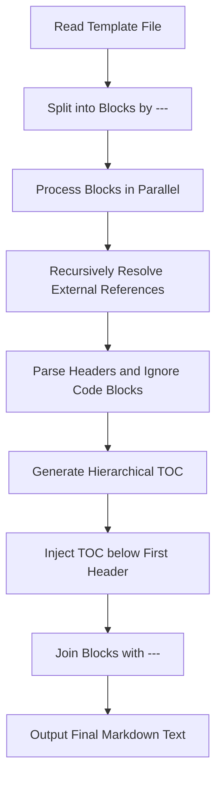

# @1-/mdt : Recursively assemble Markdown templates and generate hierarchical TOC

## 1. Features

`mdt` parses and assembles Markdown templates with the following capabilities:

- **Recursive Assembly**: Imports external Markdown files using `<+ relative_path >` syntax with nested support

- **Block Rendering**: Splits documents by `---` into independent blocks for isolated rendering

- **TOC Generation**: Extracts headers within each document block to build hierarchical tables of contents with indentation

- **TOC Injection**: Inserts the generated TOC directly below the first header of each block

- **Code Block Bypass**: Ignores headers inside code blocks to prevent parsing errors

- **Anchor Translation**: Translates header text into compliant Markdown anchor links

## 2. Usage Demonstration

### API Usage

Import `mdt` and pass the template path and the package base directory:

```javascript
import renderMdt from "@1-/mdt";

const result = await renderMdt("path/to/README.mdt", "path/to/package");
console.log(result);
```

### CLI Tool

Run `mdt` directly to process all `.mdt` files in the current directory, or target specific paths:

```bash
# Scan current directory and process all .mdt files
bun x mdt

# Process specified file
bun x mdt README.mdt

# Process specified directory
bun x mdt ./docs
```

### Template Example (README.mdt)

```markdown
# Module Name

<+ ./docs/intro.md >

---

# Detailed Design

<+ ./docs/design.md >
```

## 3. Design Idea

The system splits the input template by `---` into independent blocks, processes them in parallel to recursively expand template references, parses headers to generate a hierarchical TOC for each block, and joins them back for final output.



## 4. Tech Stack

- Runtime: [Bun](https://bun.sh/)

- Dependencies:
  - `@1-/md`: Normalizes Markdown newlines
  - `@1-/read`: Asynchronous file reader utility
  - `@1-/walk`: Directory file traversal utility
  - `@3-/log`: Console logging and warning utility
  - `yargs`: Command-line arguments parser

## 5. Code Structure

```
src/
├── _.js            # Entry point, splits blocks and coordinates rendering
├── blockRender.js  # Block renderer coordinating resolution, parsing, generation, and injection
├── linesRender.js  # Recursive line-by-line resolver for <+ relative_path > syntax
├── headerParse.js  # Header parser excluding headers inside code blocks
├── tocGen.js       # Indented TOC generator based on header levels
├── tocInject.js    # TOC injector inserting lists after the first header
└── anchor.js       # Header to URL anchor converter
```

## 6. History

In 2004, John Gruber and Aaron Swartz designed Markdown, enabling writing documents in easy-to-read plain text and converting to HTML. As software engineering scaled, technical documentation evolved from single files into complex file trees covering multiple languages and sub-modules.

Maintaining single-file documentation causes merge conflicts and retrieval difficulties. However, dividing documents into multiple separate files breaks table of contents navigation, anchor consistency, and relative links across chunks.

`mdt` addresses these issues directly. Avoiding the overhead of static site generators, it offers a lightweight assembly syntax with block-level TOC generation. Developers write isolated document fragments while the tool handles anchor calculation, hierarchy generation, and template assembly.
