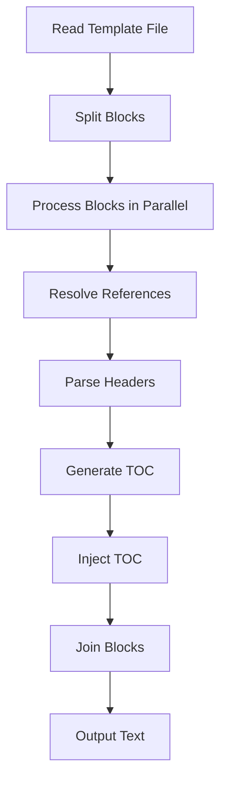

# @1-/mdt : Render Markdown templates and generate hierarchical TOC

## 1. Features

`mdt` parses Markdown template files with recursive assembly and automated TOC generation to solve multi-file documentation maintenance challenges.

- **Recursive Assembly**: Imports external Markdown files using `<+ relative_path >` syntax with nested support; missing files generate warnings but processing continues
- **Block Rendering**: Splits documents by `---` into independent blocks for isolated processing
- **Hierarchical TOC**: Extracts headers level 2 and above within each block to build indented tables of contents, skipping headers inside all types of code blocks (including language-specific blocks)
- **Automatic Injection**: Inserts generated TOC directly before the first level-2+ header of each block at optimal whitespace position
- **Anchor Conversion**: Translates header text into standardized Markdown anchor links with full Unicode character support (Chinese, Japanese, etc.), using Unicode-aware regex processing

## 2. Usage Demonstration

### API Usage

Import the main module and pass template path and package root directory:

```javascript
import render from "@1-/mdt";

const result = await render("path/to/README.mdt", "path/to/package");
console.log(result);
```

### CLI Tool

Run `mdt` to process `.mdt` template files and generate corresponding `.md` documents:

```bash
# Process all .mdt files in current directory
bun run mdt

# Process specified file (generates README.md)
bun run mdt README.mdt

# Process specified directory
bun run mdt ./docs
```

### Template Example (README.mdt)

```markdown
# Module Name

<+ ./docs/intro.md >

---

# Detailed Design

<+ ./docs/design.md >
```

## 3. Design Idea

The system splits templates by `---` into independent blocks, processes each block through recursive expansion, header parsing, TOC generation, and injection, then joins the results.


```mermaid
graph TD
    Start[Read Template File]
    Split[Split Blocks]
    Map[Process Blocks in Parallel]
    Expand[Resolve References]
    Parse[Parse Headers]
    GenTOC[Generate TOC]
    Inject[Inject TOC]
    Join[Join Blocks]
    End[Output Text]

    Start --> Split
    Split --> Map
    Map --> Expand
    Expand --> Parse
    Parse --> GenTOC
    GenTOC --> Inject
    Inject --> Join
    Join --> End
```

## 4. Tech Stack

- Runtime: [Bun](https://bun.sh/)
- Core Dependencies:
  - `@1-/md`: Markdown line processing utility (includes code block detection)
  - `@1-/read`: Asynchronous file reading
  - `@1-/walk`: Directory traversal
  - `@3-/log`: Logging utility
  - `yargs`: Command-line argument parsing

## 5. Code Structure

```
src/
├── _.js            # Main entry point, splits blocks and coordinates rendering
├── blockRender.js  # Block-level renderer coordinator
├── linesRender.js  # Recursive resolver for `<+ path >` syntax (with missing file warnings)
├── headerParse.js  # Header parser (uses regex matching, skips all code block types)
├── tocGen.js       # Hierarchical TOC generator (level 2+ headers only)
├── tocInject.js    # TOC injector (intelligent insertion positioning)
├── anchor.js       # Header-to-anchor converter (Unicode support, uses \p{L}\p{N} regex)
└── mdt.js          # CLI tool entry point
```

## 6. History

In 2004, John Gruber and Aaron Swartz designed Markdown to enable writing human-readable plain text documents that convert to HTML. As software engineering scaled, technical documentation evolved into complex cross-language, cross-module file trees.

Monolithic Markdown files cause merge conflicts and retrieval difficulties; splitting documents into multiple files breaks table of contents navigation, anchor consistency, and relative links. `mdt` provides a lightweight solution, avoiding static site generator configuration overhead, with template assembly syntax and block-level TOC generation—enabling developers to focus on content while the tool handles anchor calculation, hierarchy generation, and template assembly.
