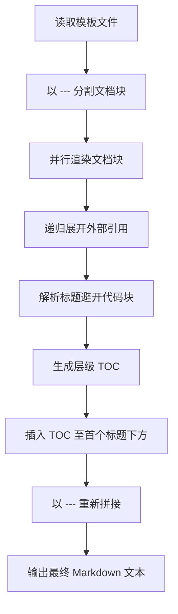

# @1-/mdt : 递归拼接 Markdown 模板并生成层级 TOC

## 1. 功能介绍

`mdt` 解析与拼接 Markdown 模板，具有以下特性：

- **递归拼接**：使用 `<+ 相对路径 >` 语法导入外部 Markdown 文件，支持多层嵌套

- **分块渲染**：使用 `---` 分割文档块，各块采用独立上下文进行渲染

- **目录生成**：提取文档块内标题，生成具有缩进层级的 TOC 目录

- **目录插入**：自动将生成的 TOC 目录插入至文档块首个标题下方

- **过滤代码块**：提取标题时忽略代码块，防止误判

- **锚点转换**：标题文本转换为 Markdown 锚点链接

## 2. 使用演示

### API 调用

引入 `mdt` 并传入模板路径与项目根路径：

```javascript
import renderMdt from "@1-/mdt";

const result = await renderMdt("path/to/README.mdt", "path/to/package");
console.log(result);
```

### 命令行工具

运行 `mdt` 处理当前目录下 `.mdt` 文件，或指定路径：

```bash
# 处理当前目录所有 .mdt 文件
bun x mdt

# 处理指定文件
bun x mdt README.mdt

# 处理指定目录
bun x mdt ./docs
```

### 模板示例 (README.mdt)

```markdown
# 模块名称

<+ ./docs/intro.md >

---

# 详细设计

<+ ./docs/design.md >
```

## 3. 设计思路

系统以 `---` 将文档分割为独立数据块，并行渲染各数据块并递归展开外部模板，解析标题生成层级目录并自动插入，拼接输出最终的文档。



## 4. 技术栈

- 运行时：[Bun](https://bun.sh/)

- 依赖库：
  - `@1-/md`：格式化 Markdown 换行
  - `@1-/read`：异步读取文件
  - `@1-/walk`：遍历目录
  - `@3-/log`：控制台日志与警告
  - `yargs`：命令行参数解析

## 5. 代码结构

```
src/
├── _.js            # 入口，分割文档块并调用块渲染
├── blockRender.js  # 块级渲染，协调展开、解析、生成与插入流程
├── linesRender.js  # 递归处理引用文件
├── headerParse.js  # 解析段落标题，避开代码块
├── tocGen.js       # 生成带缩进的 TOC 列表
├── tocInject.js    # 将 TOC 列表插入到首个标题后
└── anchor.js       # 标题文本转为 URL 锚点
```

## 6. 历史故事

2004 年 John Gruber 与 Aaron Swartz 共同设计 Markdown，旨在用纯文本编写文档并转换为 HTML。伴随软件工程规模扩张，文档演变为包含多语言、多模块的文件树。

维护大型项目文档时，开发者面临取舍。使用单体 Markdown 文件会导致协作冲突、检索困难。将文档拆分为多文件会导致目录跳转失效、目录层级混乱、锚点引用破损。

`mdt` 解决这一痛点。避开静态网站生成器（SSG）的配置，提供模板拼接语法与自动化块级 TOC 生成机制。开发者专注于编写文档片段，系统处理锚点计算、层级目录生成与模板拼接。
