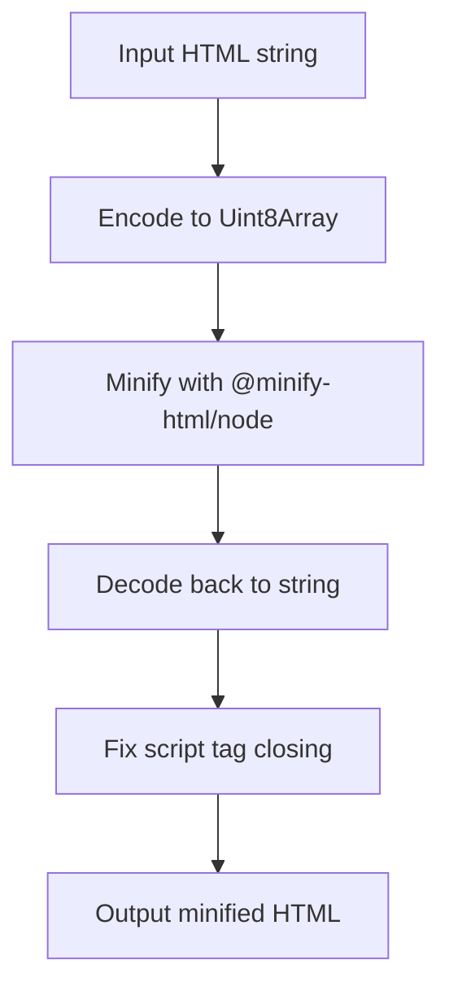

# @1-/minify_htm : Lightweight HTML minification with script tag fixes

## Functionality
Minifies HTML content while preserving essential functionality and fixing script tag closing issues. Addresses the common problem where minification incorrectly transforms `</script>` into `;</script>`, which breaks browser parsing.

## Usage demonstration
Install the package:
```bash
npm install @1-/minify_htm
```

Use in JavaScript:
```javascript
import minify from '@1-/minify_htm';

const html = '<html><body><script>console.log("hello");</script></body></html>';
const minified = minify(html);
console.log(minified);
// Output: <html><body><script>console.log("hello");</script></body></html>
```

## Design rationale
The package wraps the robust `@minify-html/node` library with targeted configuration and post-processing to ensure compatibility with modern browsers.



## Technology stack
- Core minifier: `@minify-html/node`
- Runtime: Modern Node.js (ESM modules)
- Encoding: `TextEncoder`/`TextDecoder` for efficient string conversion

## Code structure
```
src/
├── _.js          # Main entry point exporting minify function
```

## Historical context
HTML minification emerged in the early 2010s as web performance optimization became critical. The first widely adopted tools like HTMLMinifier appeared around 2012, addressing the need to reduce bandwidth usage and improve page load times. Modern minifiers evolved to handle complex edge cases like script tag parsing, which remains challenging due to HTML's forgiving parser specifications.