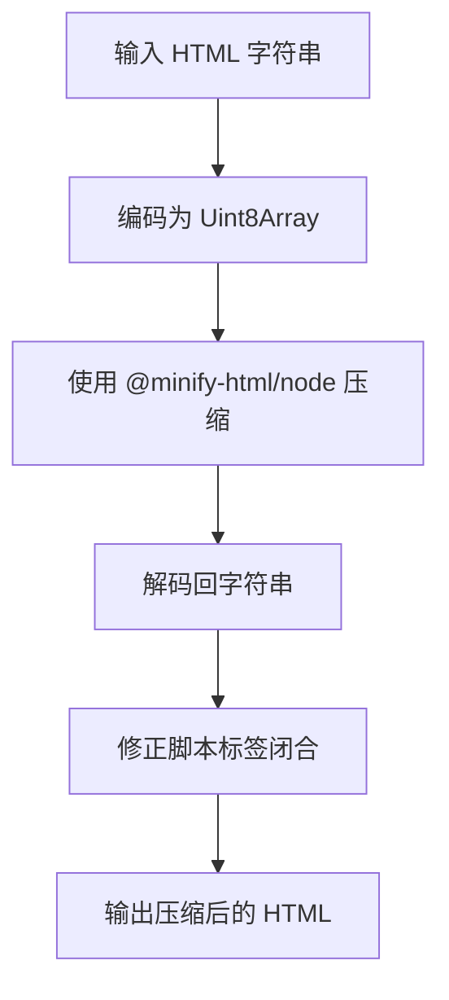

# @1-/minify_htm : 轻量级 HTML 压缩并修复脚本标签闭合

## 功能特性
压缩 HTML 内容同时保持核心功能正常，并修正脚本标签闭合问题。解决压缩过程中将 `</script>` 错误转换为 `;</script>` 导致浏览器解析失败的常见问题。

## 使用示例
安装包：
```bash
npm install @1-/minify_htm
```

JavaScript 中使用：
```javascript
import minify from '@1-/minify_htm';

const html = '<html><body><script>console.log("hello");</script></body></html>';
const minified = minify(html);
console.log(minified);
// 输出: <html><body><script>console.log("hello");</script></body></html>
```

## 设计思路
该包封装了健壮的 `@minify-html/node` 库，通过针对性配置和后处理确保与现代浏览器兼容。



## 技术栈
- 核心压缩器：`@minify-html/node`
- 运行时：现代 Node.js（ESM 模块）
- 编码：`TextEncoder`/`TextDecoder` 实现高效字符串转换

## 代码结构
```
src/
├── _.js          # 主入口文件，导出 minify 函数
```

## 历史背景
HTML 压缩技术在 2010 年代初随网页性能优化需求兴起。首个广泛采用的工具 HTMLMinifier 于 2012 年左右出现，旨在降低带宽消耗并提升页面加载速度。现代压缩器逐步演进以处理脚本标签解析等复杂边缘情况，这始终是挑战性课题，源于 HTML 解析器规范的宽容特性。