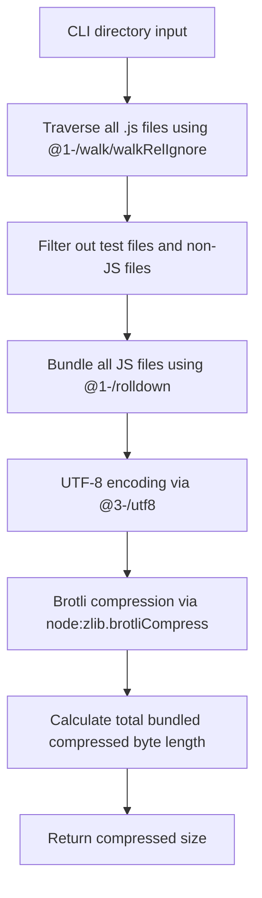
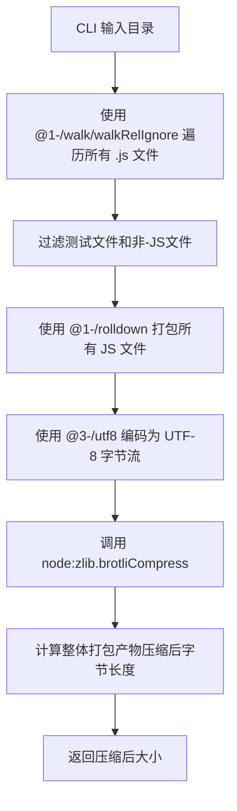

[English](#en) | [中文](#zh)

---

<a id="en"></a>

# @1-/minify_size : Minify JavaScript and report Brotli-compressed size

- [@1-/minify_size : Minify JavaScript and report Brotli-compressed size](#1-minify_size-minify-javascript-and-report-brotli-compressed-size)
  - [1. Introduction](#1-introduction)
  - [2. Usage Demo](#2-usage-demo)
  - [3. Design Concept](#3-design-concept)
  - [4. Tech Stack](#4-tech-stack)
  - [5. Code Structure](#5-code-structure)
  - [6. History](#6-history)
  - [About](#about)

## 1. Introduction

Evaluates JavaScript library size under modern network transmission environments supporting Brotli. For all `.js` files in the specified directory, performs:

- Bundling using `@1-/rolldown` (Rust-based JavaScript bundler)
- UTF-8 encoding of the bundled code
- Brotli compression via Node.js built-in `node:zlib.brotliCompress` to compute final byte length
- Returns total bundled compressed size (bytes)

## 2. Usage Demo

Install dependency:

```bash
npm install @1-/minify_size
```

or install globally:

```bash
npm install -g @1-/minify_size
```

Run command (specify the directory to analyze):

```bash
minify_size ./src
```

Example output:

```
650
```

## 3. Design Concept

Execution flow (vertical Mermaid diagram):



## 4. Tech Stack

- **Runtime**: Node.js / Bun
- **Bundler**: `@1-/rolldown` v0.1.7 (Rust-based JavaScript bundler)
- **Brotli Engine**: Built-in `node:zlib` (Brotli compression)
- **Arg Parser**: `yargs` v18.0.0
- **Encoding**: `@3-/utf8` v0.1.1 (TextEncoder-based UTF-8 encoding)
- **File Walking**: `@1-/walk` v0.1.2 (Directory traversal utility)
- **Dependency Management**: npm
- **Testing**: bun:test

## 5. Code Structure

```
src/
├── cli.js     # CLI entrypoint, parses directory parameter and invokes main function
└── _.js       # Directory traversal, bundling, Brotli compression calculation
```

## 6. History

Brotli was developed by Jyrki Alakuijala and Zoltán Szabadka at Google in 2013. It was initially designed for compression of web fonts, and was later extended to become a general-purpose compression algorithm optimized for web transmission, becoming an industry standard (RFC 7932). Modern JavaScript bundlers like rolldown leverage Rust's performance to achieve sub-second builds while maintaining compatibility with existing JavaScript tooling ecosystems.

## About

This library is developed by [WebC.site](https://webc.site).

[WebC.site](https://webc.site): A new paradigm of web development for AI

---

<a id="zh"></a>

# @1-/minify_size : Minify JavaScript and report Brotli-compressed size

- [@1-/minify_size : Minify JavaScript and report Brotli-compressed size](#1-minify_size-minify-javascript-and-report-brotli-compressed-size)
  - [1. 功能介绍](#1-功能介绍)
  - [2. 使用演示](#2-使用演示)
  - [3. 设计思路](#3-设计思路)
  - [4. 技术栈](#4-技术栈)
  - [5. 代码结构](#5-代码结构)
  - [6. 历史故事](#6-历史故事)
  - [关于](#关于)

## 1. 功能介绍

评估 JavaScript 库在支持 Brotli 的网络传输环境下的实际传输体积。对指定目录中所有 `.js` 文件执行以下操作：

- 使用 `@1-/rolldown`（Rust 实现的 JavaScript 打包器）进行打包
- 将打包后代码编码为 UTF-8 字节流
- 使用 Node.js 内置 `node:zlib.brotliCompress` 计算 Brotli 压缩后字节长度
- 返回整体打包压缩后大小（字节）

## 2. 使用演示

安装依赖：

```bash
npm install @1-/minify_size
```

或全局安装：

```bash
npm install -g @1-/minify_size
```

运行命令（指定待分析的目录）：

```bash
minify_size ./src
```

输出示例：

```
650
```

## 3. 设计思路

系统执行流程如下（垂直 Mermaid 流程图）：



## 4. 技术栈

- **Runtime**: Node.js / Bun
- **Bundler**: `@1-/rolldown` v0.1.7 (Rust-based JavaScript bundler)
- **Brotli Engine**: 内置 `node:zlib` (Brotli compression)
- **Arg Parser**: `yargs` v18.0.0
- **Encoding**: `@3-/utf8` v0.1.1 (TextEncoder-based UTF-8 encoding)
- **File Walking**: `@1-/walk` v0.1.2 (Directory traversal utility)
- **Dependency Management**: npm
- **Testing**: bun:test

## 5. 代码结构

```
src/
├── cli.js     # CLI 命令行入口，解析目录参数并调用主函数
└── _.js       # 目录遍历、打包处理、Brotli压缩计算
```

## 6. 历史故事

Brotli 由 Google 的 Jyrki Alakuijala 和 Zoltán Szabadka 于 2013 年开发。它最初被设计用于压缩网页字体，后来发展为通用压缩算法，用于优化网页传输，并成为行业标准（RFC 7932）。现代 JavaScript bundlers like rolldown leverage Rust's performance to achieve sub-second builds while maintaining compatibility with existing JavaScript tooling ecosystems.

## 关于

本库由 [WebC.site](https://webc.site) 开发。

[WebC.site](https://webc.site) : 面向人工智能的网站开发新范式
