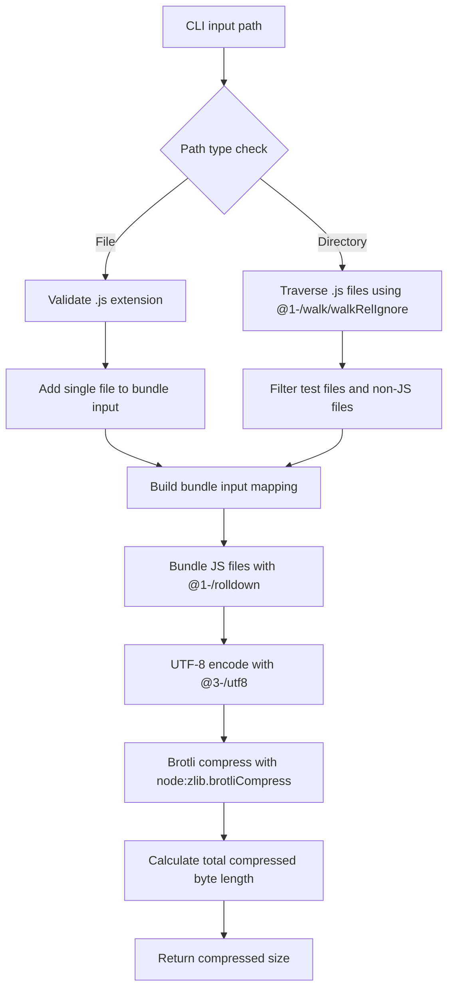
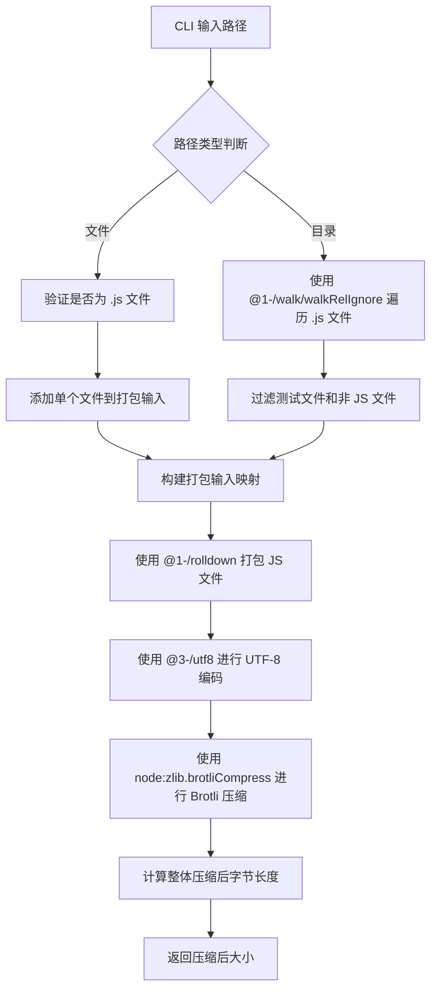

[English](#en) | [中文](#zh)

---

<a id="en"></a>

# @1-/minify_size : Minify JavaScript and report Brotli-compressed size

- [@1-/minify_size : Minify JavaScript and report Brotli-compressed size](#1-minify_size-minify-javascript-and-report-brotli-compressed-size)
  - [1. Functionality](#1-functionality)
  - [2. Usage](#2-usage)
  - [3. Design](#3-design)
  - [4. Technology Stack](#4-technology-stack)
  - [5. Code Structure](#5-code-structure)
  - [6. History](#6-history)
  - [About](#about)

## 1. Functionality

Measure JavaScript code transmission size under Brotli-enabled network environments. Supports specifying either a single JavaScript file or directory, performing:

- Bundling with `@1-/rolldown` (Rust-based JavaScript bundler)
- UTF-8 encoding using `@3-/utf8` TextEncoder
- Brotli compression via Node.js built-in `node:zlib.brotliCompress`
- Returning total compressed byte count of bundled output

Excludes test files matching `/^(|\/)tests?(\/|$)/` and `node_modules` directories.

## 2. Usage

Install locally:

```bash
npm install @1-/minify_size
```

Install globally:

```bash
npm install -g @1-/minify_size
```

Execute with target file or directory:

```bash
# Process single file
minify_size ./src/index.js

# Process entire directory
minify_size ./src
```

Output example:

```
650
```

## 3. Design

Execution flow (vertical Mermaid diagram):



## 4. Technology Stack

- **Runtime**: Bun / Node.js
- **Bundler**: `@1-/rolldown` v0.1.7 (Rust-based JavaScript bundler)
- **Compression**: `node:zlib.brotliCompress` (built-in Brotli)
- **Argument parsing**: `yargs` v18.0.0
- **Encoding**: `@3-/utf8` v0.1.1 (TextEncoder-based UTF-8)
- **File traversal**: `@1-/walk` v0.1.2 (directory traversal utility)
- **Package management**: npm
- **Testing**: bun:test

## 5. Code Structure

```
src/
├── cli.js     # CLI entrypoint, parses path parameter and invokes main function
└── _.js       # Path handling, bundling, Brotli compression calculation
```

## 6. History

Brotli was developed by Jyrki Alakuijala and Zoltán Szabadka at Google in 2013. Initially designed for web font compression, it evolved into a general-purpose algorithm optimized for web transmission and became an industry standard (RFC 7932). Modern JavaScript bundlers like rolldown leverage Rust's performance for sub-second builds while maintaining compatibility with existing JavaScript tooling ecosystems.

## About

This library is developed by [WebC.site](https://webc.site).

[WebC.site](https://webc.site): A new paradigm of web development for AI

---

<a id="zh"></a>

# @1-/minify_size : Minify JavaScript and report Brotli-compressed size

- [@1-/minify_size : Minify JavaScript and report Brotli-compressed size](#1-minify_size-minify-javascript-and-report-brotli-compressed-size)
  - [1. 功能介绍](#1-功能介绍)
  - [2. 使用演示](#2-使用演示)
  - [3. 设计思路](#3-设计思路)
  - [4. 技术栈](#4-技术栈)
  - [5. 代码结构](#5-代码结构)
  - [6. 历史故事](#6-历史故事)
  - [关于](#关于)

## 1. 功能介绍

测量 JavaScript 代码在支持 Brotli 的网络环境中的传输体积。支持指定单个 JavaScript 文件或目录，执行以下操作：

- 使用 `@1-/rolldown`（Rust 实现的 JavaScript 打包器）进行打包
- 使用 `@3-/utf8` TextEncoder 进行 UTF-8 编码
- 使用 Node.js 内置 `node:zlib.brotliCompress` 进行 Brotli 压缩
- 返回整体打包输出的压缩后字节长度

排除匹配 `/^(|\/)tests?(\/|$)/` 的测试文件和 `node_modules` 目录。

## 2. 使用演示

本地安装：

```bash
npm install @1-/minify_size
```

全局安装：

```bash
npm install -g @1-/minify_size
```

执行命令并指定目标文件或目录：

```bash
# 处理单个文件
minify_size ./src/index.js

# 处理整个目录
minify_size ./src
```

输出示例：

```
650
```

## 3. 设计思路

执行流程（垂直 Mermaid 流程图）：



## 4. 技术栈

- **运行时**: Bun / Node.js
- **打包器**: `@1-/rolldown` v0.1.7 (Rust 实现的 JavaScript 打包器)
- **压缩算法**: `node:zlib.brotliCompress` (内置 Brotli)
- **参数解析**: `yargs` v18.0.0
- **编码**: `@3-/utf8` v0.1.1 (TextEncoder 实现的 UTF-8)
- **文件遍历**: `@1-/walk` v0.1.2 (目录遍历工具)
- **包管理**: npm
- **测试**: bun:test

## 5. 代码结构

```
src/
├── cli.js     # CLI 入口，解析路径参数并调用主函数
└── _.js       # 路径处理、打包、Brotli 压缩计算
```

## 6. 历史故事

Brotli 由 Google 的 Jyrki Alakuijala 和 Zoltán Szabadka 于 2013 年开发。最初专为网页字体压缩设计，后发展为通用压缩算法，针对网页传输优化，并成为行业标准（RFC 7932）。现代 JavaScript 打包器如 rolldown 利用 Rust 的性能优势实现亚秒级构建，同时保持与现有 JavaScript 工具生态的兼容性。

## 关于

本库由 [WebC.site](https://webc.site) 开发。

[WebC.site](https://webc.site) : 面向人工智能的网站开发新范式
