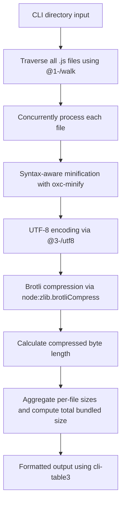

# @1-/minify_size : Minify JavaScript and report Brotli-compressed size

## 1. Introduction

Evaluates JavaScript library size under modern network transmission environments supporting Brotli. For all `.js` files in the specified directory, performs:

- Syntax-aware minification using `oxc-minify` (Rust implementation)
- UTF-8 encoding of the minified code
- Brotli compression via Node.js built-in `node:zlib.brotliCompress` to compute final byte length
- Aggregation of per-file sizes and calculation of total bundled compressed size

## 2. Usage Demo

Install dependency:

```bash
npm install @1-/minify_size
```

or install globally:

```bash
npm install -g @1-/minify_size
```

Run command (specify the directory to analyze):

```bash
minify_size ./src
```

Example output:

```
_.js                400
file.js             250
Total bundled size  650
```

## 3. Design Concept

Execution flow (vertical Mermaid diagram):



## 4. Tech Stack

- **Runtime**: Node.js / Bun
- **JS Minifier**: `oxc-minify` (JavaScript minifier implemented in Rust)
- **Brotli Engine**: Built-in `node:zlib` (Brotli compression)
- **Arg Parser**: `yargs`
- **Encoding**: `@3-/utf8` (TextEncoder-based UTF-8 encoding)
- **Output Formatting**: `cli-table3` (Formatted tabular output)
- **File Reading**: `@3-/read` (Lightweight file reading utility)
- **Dependency Management**: npm
- **Testing**: bun:test

## 5. Code Structure

```
src/
├── cli.js     # CLI entrypoint, parses directory parameter and invokes main function
├── _.js       # Directory traversal, concurrent file processing, aggregation and formatted output
└── file.js    # Single file processing: reading, oxc-minify compression, brotli compression and size calculation
```

## 6. History

Brotli was developed by Jyrki Alakuijala and Zoltán Szabadka at Google in 2013. It was initially designed for compression of web fonts, and was later extended to become a general-purpose compression algorithm optimized for web transmission, becoming an industry standard (RFC 7932).
