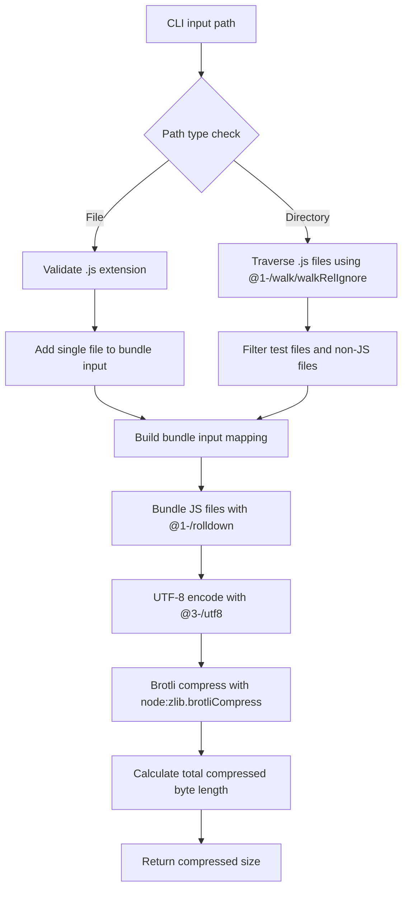

# @1-/minify_size : Minify JavaScript and report Brotli-compressed size

## 1. Functionality

Measure JavaScript code transmission size under Brotli-enabled network environments. Supports specifying either a single JavaScript file or directory, performing:

- Bundling with `@1-/rolldown` (Rust-based JavaScript bundler)
- UTF-8 encoding using `@3-/utf8` TextEncoder
- Brotli compression via Node.js built-in `node:zlib.brotliCompress`
- Returning total compressed byte count of bundled output

Excludes test files matching `/^(|\/)tests?(\/|$)/` and `node_modules` directories.

## 2. Usage

Install locally:

```bash
npm install @1-/minify_size
```

Install globally:

```bash
npm install -g @1-/minify_size
```

Execute with target file or directory:

```bash
# Process single file
minify_size ./src/index.js

# Process entire directory
minify_size ./src
```

Output example:

```
650
```

## 3. Design

Execution flow (vertical Mermaid diagram):



## 4. Technology Stack

- **Runtime**: Bun / Node.js
- **Bundler**: `@1-/rolldown` v0.1.7 (Rust-based JavaScript bundler)
- **Compression**: `node:zlib.brotliCompress` (built-in Brotli)
- **Argument parsing**: `yargs` v18.0.0
- **Encoding**: `@3-/utf8` v0.1.1 (TextEncoder-based UTF-8)
- **File traversal**: `@1-/walk` v0.1.2 (directory traversal utility)
- **Package management**: npm
- **Testing**: bun:test

## 5. Code Structure

```
src/
├── cli.js     # CLI entrypoint, parses path parameter and invokes main function
└── _.js       # Path handling, bundling, Brotli compression calculation
```

## 6. History

Brotli was developed by Jyrki Alakuijala and Zoltán Szabadka at Google in 2013. Initially designed for web font compression, it evolved into a general-purpose algorithm optimized for web transmission and became an industry standard (RFC 7932). Modern JavaScript bundlers like rolldown leverage Rust's performance for sub-second builds while maintaining compatibility with existing JavaScript tooling ecosystems.
