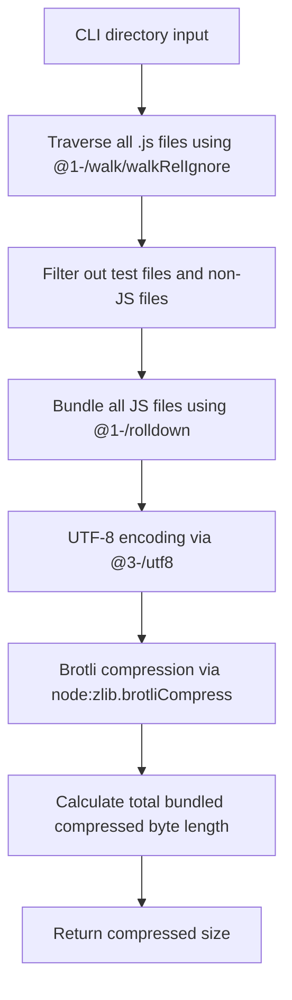

# @1-/minify_size : Minify JavaScript and report Brotli-compressed size

## 1. Introduction

Evaluates JavaScript library size under modern network transmission environments supporting Brotli. For all `.js` files in the specified directory, performs:

- Bundling using `@1-/rolldown` (Rust-based JavaScript bundler)
- UTF-8 encoding of the bundled code
- Brotli compression via Node.js built-in `node:zlib.brotliCompress` to compute final byte length
- Returns total bundled compressed size (bytes)

## 2. Usage Demo

Install dependency:

```bash
npm install @1-/minify_size
```

or install globally:

```bash
npm install -g @1-/minify_size
```

Run command (specify the directory to analyze):

```bash
minify_size ./src
```

Example output:

```
650
```

## 3. Design Concept

Execution flow (vertical Mermaid diagram):



## 4. Tech Stack

- **Runtime**: Node.js / Bun
- **Bundler**: `@1-/rolldown` v0.1.7 (Rust-based JavaScript bundler)
- **Brotli Engine**: Built-in `node:zlib` (Brotli compression)
- **Arg Parser**: `yargs` v18.0.0
- **Encoding**: `@3-/utf8` v0.1.1 (TextEncoder-based UTF-8 encoding)
- **File Walking**: `@1-/walk` v0.1.2 (Directory traversal utility)
- **Dependency Management**: npm
- **Testing**: bun:test

## 5. Code Structure

```
src/
├── cli.js     # CLI entrypoint, parses directory parameter and invokes main function
└── _.js       # Directory traversal, bundling, Brotli compression calculation
```

## 6. History

Brotli was developed by Jyrki Alakuijala and Zoltán Szabadka at Google in 2013. It was initially designed for compression of web fonts, and was later extended to become a general-purpose compression algorithm optimized for web transmission, becoming an industry standard (RFC 7932). Modern JavaScript bundlers like rolldown leverage Rust's performance to achieve sub-second builds while maintaining compatibility with existing JavaScript tooling ecosystems.