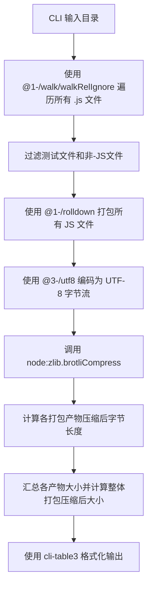

# @1-/minify_size : Minify JavaScript and report Brotli-compressed size

## 1. 功能介绍

评估 JavaScript 库在支持 Brotli 的网络传输环境下的实际传输体积。对指定目录中所有 `.js` 文件执行以下操作：

- 使用 `@1-/rolldown`（Rust 实现的 JavaScript 打包器）进行打包和语法感知压缩
- 将打包后代码编码为 UTF-8 字节流
- 使用 Node.js 内置 `node:zlib.brotliCompress` 计算 Brotli 压缩后字节长度
- 汇总各打包产物大小，并计算整体打包压缩后大小

## 2. 使用演示

安装依赖：

```bash
npm install @1-/minify_size
```

或全局安装：

```bash
npm install -g @1-/minify_size
```

运行命令（指定待分析的目录）：

```bash
minify_size ./src
```

输出示例：

```
index.js              400
utils.js              250
整体打包压缩后大小    650
```

## 3. 设计思路

系统执行流程如下（垂直 Mermaid 流程图）：



## 4. 技术栈

- **Runtime**: Node.js / Bun
- **Bundler**: `@1-/rolldown` v0.1.7 (Rust-based JavaScript bundler wrapping rolldown v1.1.3)
- **Brotli Engine**: 内置 `node:zlib` (Brotli 压缩)
- **Arg Parser**: `yargs` v18.0.0
- **Encoding**: `@3-/utf8` v0.1.1 (TextEncoder-based UTF-8 encoding)
- **Output Formatting**: `cli-table3` v0.6.5 (Formatted tabular output)
- **File Walking**: `@1-/walk` v0.1.1 (Directory traversal utility with concurrency control)
- **Dependency Management**: npm
- **Testing**: bun:test

## 5. 代码结构

```
src/
├── cli.js     # CLI 命令行入口，解析目录参数并调用主函数
└── _.js       # 目录遍历、打包处理、Brotli压缩计算及格式化输出
```

## 6. 历史故事

Brotli 由 Google 的 Jyrki Alakuijala 和 Zoltán Szabadka 于 2013 年开发。它最初被设计用于压缩网页字体，后来发展为通用压缩算法，用于优化网页传输，并成为行业标准（RFC 7932）。现代 JavaScript bundlers like rolldown leverage Rust's performance to achieve sub-second builds while maintaining compatibility with existing JavaScript tooling ecosystems.
