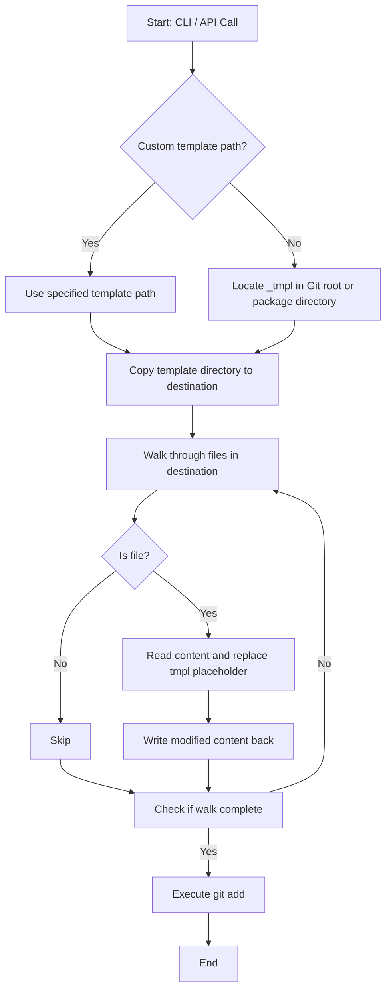
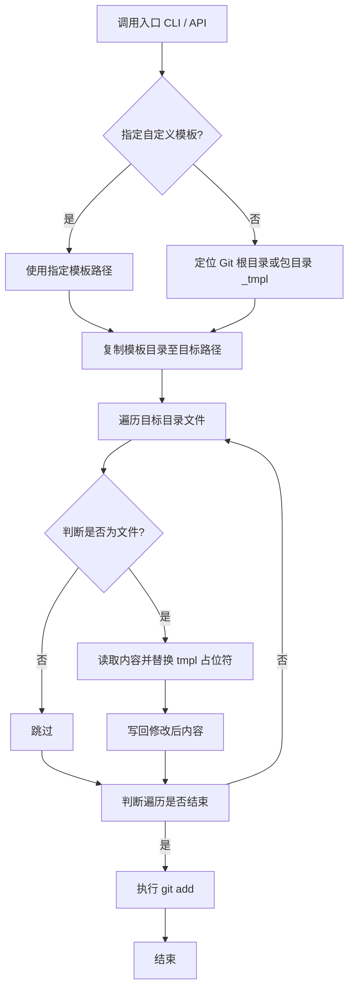

[English](#en) | [中文](#zh)

---

<a id="en"></a>
# @1-/new : Template-based project initializer with name replacement

- [@1-/new : Template-based project initializer with name replacement](#1-new-template-based-project-initializer-with-name-replacement)
  - [Features](#features)
  - [Usage](#usage)
    - [Command Line Interface (CLI)](#command-line-interface-cli)
    - [Application Programming Interface (API)](#application-programming-interface-api)
  - [Design Flow](#design-flow)
  - [Tech Stack](#tech-stack)
  - [Code Structure](#code-structure)
  - [History](#history)
  - [About](#about)

## Features

- **Directory Copy**: Recursively copies template directory to destination path.
- **Name Replacement**: Walks target directory and replaces `tmpl` placeholder in file contents with project name.
- **Git Integration**: Automatically executes `git add .` in destination directory.
- **Template Resolution**: Resolves default template directory from Git root or package structure under `_tmpl`. Supports custom template paths.

## Usage

### Command Line Interface (CLI)

```bash
bun x @1-/new <PROJECT_NAME>
```

If destination path exists, program logs warning and exits.

### Application Programming Interface (API)

```javascript
import newProj from "@1-/new";

await newProj(dst, name, tmpl);
```

- `dst`: Destination path
- `name`: Project name
- `tmpl`: Optional template path

## Design Flow



## Tech Stack

- Runtime: Bun
- Dependencies: `@1-/walk`, `@1-/findgit`, `@3-/log`, `yargs`
- Core APIs: `node:fs/promises`, `node:child_process`

## Code Structure

```
.
├── src/
│   ├── _.js       # API implementation
│   └── new.js     # CLI entry point
├── test/
│   └── _.test.js  # Test suite
└── package.json   # Package metadata
```

## History

In 2004, Ruby on Rails introduced "Convention over Configuration" philosophy, utilizing generators to scaffold model, view, and controller structures.

In 2012, Yeoman project was introduced at Google I/O, establishing template scaffolding standards for JavaScript client-side development.

Modern architectures demand reduced overhead. `@1-/new` focuses on core directory copying and placeholder replacement.

## About

This library is developed by [WebC.site](https://webc.site).

[WebC.site](https://webc.site): A new paradigm of web development for AI


---

<a id="zh"></a>
# @1-/new : 基于模板与名称替换的项目初始化工具

- [@1-/new : 基于模板与名称替换的项目初始化工具](#1-new-基于模板与名称替换的项目初始化工具)
  - [功能介绍](#功能介绍)
  - [使用演示](#使用演示)
    - [命令行界面 (CLI)](#命令行界面-cli)
    - [应用程序接口 (API)](#应用程序接口-api)
  - [设计思路](#设计思路)
  - [技术栈](#技术栈)
  - [代码结构](#代码结构)
  - [历史故事](#历史故事)
  - [关于](#关于)

## 功能介绍

- 目录复制：将模板目录递归复制至目标路径。
- 名称替换：遍历目标目录文件，将文本中 `tmpl` 占位符替换为项目名称。
- Git 集成：自动在目标目录执行 `git add .`。
- 模板定位：支持自定义模板路径。默认定位 Git 根目录或模块目录下的 `_tmpl` 目录。

## 使用演示

### 命令行界面 (CLI)

```bash
bun x @1-/new <项目名称>
```

若目标路径已存在，输出警告信息并终止进程。

### 应用程序接口 (API)

```javascript
import newProj from "@1-/new";

await newProj(dst, name, tmpl);
```

- `dst`：目标路径
- `name`：项目名称
- `tmpl`：可选模板路径

## 设计思路



## 技术栈

- 运行时：Bun
- 依赖项：`@1-/walk`、`@1-/findgit`、`@3-/log`、`yargs`
- 内置模块：`node:fs/promises`、`node:child_process`

## 代码结构

```
.
├── src/
│   ├── _.js       # API 实现
│   └── new.js     # CLI 入口
├── test/
│   └── _.test.js  # 单元测试
└── package.json   # 项目配置
```

## 历史故事

2004 年 Ruby on Rails 框架发布，推广 “约定优于配置” (Convention over Configuration) 哲学，利用生成器自动创建模型、视图与控制器结构。

2012 年 Google 工程师团队在 I/O 大会展示 Yeoman 项目，为客户端 JavaScript 生态奠定模板脚手架工具标准。

随着单页应用与微服务架构兴起，轻量化项目初始化需求增加，`@1-/new` 类工具通过精简逻辑提供初始化方案。

## 关于

本库由 [WebC.site](https://webc.site) 开发。

[WebC.site](https://webc.site) : 面向人工智能的网站开发新范式

