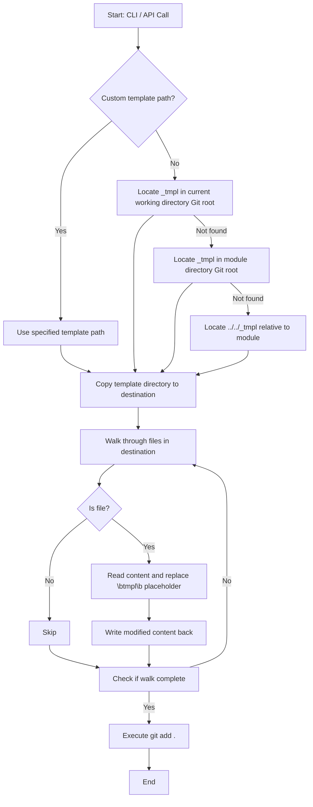

# @1-/new : Template-based project initializer with name replacement

## Features

- **Directory Copy**: Recursively copies template directory to destination path
- **Name Replacement**: Walks target directory and replaces `tmpl` placeholder with project name using word-boundary regex `\btmpl\b` (avoids false positives like "template")
- **Git Integration**: Executes `git add .` in destination directory; failures are silently ignored
- **Template Resolution**: Resolves `_tmpl` directory in order of priority: ① Git root of current working directory ② Git root of module directory ③ `../../_tmpl` relative to module; supports custom template paths

## Usage

### Command Line Interface (CLI)

```bash
bun x @1-/new <PROJECT_NAME>
```

If destination path exists, program logs warning and exits.

### Application Programming Interface (API)

```javascript
import newProj from "@1-/new";

await newProj(dst, name, tmpl);
```

- `dst`: Destination path
- `name`: Project name
- `tmpl`: Optional template path

## Design Flow



## Tech Stack

- Runtime: Bun
- Dependencies: `@1-/findgit`, `@1-/read`, `@1-/walk`, `@3-/log`, `yargs`
- Core APIs: `node:fs/promises`, `node:child_process`, `node:path`, `node:util`

## Code Structure

```
.
├── src/
│   ├── _.js       # API implementation (core logic)
│   └── new.js     # CLI entry point (argument parsing & error handling)
├── test/
│   └── _.test.js  # Test suite (verifies template copying and word-boundary replacement)
└── package.json   # Package metadata (module exports and dependency declarations)
```

## History

In 2004, Ruby on Rails introduced "Convention over Configuration" philosophy, utilizing generators to scaffold model, view, and controller structures.

In 2012, Yeoman project was introduced at Google I/O, establishing template scaffolding standards for JavaScript client-side development.

Modern architectures demand reduced overhead. `@1-/new` focuses on core directory copying and placeholder replacement.