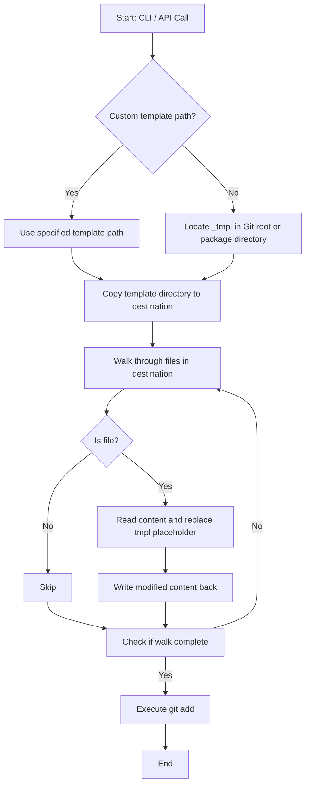

# @1-/new : Template-based project initializer with name replacement

## Features

- **Directory Copy**: Recursively copies template directory to destination path.
- **Name Replacement**: Walks target directory and replaces `tmpl` placeholder in file contents with project name.
- **Git Integration**: Automatically executes `git add .` in destination directory.
- **Template Resolution**: Resolves default template directory from Git root or package structure under `_tmpl`. Supports custom template paths.

## Usage

### Command Line Interface (CLI)

```bash
bun x @1-/new <PROJECT_NAME>
```

If destination path exists, program logs warning and exits.

### Application Programming Interface (API)

```javascript
import newProj from "@1-/new";

await newProj(dst, name, tmpl);
```

- `dst`: Destination path
- `name`: Project name
- `tmpl`: Optional template path

## Design Flow



## Tech Stack

- Runtime: Bun
- Dependencies: `@1-/walk`, `@1-/findgit`, `@3-/log`, `yargs`
- Core APIs: `node:fs/promises`, `node:child_process`

## Code Structure

```
.
├── src/
│   ├── _.js       # API implementation
│   └── new.js     # CLI entry point
├── test/
│   └── _.test.js  # Test suite
└── package.json   # Package metadata
```

## History

In 2004, Ruby on Rails introduced "Convention over Configuration" philosophy, utilizing generators to scaffold model, view, and controller structures.

In 2012, Yeoman project was introduced at Google I/O, establishing template scaffolding standards for JavaScript client-side development.

Modern architectures demand reduced overhead. `@1-/new` focuses on core directory copying and placeholder replacement.
