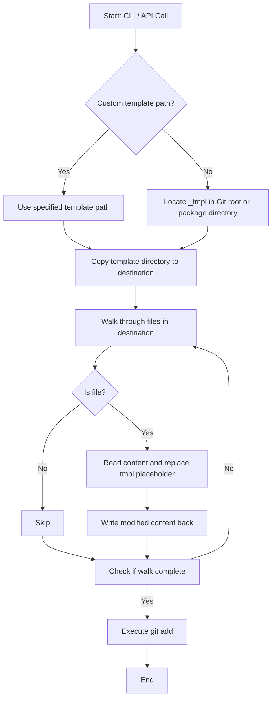

# @1-/new : Template-based project initializer with name replacement

Generates target directory structure by copying templates and replacing placeholders.

## Features

- **Directory Copy**: Copies template directory to destination path.
- **Name Replacement**: Scans copied files and replaces `tmpl` placeholder in text content with project name.
- **Git Integration**: Executes `git add .` in destination directory to stage files.
- **Template Resolution**: Resolves default template directory from Git root `_tmpl` or package structure. Supports custom template paths.

## Design Flow



## Tech Stack

- **Runtime**: Bun
- **Dependencies**: `@1-/walk`, `@1-/findgit`, `@3-/log`, `yargs`
- **APIs**: `node:fs/promises` (`cp`, `readFile`, `writeFile`), `node:child_process` (`exec`)

## Directory Structure

```
.
├── src/
│   ├── _.js       # API implementation
│   └── new.js     # CLI entry point
├── tests/
│   └── _.test.js  # Test suite
└── package.json   # Package metadata
```

## Usage

### CLI

Initialize project via command line:

```bash
bun x @1-/new <PROJECT_NAME>
```

If destination path exists, program logs warning and exits.

### API

```javascript
import newProj from "@1-/new";

await newProj("destination/path", "project-name", "optional/template/path");
```

## History

In 2004, Ruby on Rails introduced "Convention over Configuration" philosophy, utilizing generators to scaffold model, view, and controller structures.

In 2012, Yeoman project was introduced at Google I/O, establishing template scaffolding standards for JavaScript client-side development.

Modern architectures demand reduced overhead. `@1-/new` focuses on core directory copying and placeholder replacement.
