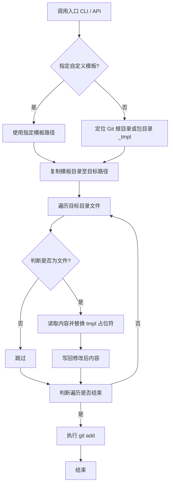

# @1-/new : 基于模板与名称替换的项目初始化工具

通过复制项目模板并替换占位符，生成目标目录结构。

## 功能特性

- **目录复制**：将模板目录复制至目标路径。
- **名称替换**：遍历文件，将文本内容中 `tmpl` 占位符替换为项目名称。
- **Git 集成**：在目标目录执行 `git add .` 将文件暂存。
- **模板配置**：支持指定自定义模板路径，默认寻找 Git 根目录 `_tmpl` 目录。

## 设计思路



## 技术栈

- **运行时**：Bun
- **外部依赖**：`@1-/walk`、`@1-/findgit`、`@3-/log`、`yargs`
- **核心 API**：`node:fs/promises` (`cp`、`readFile`、`writeFile`)、`node:child_process` (`exec`)

## 目录结构

```
.
├── src/
│   ├── _.js       # API 实现
│   └── new.js     # CLI 入口
├── tests/
│   └── _.test.js  # 自动化测试用例
└── package.json   # 依赖与项目配置
```

## 使用演示

### 命令行界面 (CLI)

执行命令初始化项目：

```bash
bun x @1-/new <PROJECT_NAME>
```

若目标路径已存在，程序输出冲突警告并终止进程。

### 应用程序接口 (API)

```javascript
import newProj from "@1-/new";

await newProj("目标路径", "项目名称", "可选模板路径");
```

## 历史故事

2004 年 Ruby on Rails 框架发布，推广 “约定优于配置” (Convention over Configuration) 哲学，利用生成器自动创建模型、视图与控制器结构。

2012 年 Google 工程师团队在 I/O 大会展示 Yeoman 项目，为客户端 JavaScript 生态奠定模板脚手架工具标准。

随着单页应用与微服务架构兴起，轻量化项目初始化需求增加，`@1-/new` 类工具通过精简逻辑提供初始化方案。
