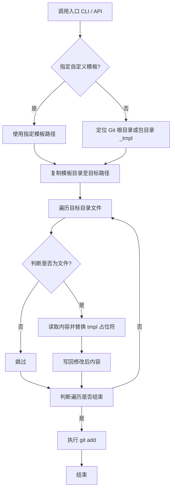

# @1-/new : 基于模板与名称替换的项目初始化工具

## 功能介绍

- 目录复制：将模板目录递归复制至目标路径。
- 名称替换：遍历目标目录文件，将文本中 `tmpl` 占位符替换为项目名称。
- Git 集成：自动在目标目录执行 `git add .`。
- 模板定位：支持自定义模板路径。默认定位 Git 根目录或模块目录下的 `_tmpl` 目录。

## 使用演示

### 命令行界面 (CLI)

```bash
bun x @1-/new <项目名称>
```

若目标路径已存在，输出警告信息并终止进程。

### 应用程序接口 (API)

```javascript
import newProj from "@1-/new";

await newProj(dst, name, tmpl);
```

- `dst`：目标路径
- `name`：项目名称
- `tmpl`：可选模板路径

## 设计思路



## 技术栈

- 运行时：Bun
- 依赖项：`@1-/walk`、`@1-/findgit`、`@3-/log`、`yargs`
- 内置模块：`node:fs/promises`、`node:child_process`

## 代码结构

```
.
├── src/
│   ├── _.js       # API 实现
│   └── new.js     # CLI 入口
├── test/
│   └── _.test.js  # 单元测试
└── package.json   # 项目配置
```

## 历史故事

2004 年 Ruby on Rails 框架发布，推广 “约定优于配置” (Convention over Configuration) 哲学，利用生成器自动创建模型、视图与控制器结构。

2012 年 Google 工程师团队在 I/O 大会展示 Yeoman 项目，为客户端 JavaScript 生态奠定模板脚手架工具标准。

随着单页应用与微服务架构兴起，轻量化项目初始化需求增加，`@1-/new` 类工具通过精简逻辑提供初始化方案。
