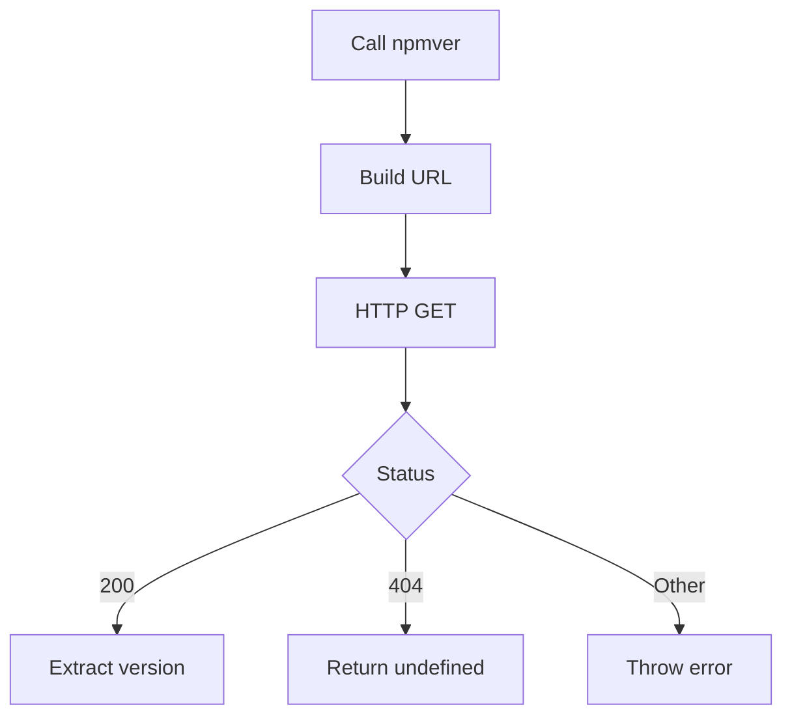

[English](#en) | [中文](#zh)

---

<a id="en"></a>

# @1-/npmver : Fetch latest NPM package version

- [@1-/npmver : Fetch latest NPM package version](#1-npmver-fetch-latest-npm-package-version)
  - [Functionality](#functionality)
  - [Usage demonstration](#usage-demonstration)
  - [Design rationale](#design-rationale)
  - [Technology stack](#technology-stack)
  - [Code structure](#code-structure)
  - [Historical context](#historical-context)
  - [About](#about)

## Functionality

Fetch the latest published version of any NPM package directly from the official NPM registry API.

## Usage demonstration

Install the package:

```bash
npm install @1-/npmver
```

Use in JavaScript/TypeScript:

```javascript
import npmver from "@1-/npmver";

// Get latest version of a package
const version = await npmver("lodash");
console.log(version); // e.g., '4.17.21'

// Handle non-existent packages
const unknownVersion = await npmver("non-existent-package");
console.log(unknownVersion); // undefined
```

## Design rationale

The package implements a minimal, focused solution for retrieving package versions with proper error handling:



## Technology stack

- Runtime: Modern JavaScript (ES modules)
- HTTP client: Native `fetch` API
- Testing: Bun test framework

## Code structure

```
src/
├── _.js          # Main module exporting default async function
```

test/
├── \_.test.js # Test cases verifying functionality

## Historical context

The NPM registry launched in 2010 as the central repository for JavaScript packages, enabling the rapid growth of the Node.js ecosystem. Before standardized package managers, developers manually tracked library versions across projects. This utility continues that evolution by providing direct, programmatic access to version information without requiring full package installation.

## About

This library is developed by [WebC.site](https://webc.site).

[WebC.site](https://webc.site): A new paradigm of web development for AI

---

<a id="zh"></a>

# @1-/npmver : 获取 NPM 包最新版本

- [@1-/npmver : 获取 NPM 包最新版本](#1-npmver-获取-npm-包最新版本)
  - [功能介绍](#功能介绍)
  - [使用演示](#使用演示)
  - [设计思路](#设计思路)
  - [技术栈](#技术栈)
  - [代码结构](#代码结构)
  - [历史故事](#历史故事)
  - [关于](#关于)

## 功能介绍

从官方 NPM 注册表直接获取任意 NPM 包的最新发布版本号。

## 使用演示

安装包：

```bash
npm install @1-/npmver
```

在 JavaScript/TypeScript 中使用：

```javascript
import npmver from "@1-/npmver";

// 获取包的最新版本
const version = await npmver("lodash");
console.log(version); // 例如 '4.17.21'

// 处理不存在的包
const unknownVersion = await npmver("non-existent-package");
console.log(unknownVersion); // undefined
```

## 设计思路

该包实现轻量级、专注的版本获取解决方案，具备完善的错误处理机制：


## 技术栈

- 运行时：现代 JavaScript（ES 模块）
- HTTP 客户端：原生 `fetch` API
- 测试：Bun 测试框架

## 代码结构

```
src/
├── _.js          # 导出默认异步函数的主模块
```

test/
├── \_.test.js # 验证功能的测试用例

## 历史故事

NPM 注册表于 2010 年上线，作为 JavaScript 包的中央仓库，推动了 Node.js 生态系统的快速发展。在标准化包管理器出现之前，开发者需手动跨项目追踪库版本。此工具延续这一演进，提供无需完整安装即可程序化访问版本信息的能力。

## 关于

本库由 [WebC.site](https://webc.site) 开发。

[WebC.site](https://webc.site) : 面向人工智能的网站开发新范式
