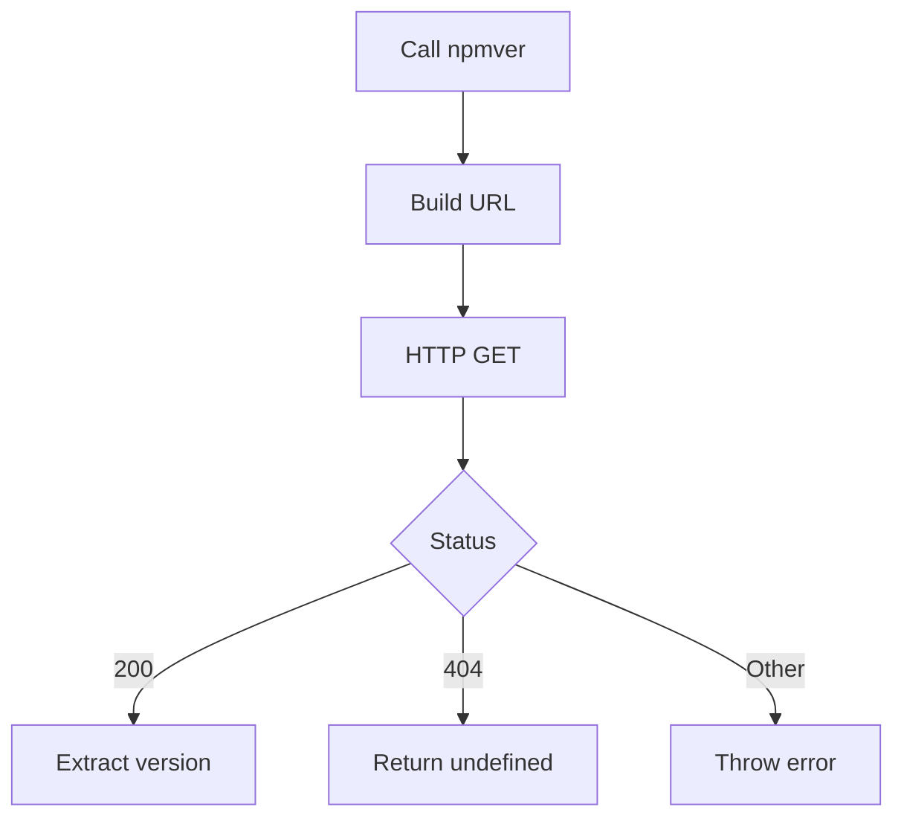

# @1-/npmver : Fetch latest NPM package version

## Functionality

Fetch the latest published version of any NPM package directly from the official NPM registry API.

## Usage demonstration

Install the package:

```bash
npm install @1-/npmver
```

Use in JavaScript/TypeScript:

```javascript
import npmver from "@1-/npmver";

// Get latest version of a package
const version = await npmver("lodash");
console.log(version); // e.g., '4.17.21'

// Handle non-existent packages
const unknownVersion = await npmver("non-existent-package");
console.log(unknownVersion); // undefined
```

## Design rationale

The package implements a minimal, focused solution for retrieving package versions with proper error handling:



## Technology stack

- Runtime: Modern JavaScript (ES modules)
- HTTP client: Native `fetch` API
- Testing: Bun test framework

## Code structure

```
src/
├── _.js          # Main module exporting default async function
```

test/
├── \_.test.js # Test cases verifying functionality

## Historical context

The NPM registry launched in 2010 as the central repository for JavaScript packages, enabling the rapid growth of the Node.js ecosystem. Before standardized package managers, developers manually tracked library versions across projects. This utility continues that evolution by providing direct, programmatic access to version information without requiring full package installation.
