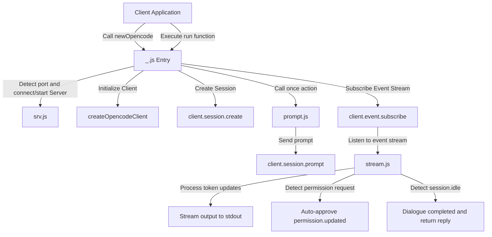
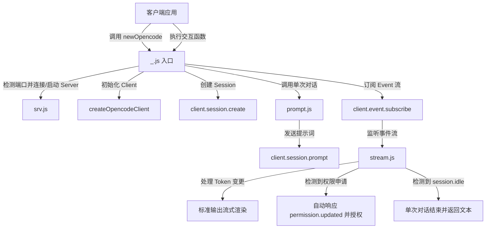

[English](#en) | [中文](#zh)

---

<a id="en"></a>
# @1-/opencode : Terminal session SDK for AI agents

- [@1-/opencode : Terminal session SDK for AI agents](#1-opencode-terminal-session-sdk-for-ai-agents)
  - [1. Features](#1-features)
  - [2. Usage Demo](#2-usage-demo)
  - [3. Design Ideas](#3-design-ideas)
  - [4. Technical Stack](#4-technical-stack)
  - [5. Code Structure](#5-code-structure)
  - [6. History Story](#6-history-story)
  - [About](#about)

## 1. Features

- **Service Hosting**
  Detects target port.
  Starts server if port is free.
  Connects and reuses existing service if occupied.

- **Environment Configuration**
  Configures custom port and host via `OPENCODE_PORT` and `OPENCODE_HOST` environment variables.

- **Auto Approval**
  Subscribes to event stream.
  Automatically approves terminal execution permission requests to enable unattended operation.

- **Stream Output**
  Renders tokens to stdout in real-time.
  Separates reasoning logs from text replies.
  Supports text delta callback.

- **Chainable Interaction**
  Provides chainable interface to support continuous dialog via returned subsequent prompt functions.

## 2. Usage Demo

```javascript
import newOpencode from "@1-/opencode";

// Bind working directory, initialize session
const [prompt, client, session] = await newOpencode(process.cwd(), "Terminal Assistant");

// Trigger interaction
let [reply, next] = await prompt("List directory files");

// Continue chainable interaction
// [reply, next] = await next("Another instruction");
```

## 3. Design Ideas

System wraps `@opencode-ai/sdk` API, manages server lifecycle, and processes state updates from event stream.



## 4. Technical Stack

- Runtime: Bun / Node.js
- Core Dependency: `@opencode-ai/sdk`
- Peer Dependencies: `@3-/tcpping`, `@3-/log`
- Module System: ES Modules (ESM)

## 5. Code Structure

```text
.
├── src/
│   ├── _.js        # Entry file, manages client initialization, session creation, and lifecycle
│   ├── prompt.js   # Encapsulates request transmission and controls dialog synchronization
│   ├── stream.js   # Listens to event stream, handles streaming output, auto approval, and state detection
│   ├── srv.js      # Manages server backend, handles port detection and auto start
│   └── ERR.js      # Predefined error codes
└── tests/
    └── _.test.js   # Unit tests
```

## 6. History Story

In 1964, Douglas McIlroy proposed the Unix pipeline concept in a memo, advocating that programs should connect via standard input and standard output to build complex systems.
In 1972, Ken Thompson officially implemented the pipeline mechanism in Unix Version 3.
This design established the Unix philosophy and profoundly shaped software collaboration.

In the AI agent era, the pipeline mechanism evolves into control pipelines based on real-time event streams.
Agents transmit reasoning logs and interaction text via streaming channels, and use permission confirmation events to guarantee execution safety.
This SDK inherits this concept to build automated terminal execution streams and human-agent feedback loops.

## About

This library is developed by [WebC.site](https://webc.site).

[WebC.site](https://webc.site): A new paradigm of web development for AI


---

<a id="zh"></a>
# @1-/opencode : 终端 AI 智能体会话 SDK

- [@1-/opencode : 终端 AI 智能体会话 SDK](#1-opencode-终端-ai-智能体会话-sdk)
  - [1. 功能介绍](#1-功能介绍)
  - [2. 使用演示](#2-使用演示)
  - [3. 设计思路](#3-设计思路)
  - [4. 技术栈](#4-技术栈)
  - [5. Code Structure](#5-code-structure)
  - [6. 历史故事](#6-历史故事)
  - [关于](#关于)

## 1. 功能介绍

- **服务托管**
  自动检测配置端口。
  端口空闲时自动启动底层服务，端口占用时建立连接并复用服务。

- **环境配置**
  支持通过 `OPENCODE_PORT` 与 `OPENCODE_HOST` 环境变量自定义服务端口与主机地址。

- **自动授权**
  实时订阅事件流。
  检测到终端执行等权限申请时自动批准，确保自动化流程无需人工干预。

- **分流渲染**
  实时解析事件流，在标准输出（stdout）分别渲染思考过程与回复文本。
  支持回调函数接收文本增量。

- **链式交互**
  提供链式交互接口，支持通过返回的下一轮交互函数进行持续对话。

## 2. 使用演示

```javascript
import newOpencode from "@1-/opencode";

// 初始化会话并绑定工作目录
const [prompt, client, session] = await newOpencode(process.cwd(), "Terminal Assistant");

// 发起交互
let [reply, next] = await prompt("List directory files");

// 持续链式交互
// [reply, next] = await next("Another instruction");
```

## 3. 设计思路

系统封装底层 `@opencode-ai/sdk` 接口，托管服务生命周期，订阅事件流并处理状态更新。



## 4. 技术栈

- 运行环境：Bun / Node.js
- 核心依赖：`@opencode-ai/sdk`
- 辅助库：`@3-/tcpping`、`@3-/log`
- 模块规范：ES Modules (ESM)

## 5. Code Structure

```text
.
├── src/
│   ├── _.js        # 入口文件，初始化客户端、创建会话与生命周期管理
│   ├── prompt.js   # 封装消息发送，控制单次对话的同步等待
│   ├── stream.js   # 监听事件流，处理流式渲染、自动授权与状态检测
│   ├── srv.js      # 托管服务端，处理端口检测与自动启动
│   └── ERR.js      # 预定义错误码
└── tests/
    └── _.test.js   # 单元测试
```

## 6. 历史故事

1964 年，Douglas McIlroy 在一份备忘录中首次提出 Unix 管道（Pipeline）构想，主张程序应通过标准输入与标准输出连接，以组装复杂系统。
1972 年，Ken Thompson 在 Unix 第三版中正式实现管道机制。
这一设计确立了 Unix 哲学，深刻影响了后世的软件协同模式。

进入 AI 智能体时代，管道机制演变为基于实时事件流的控制管道。
智能体通过流式通道传输思考日志、交互文本，并利用权限确认事件保障执行安全。
本 SDK 继承这一思想，建立自动化终端执行流与人机交互反馈环。

## 关于

本库由 [WebC.site](https://webc.site) 开发。

[WebC.site](https://webc.site) : 面向人工智能的网站开发新范式

