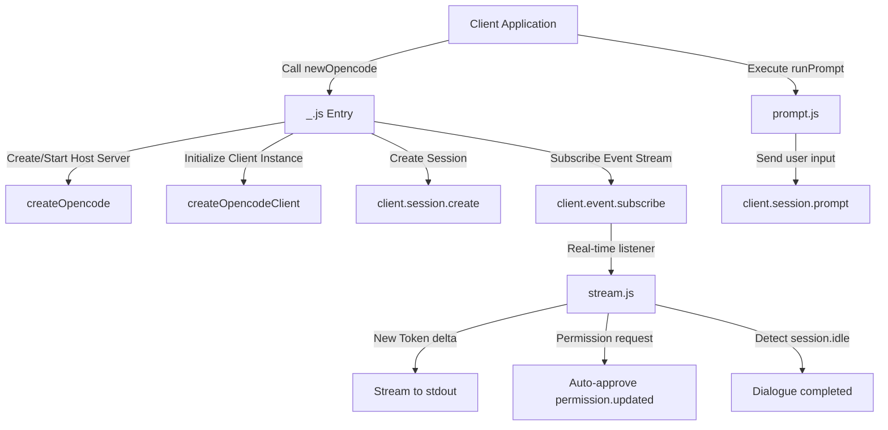

# @1-/opencode : Minimalist SDK for terminal-based AI agent session interaction

## Features

- **Automated Lifecycle** : Automatically spins up and shuts down local host servers, reducing setup overhead
- **Auto-Approve Permissions** : Automatically approves terminal operation permission requests to ensure unattended execution
- **Dual-State Streaming** : Streams real-time tokens while clearly separating reasoning phases from final replies
- **Resource Management** : Implements `Symbol.asyncDispose` for clean, automatic cleanup and resource release

## Tech Stack

- Runtime: Bun / Node.js
- Core Dependency: `@opencode-ai/sdk`
- Format: ES Modules (ESM)

## Usage

```javascript
import newOpencode from "@1-/opencode";

// Initialize and bind to current directory
await using helper = await newOpencode(process.cwd(), "Terminal Assistant");
const [prompt] = helper;

// Execute first prompt
let [reply, next] = await prompt("List directory files");

// Continue conversation using the returned next function
// [reply, next] = await next("Another instruction");
```

## Directory Structure

```text
.
├── src/
│   ├── _.js        # Main entry, handles initialization and lifecycle
│   ├── prompt.js   # Handles sending prompts and dialogue loop state
│   ├── stream.js   # Listens to event streams, handles output & permissions
│   └── ERR.js      # Error type definitions
└── tests/
    └── _.test.js   # Unit tests
```

## Design

The library wraps low-level `@opencode-ai/sdk` functions, abstracting server initialization, client communication, and event stream subscription.

### Call Flow



## History

The Origin of Pipes: In 1964, Unix pioneer Douglas McIlroy first proposed the concept of pipeline: "We should have some ways of coupling programs like garden hose, screwed together when it is necessary to massage data in another way." This philosophy of simple tools communicating via standard streams (stdout/stdin) was implemented by Ken Thompson in 1972.

Today, in the era of terminal-native AI agents, this paradigm remains remarkably relevant. Agents listen to stream-based outputs and coordinate tool executions, proving once again that standard streams are the bedrock of computing.
