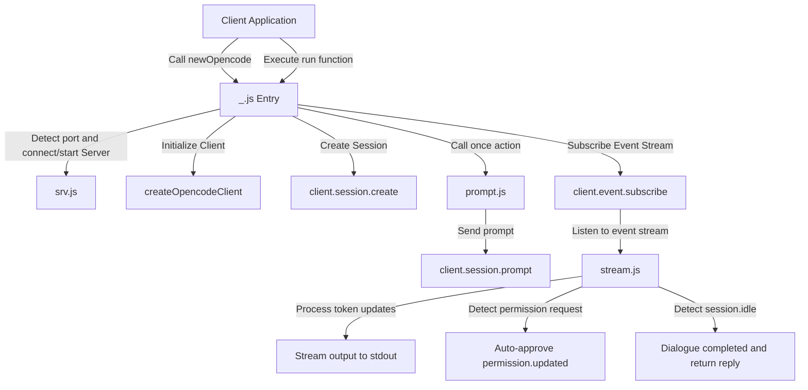

# @1-/opencode : Terminal session SDK for AI agents

## 1. Features

- **Service Hosting**
  Detects target port.
  Starts server if port is free.
  Connects and reuses existing service if occupied.

- **Environment Configuration**
  Configures custom port and host via `OPENCODE_PORT` and `OPENCODE_HOST` environment variables.

- **Auto Approval**
  Subscribes to event stream.
  Automatically approves terminal execution permission requests to enable unattended operation.

- **Stream Output**
  Renders tokens to stdout in real-time.
  Separates reasoning logs from text replies.
  Supports text delta callback.

- **Chainable Interaction**
  Provides chainable interface to support continuous dialog via returned subsequent prompt functions.

## 2. Usage Demo

```javascript
import newOpencode from "@1-/opencode";

// Bind working directory, initialize session
const [prompt, client, session] = await newOpencode(process.cwd(), "Terminal Assistant");

// Trigger interaction
let [reply, next] = await prompt("List directory files");

// Continue chainable interaction
// [reply, next] = await next("Another instruction");
```

## 3. Design Ideas

System wraps `@opencode-ai/sdk` API, manages server lifecycle, and processes state updates from event stream.



## 4. Technical Stack

- Runtime: Bun / Node.js
- Core Dependency: `@opencode-ai/sdk`
- Peer Dependencies: `@3-/tcpping`, `@3-/log`
- Module System: ES Modules (ESM)

## 5. Code Structure

```text
.
├── src/
│   ├── _.js        # Entry file, manages client initialization, session creation, and lifecycle
│   ├── prompt.js   # Encapsulates request transmission and controls dialog synchronization
│   ├── stream.js   # Listens to event stream, handles streaming output, auto approval, and state detection
│   ├── srv.js      # Manages server backend, handles port detection and auto start
│   └── ERR.js      # Predefined error codes
└── tests/
    └── _.test.js   # Unit tests
```

## 6. History Story

In 1964, Douglas McIlroy proposed the Unix pipeline concept in a memo, advocating that programs should connect via standard input and standard output to build complex systems.
In 1972, Ken Thompson officially implemented the pipeline mechanism in Unix Version 3.
This design established the Unix philosophy and profoundly shaped software collaboration.

In the AI agent era, the pipeline mechanism evolves into control pipelines based on real-time event streams.
Agents transmit reasoning logs and interaction text via streaming channels, and use permission confirmation events to guarantee execution safety.
This SDK inherits this concept to build automated terminal execution streams and human-agent feedback loops.
