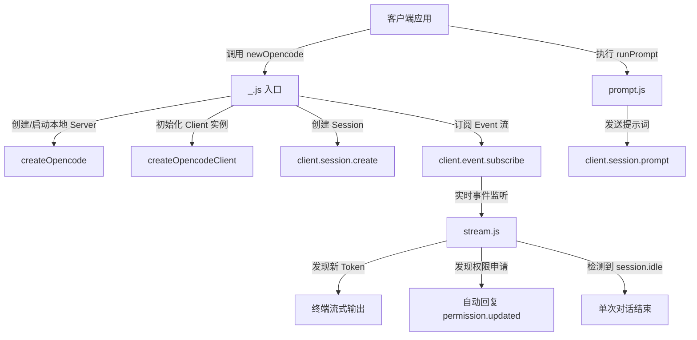

# @1-/opencode : 极简的终端 AI 智能体交互开发套件

## 功能特性

- **服务自动托管**：自动启动与管理 AI 智能体本地服务，简化部署流程
- **自动权限审批**：自动同意智能体运行期间的终端操作权限请求，实现无人值守运行
- **双态流式输出**：实时流式输出 Token，清晰区分思考过程（Reasoning）与最终回复（Text）
- **生命周期管理**：支持 `Symbol.asyncDispose` 异步销毁模式，自动关闭服务并释放资源

## 技术栈

- 运行环境：Bun / Node.js
- 核心依赖：`@opencode-ai/sdk`
- 模块规范：ES Modules (ESM)

## 使用演示

```javascript
import newOpencode from "@1-/opencode";

// 启动并关联当前目录
await using helper = await newOpencode(process.cwd(), "Terminal Assistant");
const [prompt] = helper;

// 发起首轮对话
let [reply, next] = await prompt("List directory files");

// 可通过返回的 next 函数持续对话
// [reply, next] = await next("Another instruction");
```

## 目录结构

```text
.
├── src/
│   ├── _.js        # 入口文件，处理初始化与生命周期管理
│   ├── prompt.js   # 提示词发送与单次交互封装
│   ├── stream.js   # 事件流监听，处理流式输出与权限自动审批
│   └── ERR.js      # 错误类型定义
└── tests/
    └── _.test.js   # 单元测试
```

## 设计思路

项目通过封装 `@opencode-ai/sdk` 的底层接口，隐藏服务端启动、客户端连接与事件订阅的复杂细节。

### 调用流程



## 历史故事

管道与流的起源：1964 年，Unix 联合创始人 Douglas McIlroy 首次提出管道（Pipes）概念：“我们应该用像花园水管一样的方法将程序连接起来，当需要以另一种方式处理数据时，只需接上另一段水管。” 这一让简单程序通过标准输入输出（stdin/stdout）协同工作的构想，在 1972 年被 Ken Thompson 实现。

如今，在终端 AI 智能体时代，这一哲学依然适用。智能体通过监听标准流与事件流，实现自主分析、工具调用与结果反馈，使得命令行再次成为最强大的计算交互界面。
