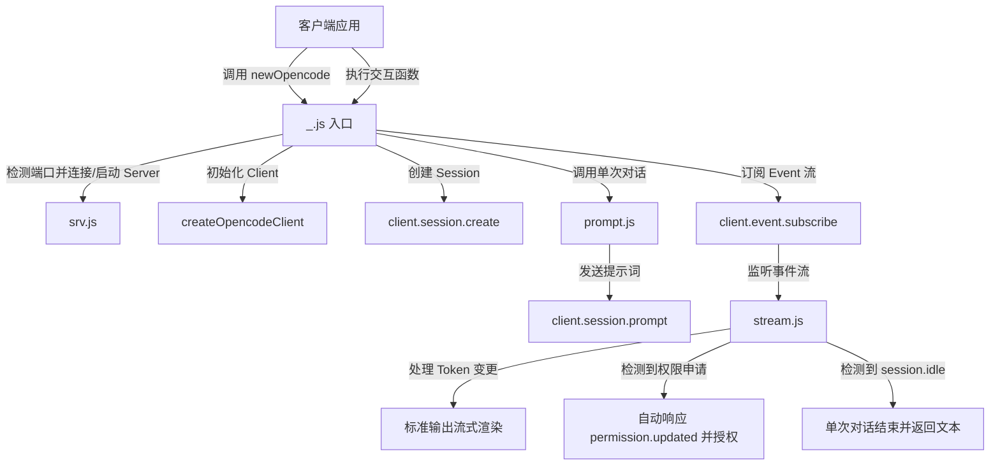

# @1-/opencode : 终端 AI 智能体会话 SDK

## 1. 功能介绍

- **服务托管**
  自动检测配置端口。
  端口空闲时自动启动底层服务，端口占用时建立连接并复用服务。

- **环境配置**
  支持通过 `OPENCODE_PORT` 与 `OPENCODE_HOST` 环境变量自定义服务端口与主机地址。

- **自动授权**
  实时订阅事件流。
  检测到终端执行等权限申请时自动批准，确保自动化流程无需人工干预。

- **分流渲染**
  实时解析事件流，在标准输出（stdout）分别渲染思考过程与回复文本。
  支持回调函数接收文本增量。

- **链式交互**
  提供链式交互接口，支持通过返回的下一轮交互函数进行持续对话。

## 2. 使用演示

```javascript
import newOpencode from "@1-/opencode";

// 初始化会话并绑定工作目录
const [prompt, client, session] = await newOpencode(process.cwd(), "Terminal Assistant");

// 发起交互
let [reply, next] = await prompt("List directory files");

// 持续链式交互
// [reply, next] = await next("Another instruction");
```

## 3. 设计思路

系统封装底层 `@opencode-ai/sdk` 接口，托管服务生命周期，订阅事件流并处理状态更新。



## 4. 技术栈

- 运行环境：Bun / Node.js
- 核心依赖：`@opencode-ai/sdk`
- 辅助库：`@3-/tcpping`、`@3-/log`
- 模块规范：ES Modules (ESM)

## 5. Code Structure

```text
.
├── src/
│   ├── _.js        # 入口文件，初始化客户端、创建会话与生命周期管理
│   ├── prompt.js   # 封装消息发送，控制单次对话的同步等待
│   ├── stream.js   # 监听事件流，处理流式渲染、自动授权与状态检测
│   ├── srv.js      # 托管服务端，处理端口检测与自动启动
│   └── ERR.js      # 预定义错误码
└── tests/
    └── _.test.js   # 单元测试
```

## 6. 历史故事

1964 年，Douglas McIlroy 在一份备忘录中首次提出 Unix 管道（Pipeline）构想，主张程序应通过标准输入与标准输出连接，以组装复杂系统。
1972 年，Ken Thompson 在 Unix 第三版中正式实现管道机制。
这一设计确立了 Unix 哲学，深刻影响了后世的软件协同模式。

进入 AI 智能体时代，管道机制演变为基于实时事件流的控制管道。
智能体通过流式通道传输思考日志、交互文本，并利用权限确认事件保障执行安全。
本 SDK 继承这一思想，建立自动化终端执行流与人机交互反馈环。
