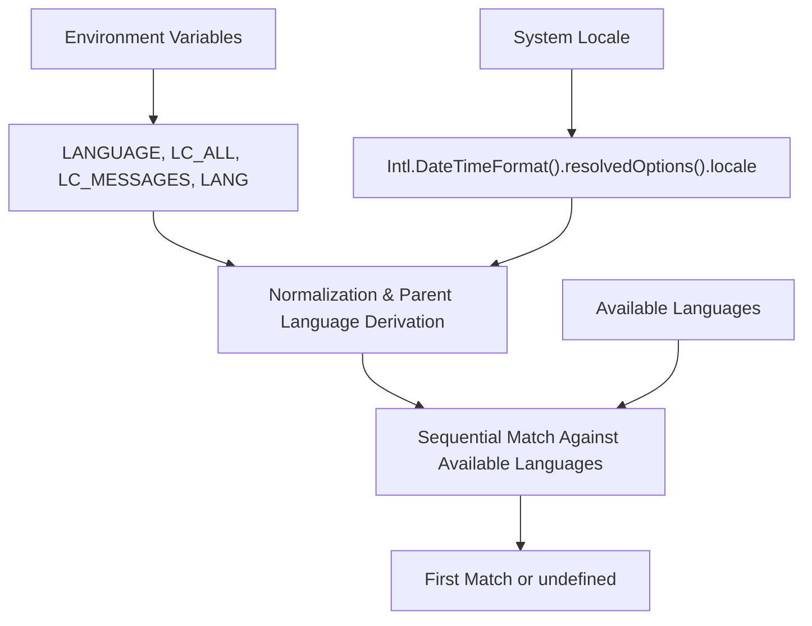

# @1-/oslang : OS language detection utility

## Functionality

Detects user's preferred language from operating system environment variables and browser/system locale settings, with normalization and hierarchical matching support. Implements multi-level fallback (e.g., `zh-CN` → `zh`) to reliably select the best-fit language in internationalized applications.

## Usage demonstration

```bash
npm install @1-/oslang
```

```javascript
import oslang from "@1-/oslang";
import match from "@1-/oslang/match.js";

// Get all normalized, deduplicated language tags, including parent languages
console.log([...oslang]); // ['en-US', 'en', 'zh-CN', 'zh']

// Match against a list of available languages
const available = ["en", "zh", "ja", "ko"];
const preferred = match(available).next().value;
console.log(preferred); // 'zh' (if system is zh-CN) or undefined (if no match)
```

## Design rationale

The library uses a deterministic priority order: sources are tried sequentially, then results are normalized and expanded to include parent locales:



## Technology stack

- Node.js runtime (ESM modules)
- Standard JavaScript (zero external dependencies)
- `Intl.DateTimeFormat().resolvedOptions().locale` API
- `node:process.env` for environment variable access

## Code structure

```
src/
├── _.js        # Main export: yields raw language sources (env + Intl + fallback)
├── all.js      # Normalized set: deduplicated, lowercase, hyphen-separated, with auto-added parent languages (e.g., en-US → en)
├── match.js    # Matching function: returns iterator yielding first matched item (original input)
└── parse.js    # Normalization utility: strips encoding suffixes, replaces `_` with `-`, lowercases
```

## Historical context

The POSIX standard, first published in 1988 (IEEE Std 1003.1-1988), formally standardized `LC_*` environment variables (e.g., `LC_MESSAGES`, `LC_TIME`) to provide portable localization on Unix systems. `LANG` served as the default fallback, while `LANGUAGE` was later extended by GNU to support ordered language preference lists (e.g., `zh_CN:zh_TW`). This library carries forward that four-decade tradition, re-implementing its core semantics in modern JavaScript.
