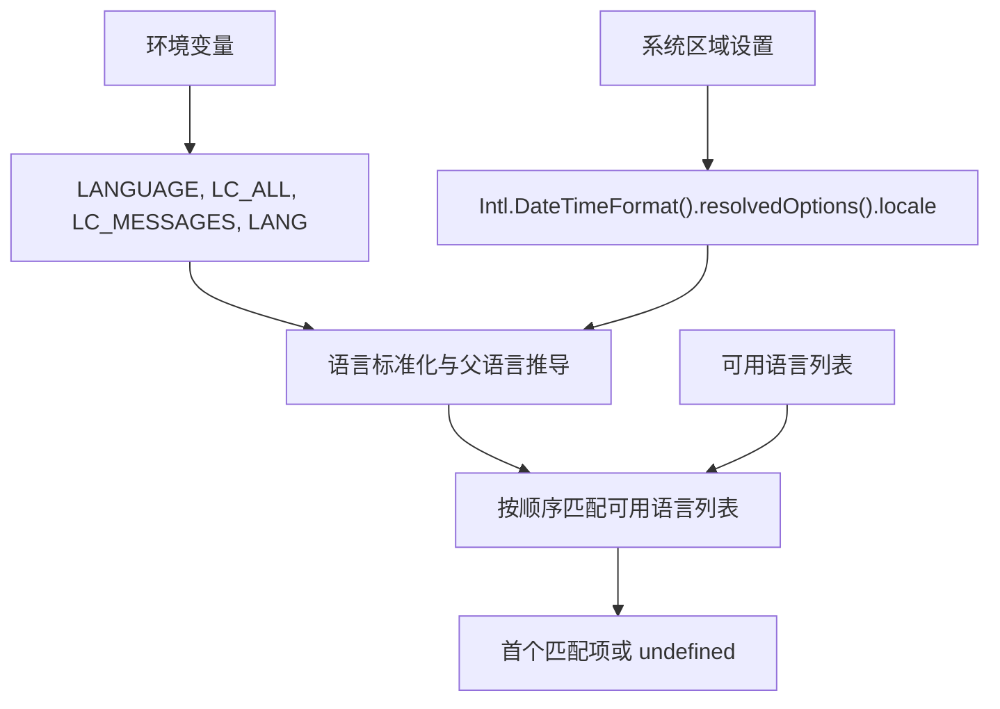

# @1-/oslang : 操作系统语言检测工具

## 功能介绍

从操作系统环境变量与浏览器/系统区域设置中检测用户首选语言，提供标准化处理与层级匹配能力。支持多级语言回退（如 `zh-CN` → `zh`），确保在国际化应用中可靠选择最适配的语言。

## 使用演示

```bash
npm install @1-/oslang
```

```javascript
import oslang from "@1-/oslang";
import match from "@1-/oslang/match.js";

// 获取所有已标准化、去重且含父语言的语言标识符
console.log([...oslang]); // ['en-US', 'en', 'zh-CN', 'zh']

// 在可用语言列表中匹配最优项
const available = ["en", "zh", "ja", "ko"];
const preferred = match(available).next().value;
console.log(preferred); // 'zh'（若系统为 zh-CN）或 undefined（若无匹配）
```

## 设计思路

本库采用确定性优先级策略，按顺序尝试多种来源，并对结果进行标准化与层级扩展：



## 技术栈

- Node.js 运行时（ESM 模块）
- 标准 JavaScript（无外部依赖）
- `Intl.DateTimeFormat().resolvedOptions().locale` API
- `node:process.env` 环境读取

## 代码结构

```
src/
├── _.js        # 主导出：生成原始语言源（环境变量 + Intl + fallback）
├── all.js      # 标准化集：去重、小写、短横线分隔，并自动添加父语言（如 en-US → en）
├── match.js    # 匹配函数：返回迭代器，yield 首个匹配项（原始输入项）
└── parse.js    # 标准化工具：移除编码后缀、下划线转短横线、转小写
```

## 历史故事

POSIX 标准于 1988 年首次发布（IEEE Std 1003.1-1988），正式将 `LC_*` 环境变量（如 `LC_MESSAGES`, `LC_TIME`）纳入规范，为 Unix 系统提供可移植的本地化机制。`LANG` 变量作为默认兜底，`LANGUAGE` 则被 GNU 系统扩展用于多语言优先级列表（如 `zh_CN:zh_TW`）。本库延续这一四十年传统，在现代 JavaScript 环境中轻量复现其核心语义。
