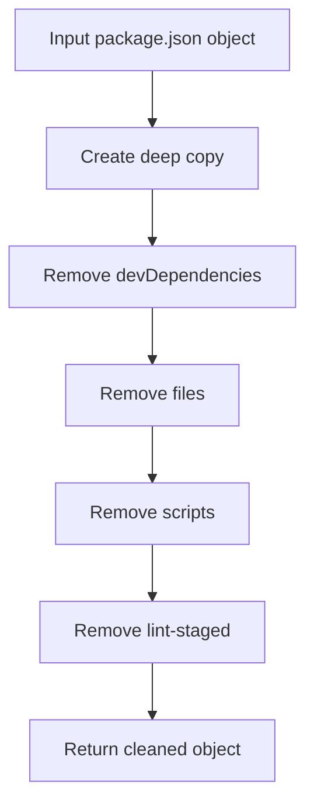
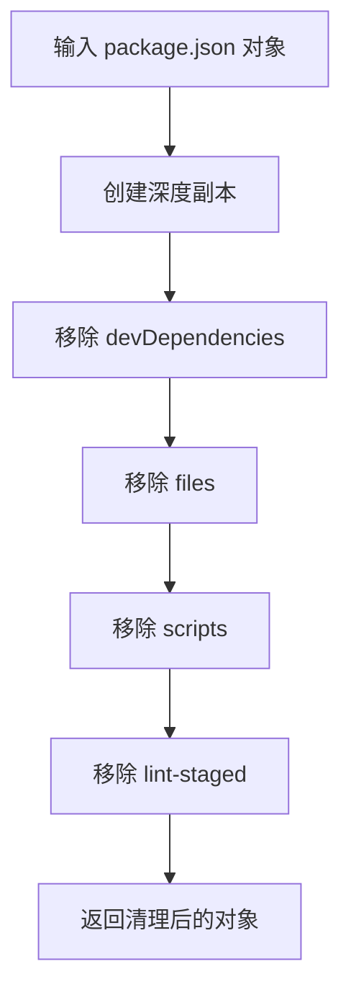

[English](#en) | [中文](#zh)

---

<a id="en"></a>

# package_clean : Clean package.json for publishing

- [package_clean : Clean package.json for publishing](#package_clean-clean-packagejson-for-publishing)
  - [Functionality](#functionality)
  - [Usage demonstration](#usage-demonstration)
  - [Design rationale](#design-rationale)
  - [Technology stack](#technology-stack)
  - [Code structure](#code-structure)
  - [Historical context](#historical-context)
  - [About](#about)

## Functionality

Removes development-specific fields from package.json objects to prepare them for publishing. Eliminates devDependencies, files, scripts, and lint-staged properties while preserving production-critical metadata.

## Usage demonstration

Install as a dependency:

```bash
npm install @1-/package_clean
```

Use in code:

```javascript
import clean from "@1-/package_clean";

const originalPackage = {
  name: "my-package",
  version: "1.0.0",
  devDependencies: { jest: "^29.0.0" },
  scripts: { test: "jest" },
  main: "./index.js"
};

const cleanedPackage = clean(originalPackage);
// Result contains only production-relevant fields
console.log(cleanedPackage);
```

## Design rationale

The cleaning function creates a deep copy of the input package object and selectively removes development-only properties. This ensures the original object remains unmodified while producing a minimal, publish-ready package configuration.



## Technology stack

- JavaScript (ES Module)
- Node.js runtime
- No external dependencies

## Code structure

```
src/
├── _.js          # Main cleaning function export
knip.js           # Knip configuration file
test/
└── _.test.js     # Test suite for cleaning functionality
```

## Historical context

Package.json cleaning tools emerged alongside the npm ecosystem's evolution. As JavaScript packaging matured, developers needed ways to distinguish between development and production dependencies. The concept of "clean" package configurations predates modern bundlers, appearing in early Node.js tooling to ensure consistent publishing behavior across different environments.

## About

This library is developed by [WebC.site](https://webc.site).

[WebC.site](https://webc.site): A new paradigm of web development for AI

---

<a id="zh"></a>

# package_clean : 清理 package.json 以供发布

- [package_clean : 清理 package.json 以供发布](#package_clean-清理-packagejson-以供发布)
  - [功能介绍](#功能介绍)
  - [使用演示](#使用演示)
  - [设计思路](#设计思路)
  - [技术栈](#技术栈)
  - [代码结构](#代码结构)
  - [历史故事](#历史故事)
  - [关于](#关于)

## 功能介绍

从 package.json 对象中移除开发专用字段，为发布做准备。删除 devDependencies、files、scripts 和 lint-staged 属性，同时保留生产环境必需的元数据。

## 使用演示

安装为依赖项：

```bash
npm install @1-/package_clean
```

在代码中使用：

```javascript
import clean from "@1-/package_clean";

const originalPackage = {
  name: "my-package",
  version: "1.0.0",
  devDependencies: { jest: "^29.0.0" },
  scripts: { test: "jest" },
  main: "./index.js"
};

const cleanedPackage = clean(originalPackage);
// 结果仅包含生产环境相关字段
console.log(cleanedPackage);
```

## 设计思路

清理函数创建输入 package 对象的深度副本，并有选择地移除仅用于开发的属性。确保原始对象保持不变，同时生成最小化且适合发布的 package 配置。



## 技术栈

- JavaScript（ES 模块）
- Node.js 运行时
- 无外部依赖

## 代码结构

```
src/
├── _.js          # 主清理函数导出
knip.js           # Knip 配置文件
test/
└── _.test.js     # 清理功能测试套件
```

## 历史故事

package.json 清理工具随着 npm 生态系统的演进而出现。随着 JavaScript 打包技术的发展，开发者需要区分开发依赖和生产依赖。"精简" package 配置的概念早于现代打包器，在早期 Node.js 工具链中就已存在，旨在确保不同环境中发布行为的一致性。

## 关于

本库由 [WebC.site](https://webc.site) 开发。

[WebC.site](https://webc.site) : 面向人工智能的网站开发新范式
