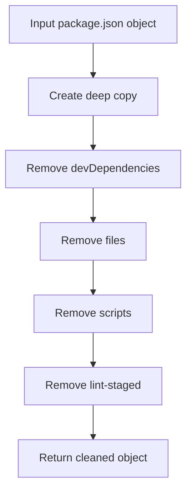

# package_clean : Clean package.json for publishing

## Functionality

Removes development-specific fields from package.json objects to prepare them for publishing. Eliminates devDependencies, files, scripts, and lint-staged properties while preserving production-critical metadata.

## Usage demonstration

Install as a dependency:

```bash
npm install @1-/package_clean
```

Use in code:

```javascript
import clean from "@1-/package_clean";

const originalPackage = {
  name: "my-package",
  version: "1.0.0",
  devDependencies: { jest: "^29.0.0" },
  scripts: { test: "jest" },
  main: "./index.js"
};

const cleanedPackage = clean(originalPackage);
// Result contains only production-relevant fields
console.log(cleanedPackage);
```

## Design rationale

The cleaning function creates a deep copy of the input package object and selectively removes development-only properties. This ensures the original object remains unmodified while producing a minimal, publish-ready package configuration.



## Technology stack

- JavaScript (ES Module)
- Node.js runtime
- No external dependencies

## Code structure

```
src/
├── _.js          # Main cleaning function export
knip.js           # Knip configuration file
test/
└── _.test.js     # Test suite for cleaning functionality
```

## Historical context

Package.json cleaning tools emerged alongside the npm ecosystem's evolution. As JavaScript packaging matured, developers needed ways to distinguish between development and production dependencies. The concept of "clean" package configurations predates modern bundlers, appearing in early Node.js tooling to ensure consistent publishing behavior across different environments.
